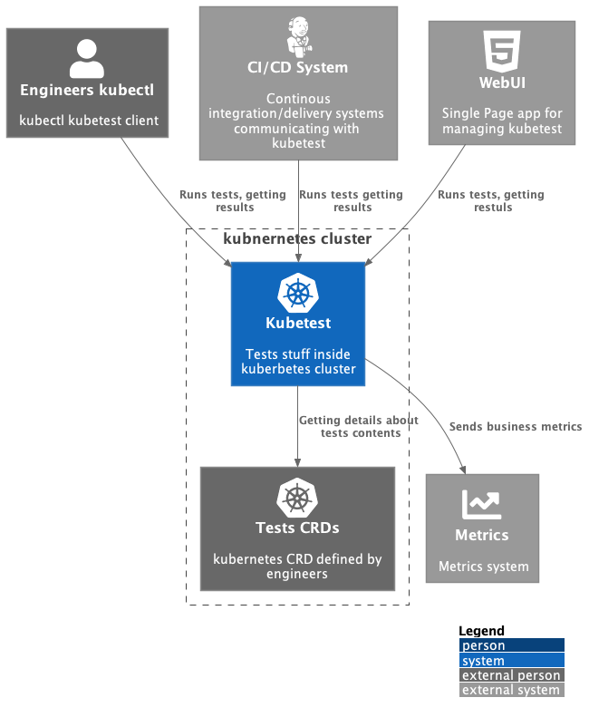
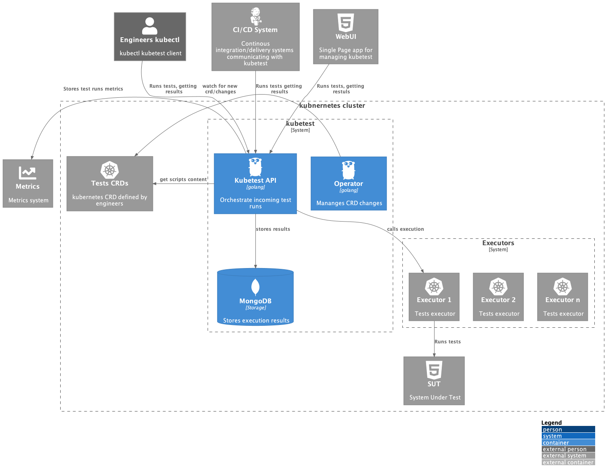
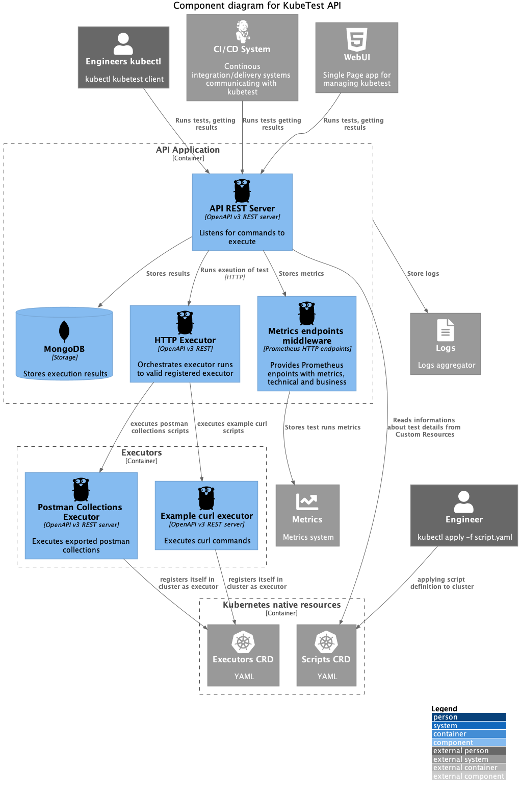

# KubeTest

Kubernetes-native framework for definition and execution of tests in a cluster; 

Instead of orchestrating and executing test with a CI tool (jenkins, travis, circle-ci, GitHub/GitLab, etc) tests are defined/orchestrated in the cluster using k8s native concepts (manifests, etc) and executed automatically when target resources are updated in the cluster. Results are written to existing tooling (prometheus, etc). This decouples test-definition and execution from CI-tooling/pipelines and ensures that tests are run when corresponding resources are updated (which could still be part of a CI/CD workflow). 

# Architecture (C4 Diagrams)
## Info

Diagrams was made with use of C4 diagram technique 
(https://c4model.com/) 

## Diagrams

### System Context 

### Containers

### Components

#### API 

#### Operator

TODO  add diagram for operator

#### Executor

TODO add diagram for executor

# Minimal components for PoC

- kubectl plugin - simple - installed w/o 3rd party repositories (like Krew etc), communicates with  
- API Server - work orchestrator, runs executors, gather execution results
- CRDs Operator - watch KubeTest CR, handles changes communicates with API Server
- Executors - runs tests defined by specific runner, for PoC phase we'll run 
  Postman collection defined in CR.

## Key components from confluence

- custom crds and corresponding controllers/operators for defining testsuites consisting or supported artefacts
- extension mechanism that allows 3rd party tool providers to add support for their test artefact
- kubectl extension for examining/running tests
- integration with 3rd party tools for result reporting/analysis (prometheus, etc.)
- custom controller/operator that can be configured to run specific tests based on events/annotations/etc

