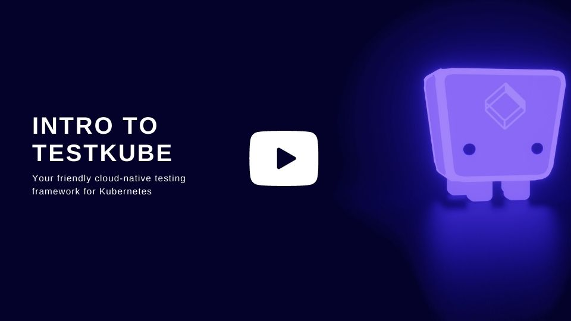

  
  
  

  Welcome to Testkube - Your friendly cloud-native testing framework for Kubernetes

  <a href="https://testkube.io">Website</a>&nbsp;|&nbsp;
  <a href="https://docs.testkube.io">Documentation</a>&nbsp;|&nbsp; 
  <a href="https://twitter.com/testkube_io">Twitter</a>&nbsp;|&nbsp; 
  <a href="https://testkubeworkspace.slack.com/join/shared_invite/zt-2arhz5vmu-U2r3WZ69iPya5Fw0hMhRDg#/shared-invite/email">Slack</a>&nbsp;|&nbsp; 
  <a href="https://kubeshop.io/category/testkube">Blog</a>

  
  
  
  
  
  
  
  

  <a target="_new" href="https://www.youtube.com/watch?v=GVvgLuxdrXE&t=47s">
    
    

      Click on the image or this link to watch the "Intro to Testkube" short video (3 mins)
    

  </a>

<!-- try to enable it after snyk resolves https://github.com/snyk/snyk/issues/347
Known vulnerabilities: 

-->

# Welcome to Testkube
Your friendly cloud-native testing framework for Kubernetes.

    

Testkube natively integrates test orchestration and execution into Kubernetes and your CI/CD/GitOps pipeline. It decouples test artifacts and execution from CI/CD tooling; tests are meant to be part of your clusters state and can be executed as needed:
- Kubectl plugin
- Externally triggered via API (CI, external tooling, etc)
- Automatically on deployment of annotated/labeled services/pods/etc (WIP)

Testkube advantages:
- Avoids vendor lock-in for test orchestration and execution in CI/CD  pipelines
- Makes it easy to orchestrate and run any kind of tests - functional, load/performance, security, compliance, etc. in your clusters, without having to wrap them in docker-images or providing network access
- Makes it possible to decouple test execution from build processes; engineers should be able to run specific tests whenever needed
- Centralizes all test results in a consistent format for "actionable QA analytics"
- Provides a modular architecture for adding new types of tests and executors

Main Testkube components are:

- kubectl Testkube plugin - simple - installed w/o 3rd party repositories (like Krew etc), communicates with
- API Server - work orchestrator, runs executors, gather execution results
- [CRDs Operator](https://github.com/kubeshop/testkube-operator) - watches Testkube CR, handles changes, communicates with API Server
- Executors - runs tests defined for specific runner
  - [Postman Executor](https://github.com/kubeshop/testkube-executor-postman) - runs Postman Collections
  - [Cypress Executor](https://github.com/kubeshop/testkube-executor-cypress) - runs Cypress Tests
  - [K6 Executor](https://github.com/kubeshop/testkube-executor-k6) - runs K6 performance tests ([@lreimer](https://github.com/lreimer))
  - [SoapUI](https://docs.testkube.io/test-types/executor-soapui/) - runs SoapUI tests
  - [Kubepug](https://docs.testkube.io/test-types/executor-kubepug/) - runs Kubepug tests
  - [Artillery.io](https://docs.testkube.io/test-types/executor-artillery/) - runs Artillery tests
  - [Curl Executor](https://docs.testkube.io/test-types/curl) - runs simple Curl commands
  - [Maven](https://docs.testkube.io/test-types/executor-maven/) - Runs tests written in Java using Maven ([@lreimer](https://github.com/lreimer))
  - [Gradle](https://docs.testkube.io/test-types/executor-gradle/) - Runs tests written in Java using Gradle ([@lreimer](https://github.com/lreimer))
  - [Ginkgo](https://docs.testkube.io/test-types/executor-ginkgo/) - Runs tests written in Go using Ginkgo ([@jdborneman-terminus](https://github.com/jdborneman-terminus))
  - [Executor Template](https://github.com/kubeshop/testkube-executor-template) - for creating your own executors
- Results DB - for centralized test results aggregation and analysis

## Getting Started

Checkout the [Getting Started](https://docs.testkube.io/articles/getting-started-overview) guides to set up Testkube and run your first tests!

# Documentation

Is available at [docs.testkube.io](https://docs.testkube.io)

## Contributing

Shout-out to our contributors 🎉 - you're great!

- ⭐️ [@lreimer](https://github.com/lreimer) - [K6 executor](https://github.com/kubeshop/testkube-executor-k6) [Gradle executor](https://github.com/kubeshop/testkube-executor-gradle) [Maven executor](https://github.com/kubeshop/testkube-executor-maven)
- ⭐️ [@jdborneman-terminus](https://github.com/jdborneman-terminus) - [Ginkgo executor](https://github.com/kubeshop/testkube-executor-ginkgo) 
- ️⭐️ [@abhishek9686](https://github.com/abhishek9686)
- ⭐️ [@ancosma](https://github.com/ancosma)
- ⭐️ [@Stupremee](https://github.com/Stupremee)
- ⭐️ [@artem-zherdiev-ingio](https://github.com/artem-zherdiev-ingio)
- ⭐️ [@chooco13](https://github.com/chooco13) - [Playwright executor](https://github.com/kubeshop/testkube-executor-playwright)

Go to [contribution document](CONTRIBUTING.md) to read more how can you help us 🔥

# Feedback
Whether it helps you or not - we'd LOVE to hear from you.  Please let us know what you think and of course, how we can make it better.
Please join our growing community on [Slack](https://testkubeworkspace.slack.com/join/shared_invite/zt-2arhz5vmu-U2r3WZ69iPya5Fw0hMhRDg#/shared-invite/email)
