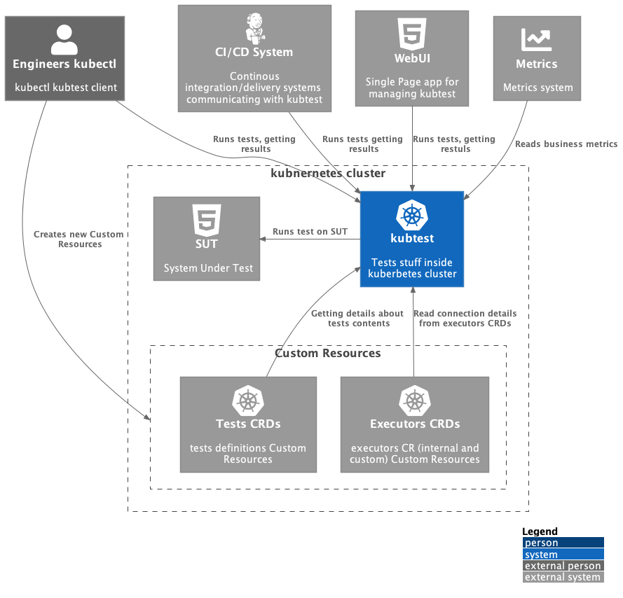
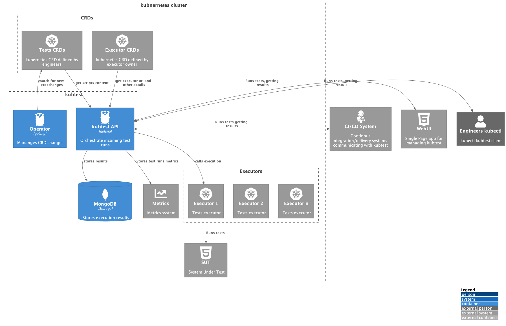
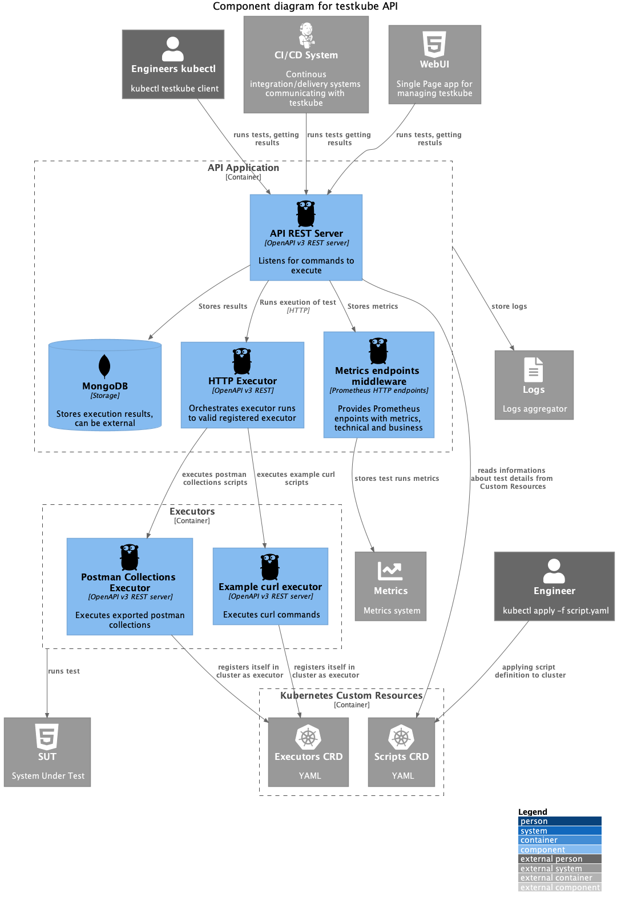
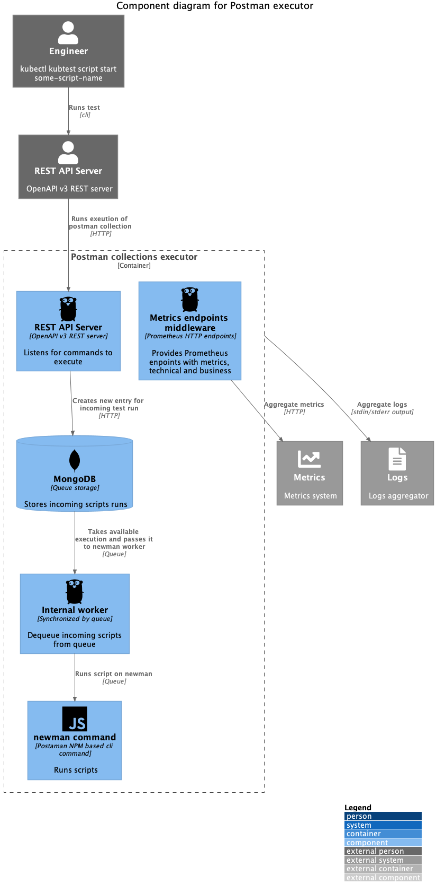

# TOC 

- [KubeTest - your testing friend](#kubetest---your-testing-friend)
- [Kubectl kubetest plugin](#kubectl-kubetest-plugin)
  * [Installation](#installation)
    + [Helm installation](#helm-installation)
  * [Usage](#usage)
- [Architecture (C4 Diagrams)](#architecture--c4-diagrams-)
  * [Info](#info)
  * [Diagrams](#diagrams)
    + [System Context](#system-context)
    + [Containers](#containers)
    + [Components](#components)
      - [API](#api)
      - [Operator](#operator)
      - [Executor](#executor)
- [Contribution to project](#contribution-to-project)
  * [General guidance for contributing to KubeTest project](#general-guidance-for-contributing-to-kubetest-project)
    + [For golang based components](#for-golang-based-components)
    + [For infrastructure / Kubernetes based components](#for-infrastructure---kubernetes-based-components)
  * [Building diagrams](#building-diagrams)
- [Minimal components for PoC](#minimal-components-for-poc)

# KubeTest - your testing friend

Kubernetes-native framework for definition and execution of tests in a cluster; 

Instead of orchestrating and executing test with a CI tool (jenkins, travis, circle-ci, GitHub/GitLab, etc) tests are defined/orchestrated in the cluster using k8s native concepts (manifests, etc) and executed automatically when target resources are updated in the cluster. Results are written to existing tooling (prometheus, etc). This decouples test-definition and execution from CI-tooling/pipelines and ensures that tests are run when corresponding resources are updated (which could still be part of a CI/CD workflow). 


# Kubectl kubetest plugin

## Installation 

For installation we're using Helm charts. To simplify install 
you can use following command to install all required components of KubeTest: 

```
kubectl kubetest install
```

### Helm installation

Helm install 

[Helm](https://helm.sh) must be installed to use the charts.  Please refer to
Helm's [documentation](https://helm.sh/docs) to get started.

Once Helm has been set up correctly, add the repo as follows:
```sh
helm repo add kubetest https://kubeshop.github.io/kubetest
```
If you had already added this repo earlier, run `helm repo update` to retrieve
the `latest` versions of the packages.  You can then run `helm search repo
kubetest` to see the charts.

To install the `kubetest` chart:
```sh
helm install my-<chart-name> kubetest/kubetest
```
To uninstall the `kubetest` chart:
```sh
helm delete my-<chart-name> kubetest/kubetest
```

Helm defaults used in the `Kubetest` chart:

| Parameter | Is optional | Default |
| --- | --- | --- |
| mongodb.auth.enabled | yes | false |
| mongodb.service.port | yes | "27017" |
| mongodb.service.portNmae | yes | "mongodb" |
| mongodb.service.nodePort | yes | true |
| mongodb.service.clusterIP | yes | "" |
| mongodb.nameOverride | yes | "mongodb" |
| mongodb.fullnameOverride | yes | "kubetest-mongodb" |
| api-server.image.repository | yes | "kubeshop/kubetest-api-server" |
| api-server.image.pullPolicy | yes | "Always" |
| api-server.image.tag | yes | "latest" |
| api-server.service.type | yes | "NodePort" |
| api-server.service.port | yes | 8080 |
| api-server.mongoDSN | yes | "mongodb://kubetest-mongodb:27017" |
| api-server.postmanExecutorURI | yes | "http://kubetest-postman-executor:8082" |
| postman-executor.image.repository | yes | "kubeshop/kubetest-postman-executor" |
| postman-executor.image.pullPolicy | yes | "Always" |
| postman-executor.image.tag | yes | "latest" |
| postman-executor.service.type | yes | "NodePort" |
| postman-executor.service.port | yes | 8082 |
| postman-executor.mongoDSN | yes | "mongodb://kubetest-mongodb:27017" |
| postman-executor.apiServerURI | yes | "http://kubetest-api-server:8080" |

>For more configuration parameters of `MongoDB` chart please look here:
https://github.com/bitnami/charts/tree/master/bitnami/mongodb#parameters

## Usage 

0) First you'll need to define test, tests are defined as Curstom Resource in Kubernetes cluster (access to Kubernetes cluster would be also needed)

If you don't want to create Custom Resources "by hand" we have a little helper for this: 

```sh
kubectl kubetest scripts create --file my_collection_file.json --name my-test-name

#or 
cat my_collection_file.json | kubectl kubetest scripts create --name my-test-name
```


You can create new test by creating new Custom Resource 'by hand' (via `kubectl apply -f ...` cli possibility) e.g.:

```yaml
cat <<EOF | kubectl apply -f -
apiVersion: tests.kubetest.io/v1
kind: Script
metadata:
  name: test-kubeshop
spec:
  # Add fields here
  id: Some internal ID 
  type: postman/collection
  content: >
    {
      "info": {
        "_postman_id": "8af42c21-3e31-49c1-8b27-d6e60623a180",
        "name": "Kubeshop",
        "schema": "https://schema.getpostman.com/json/collection/v2.1.0/collection.json"
      },
      "item": [
        {
          "name": "Home",
          "event": [
            {
              "listen": "test",
              "script": {
                "exec": [
                  "pm.test(\"Body matches string\", function () {",
                  "    pm.expect(pm.response.text()).to.include(\"K8s Accelerator\");",
                  "});"
                ],
                "type": "text/javascript"
              }
            }
          ],
          "request": {
            "method": "GET",
            "header": [],
            "url": {
              "raw": "https://kubeshop.io/",
              "protocol": "https",
              "host": [
                "kubeshop",
                "io"
              ],
              "path": [
                ""
              ]
            }
          },
          "response": []
        },
        {
          "name": "Team",
          "event": [
            {
              "listen": "test",
              "script": {
                "exec": [
                  "pm.test(\"Status code is 200\", function () {",
                  "    pm.response.to.have.status(200);",
                  "});",
                  "",
                  "pm.test(\"Body matches string\", function () {",
                  "    pm.expect(pm.response.text()).to.include(\"Jacek Wysocki\");",
                  "});"
                ],
                "type": "text/javascript"
              }
            }
          ],
          "request": {
            "method": "GET",
            "header": [],
            "url": {
              "raw": "https://kubeshop.io/our-team",
              "protocol": "https",
              "host": [
                "kubeshop",
                "io"
              ],
              "path": [
                "our-team"
              ]
            }
          },
          "response": []
        }
      ]
    }
EOF
```

Where content is simply exported postman collection in example above. 
Name is unique Sript Custom Resource name. 
Type is `postman/collection` as it runs exported postman collections.


1) Starting new script execution 

```
$ kubectl kubetest scripts start my-test-name 

Script "my-test-name" started
Execution ID 02wi02-29329-2392930-93939
```
> Please keep in mind if you follow examples and have created `test script` by hand via `kubectl apply -f ...` then you should start it with the usage of what has been provided here:
> ```
> metadata:
>  name: test-kubeshop
> ```
>>_E.G. `kubectl kubetest scripts start test-kubeshop`_

2) [TODO] Aborting already started script execution 
```
$ kubectl kubetest scripts abort SOME_EXECUTION_ID
Script "SCRIPTNAME" Execution aborted

```

3) Getting available scripts
```
$ kubectl kubetest scripts list

ID         NAME              Type
040-134   HomePage test      postman/collection   
123-246   Contact API test   postman/collection

```
 
4) Getting available executions

```sh
kubectl kubetest scripts executions

ID         NAME             Status     Complete   Start              End
1233-333   HomePage run     pending    75%        2021-07-30 12:33   
1233-332   HomePage run     pending    100%       2021-07-30 12:33   2021-07-30 13:10
```

5) Getting execution details

```sh
kubectl kubetest scripts execution test 6103a45b7e18c4ea04883866

....
some execution details
```


# Architecture (C4 Diagrams)
## Info

Diagrams was made with use of C4 diagram technique 
(https://c4model.com/) 


## Diagrams

### System Context 



### Containers



### Components

#### API 



#### Operator

TODO  add diagram for operator

#### Executor




# Contribution to project 

If you're new in Open-source community there is nice guide how to start contributing to projects: 
https://github.com/firstcontributions/first-contributions


## General guidance for contributing to KubeTest project

You're very welcome to help in KubeTest development, there is a lot of incoming work to do :). 

We're trying hard to limit technical debt from the beginning so we defined simple rules when putting some code into KubeTest repo.

### For golang based components

- Always use gofmt
- Follow golang good practices (proverbs) in your code
- Tests are your friend (we will target 80% CC in our code)
- Use clean names, don't brake basic design patterns and rules.

### For infrastructure / Kubernetes based components

- Comment non-obvious decisions
- Use current Helm/Kubernetes versions


## Building diagrams

To build diagrams you'll need to install plantuml:

```sh
brew install plantuml # on mac
sudo apt-get install -y plantuml # on ubuntu linux 
pacman -S plantuml # on arch linux
```
Next run 
```sh 
make diagrams
```
to generate png files from puml files


TIP: If using vscode there is nice extension for live preview of plantuml files.  


# Minimal components for PoC

- kubectl plugin - simple - installed w/o 3rd party repositories (like Krew etc), communicates with  
- API Server - work orchestrator, runs executors, gather execution results
- CRDs Operator - watch KubeTest CR, handles changes communicates with API Server
- Executors - runs tests defined by specific runner, for PoC phase we'll run 
  Postman collection defined in CR.
