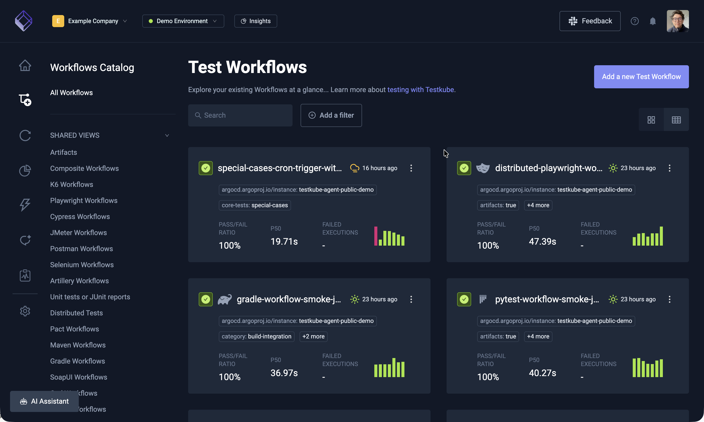

<picture>
  <source media="(prefers-color-scheme: dark)" srcset="./assets/testkube_logo-light.png">
  <source media="(prefers-color-scheme: light)" srcset="./assets/testkube_logo-dark.png">
  
</picture>

# The Open Testing Platform for AI-driven Engineering Teams

Testkube provides a single platform for defining, running and analyzing automated tests, using your existing testing tools/scripts, running in your Kubernetes infrastructure.

 

---

> Trusted by Engineering Teams at CoreWeave, NVidia, Siemens, T-Mobile, Harvard, SwissCom, and many more..

---

[Website](https://testkube.io/?utm_campaign=40056390-2026%20-%20Thematic%20-%20Open%20Source&utm_source=Github&utm_medium=readme&utm_content=home-page) |  [Docs](https://docs.testkube.io/?utm_campaign=40056390-2026%20-%20Thematic%20-%20Open%20Source&utm_source=Github&utm_medium=readme&utm_content=docs-click) |  [Changelog](https://docs.testkube.io/changelog?utm_campaign=40056390-2026%20-%20Thematic%20-%20Open%20Source&utm_source=Github&utm_medium=readme&utm_content=docs-click) |  [Blog](https://testkube.io/blog?utm_campaign=40056390-2026%20-%20Thematic%20-%20Open%20Source&utm_source=Github&utm_medium=readme&utm_content=blog_click) |  [Slack](https://hubs.ly/Q04gqKkB0)  |  [LinkedIn](https://hubs.ly/Q04gqR4k0)  |  [X](https://hubs.ly/Q04gqRp90) 

---

## Why Testkube?

- **Run any Tests** : Execute _any_ tests/tools/scripts at scale; API, E2E, Performance, Security, Infrastructure, etc. - [Examples & Guides](https://docs.testkube.io/articles/examples/overview?utm_campaign=40056390-2026%20-%20Thematic%20-%20Open%20Source&utm_source=Github&utm_medium=readme&utm_content=docs-click).
- **Trigger Tests whenever needed**: Trigger tests manually, on schedules, from CI/CD/GitOps pipelines, on Kubernetes Events, via the REST API, through MCP, etc. - [Read More](https://docs.testkube.io/articles/triggering-overview?utm_campaign=40056390-2026%20-%20Thematic%20-%20Open%20Source&utm_source=Github&utm_medium=readme&utm_content=docs-click).
- **See Everything**: All test results, artifacts, logs and resource-metrics are aggregated for centralized troubleshooting and reporting - [Read More](https://docs.testkube.io/articles/results-overview?utm_campaign=40056390-2026%20-%20Thematic%20-%20Open%20Source&utm_source=Github&utm_medium=readme&utm_content=docs-click).
- **Integrate Natively**: Testkube integrates with existing tools and infrastructure using [Webhooks](https://docs.testkube.io/articles/webhooks?utm_campaign=40056390-2026%20-%20Thematic%20-%20Open%20Source&utm_source=Github&utm_medium=readme&utm_content=docs-click), the [Testkube REST API](https://docs.testkube.io/openapi/overview?utm_campaign=40056390-2026%20-%20Thematic%20-%20Open%20Source&utm_source=Github&utm_medium=readme&utm_content=docs-click) or the [MCP Server](https://docs.testkube.io/articles/mcp-overview?utm_campaign=40056390-2026%20-%20Thematic%20-%20Open%20Source&utm_source=Github&utm_medium=readme&utm_content=docs-click) - see [Integration Examples](https://docs.testkube.io/articles/integrations?utm_campaign=40056390-2026%20-%20Thematic%20-%20Open%20Source&utm_source=Github&utm_medium=readme&utm_content=docs-click).
- **Testkube AI**: Use the Testkube MCP Server or native AI Agents for troubleshooting, analysis, remediation, etc - [Read More](https://docs.testkube.io/articles/testkube-ai-overview?utm_campaign=40056390-2026%20-%20Thematic%20-%20Open%20Source&utm_source=Github&utm_medium=readme&utm_content=docs-click)
- **Enterprise Ready**: SSO/SCIM, RBAC, Teams, Resource-Groups, Audit-logs, etc. - [Read More](https://docs.testkube.io/articles/administration-overview?utm_campaign=40056390-2026%20-%20Thematic%20-%20Open%20Source&utm_source=Github&utm_medium=readme&utm_content=docs-click).

**See it in action:** Open the [interactive TestWorkflows showcase](https://docs.testkube.io/articles/testworkflows-showcase?utm_campaign=40056390-2026%20-%20Thematic%20-%20Open%20Source&utm_source=Github&utm_medium=readme&utm_content=docs-click) to see how a workflow builds up from a single test to a fully orchestrated pipeline.

## Two ways to run Testkube 

### Open Source Agent - this repo.

MIT-licensed, runs standalone in your Kubernetes cluster, no control plane required. Great for single-cluster setups, self-managed environments, and evaluating Testkube.

- The [Helm or CLI Installation](https://docs.testkube.io/articles/install/standalone-agent?utm_campaign=40056390-2026%20-%20Thematic%20-%20Open%20Source&utm_source=Github&utm_medium=readme&utm_content=docs-click#installing-the-standalone-agent) will make it easy to deploy the agent into your target cluster.
- The [Quickstart](https://docs.testkube.io/articles/getting-started-with-open-source?utm_campaign=40056390-2026%20-%20Thematic%20-%20Open%20Source&utm_source=Github&utm_medium=readme&utm_content=docs-click) is the easiest way to set up
  Testkube and run your first tests.

Check out the [Testkube Open Source Overview](https://docs.testkube.io/articles/open-source?utm_campaign=40056390-2026%20-%20Thematic%20-%20Open%20Source&utm_source=Github&utm_medium=readme&utm_content=docs-click) to learn more about the open source deployment architecture.

### Commercial Control Plane

The control plane connects every Testkube agent across clusters, teams, and environments into a single dashboard:

- **One control plane, unlimited clusters** - orchestrate and analyze tests across clusters and regions
- **Testkube AI** - workflow generation, failure investigation, remediation PRs
- **Enterprise-grade** - SSO/SCIM, RBAC, audit logs, SLA-backed support

Check out the [Installation Overview](https://docs.testkube.io/articles/install/overview?utm_campaign=40056390-2026%20-%20Thematic%20-%20Open%20Source&utm_source=Github&utm_medium=readme&utm_content=docs-click) to learn more about different ways to deploy and run the Testkube Control Plane.

The online Trial is the easiest way to try the commercial Testkube offering - [Get Started](https://testkube.io/get-started?utm_campaign=40056390-2026%20-%20Thematic%20-%20Open%20Source&utm_source=Github&utm_medium=readme&utm_content=trynow-link)

### Marketplace

The [Testkube Marketplace](https://github.com/kubeshop/testkube-marketplace) provides an open and ready-to-use catalog of Testkube Workflows for Infrastructure Testing - [Read More](https://docs.testkube.io/articles/examples/marketplace?utm_campaign=40056390-2026%20-%20Thematic%20-%20Open%20Source&utm_source=Github&utm_medium=readme&utm_content=docs-click).

### Documentation

Extensive documentation is available at [docs.testkube.io](https://docs.testkube.io/?utm_campaign=40056390-2026%20-%20Thematic%20-%20Open%20Source&utm_source=Github&utm_medium=readme&utm_content=docs-click).

### Contributing

Check out our [Contributors Guide](CONTRIBUTING.md) and the [Agent Architecture](ARCHITECTURE.md) to find your way around our codebase and process.

If you want to contribute code, this reading order works well:

1. [CONTRIBUTING.md](CONTRIBUTING.md) - contribution workflow, coding standards, and PR process
2. [DEVELOPMENT.md](DEVELOPMENT.md) - local setup with Tilt and day-to-day development loop
3. [ARCHITECTURE.md](ARCHITECTURE.md) - high-level system design and key code paths

Shout-out to our contributors 🎉 - you're great!

- ⭐️ [@lreimer](https://github.com/lreimer) - [K6 executor](https://github.com/kubeshop/testkube-executor-k6) [Gradle executor](https://github.com/kubeshop/testkube-executor-gradle) [Maven executor](https://github.com/kubeshop/testkube-executor-maven)
- ⭐️ [@jdborneman-terminus](https://github.com/jdborneman-terminus) - [Ginkgo executor](https://github.com/kubeshop/testkube-executor-ginkgo)
- ️⭐️ [@abhishek9686](https://github.com/abhishek9686)
- ⭐️ [@ancosma](https://github.com/ancosma)
- ⭐️ [@Stupremee](https://github.com/Stupremee)
- ⭐️ [@artem-zherdiev-ingio](https://github.com/artem-zherdiev-ingio)
- ⭐️ [@chooco13](https://github.com/chooco13) - [Playwright executor](https://github.com/kubeshop/testkube-executor-playwright)

Go to [contribution document](CONTRIBUTING.md) to read more how can you help us 🔥

### Feedback

Whether Testkube helps you or not, we would love to help and hear from you. Please [join us on Slack](https://hubs.ly/Q04gqKkB0) to ask questions
and let us know how we can make Testkube even better!
