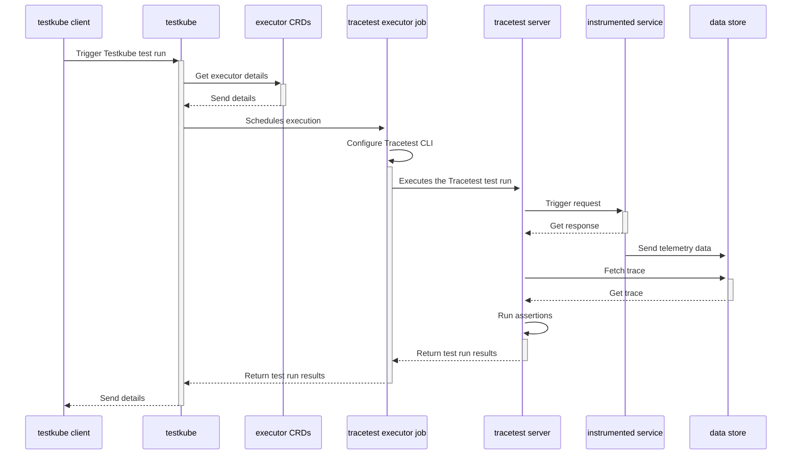

# Welcome to Testkube Tracetest Executor

Testkube Tracetest Executor is a test executor to run [Tracetest](https://tracetest.io/) tests with [Testkube](https://testkube.io).

# Running Tracetest with Testkube

[Tracetest](https://tracetest.io/) is a testing tool based on [OpenTelemetry](https://opentelemetry.io/) that permits you to test your distributed application. It allows you to use the trace data generated by your OpenTelemetry tools to check and assert if your application has the desired behavior defined by your test definitions.

[Testkube](https://testkube.io/) is a Kubernetes-native testing framework for Testers and Developers that allows you to automate the executions of your existing testing tools inside your Kubernetes cluster, removing all the complexity from your CI/CD/GitOps pipelines.

By using the [Testkube Tracetest Executor](https://github.com/kubeshop/testkube-executor-tracetest) you can unlock Testkube's capacity in conjunction with Tracetest, and leverage the work you have already done to instrument your services.

## Quickstart

Here we will show how to use Testkube alongside Tracetest to run your tests in a Kubernetes cluster.

### Prerequisites

In your Kubernetes cluster you should have:

1. `Testkube`: Use HELM or the Testkube CLI to [install](https://kubeshop.github.io/testkube/installing) Testkube Server components in your cluster.
2. `Trecetest Server`: You need a running instance of Tracetest which is going to be executing your assertions. To do so you can follow the instructions defined in the Tracetest [documentation](https://docs.tracetest.io/deployment/kubernetes).
3. `OpenTelemetry Instrumented Service`: In order to generate traces and spans, the service under test must support the basics for [propagation](https://opentelemetry.io/docs/reference/specification/context/api-propagators/) through HTTP requests, and also store traces and spans into a Data Store Backend (Jaeger, Grafana Tempo, OpenSearch, etc) or use the [OpenTelemetry Collector](https://docs.tracetest.io/configuration/overview#using-tracetest-without-a-trace-data-store).

On your machine you should have:

1. `Kubectl` [installed](https://kubernetes.io/docs/tasks/tools/)
2. `Testkube CLI` [installed](https://kubeshop.github.io/testkube/installing#1-installing-the-testkube-cli)

With everything set up, we will start configuring Testkube and Tracetest.

### 1. Deploy the Tracetest Executor

Testkube works with the concept of [Executors](https://kubeshop.github.io/testkube/test-types/executor-custom). An Executor is a wrapper around a testing framework (Tracetest in this case) in the form of a Docker container and runs as a Kubernetes job. To start you need to register and deploy the Tracetest executor in your cluster using the Testkube CLI:

```bash
kubectl testkube create executor --image kubeshop/testkube-executor-tracetest:latest --types "tracetest/test" --name tracetest-executor
```

### 2. Create your test

Now you need a Tracetest test. Have a look at the [Tracetest documentation](https://docs.tracetest.io/cli/creating-tests) for details on writing tests. Here is a simple test definition example:

```yaml
type: Test
spec:
  id: R5NITR14g
  name: Pokeshop - List
  description: Get a Pokemon
  trigger:
    type: http
    httpRequest:
      url: http://demo-pokemon-api.demo/pokemon?take=20&skip=0
      method: GET
      headers:
        - key: Content-Type
          value: application/json
  specs:
    - selector: span[tracetest.span.type="http"]
      assertions:
        - attr:http.method = "GET"
    - selector: span[tracetest.span.type="database"]
      assertions:
        - attr:db.name = "pokeshop"
```

Execute the following command to create the test executor object in Testkube. Do not forget to provide the path to your Tracetest definition file using the `--file` argument, and also the Tracetest Server endpoint using the `TRACETEST_ENDPOINT` `--variable`:

```bash
kubectl testkube create test --file my/file/location.yaml --type "tracetest/test" --name pokeshop-tracetest-test --variable TRACETEST_ENDPOINT=http://tracetest
```

### 3. Run your test

Finally, to see the integration working, you only need to run the test by executing the following command:

```bash
kubectl testkube run test --watch pokeshop-tracetest-test
```

# Architecture

The following is high level sequence diagram on how Testkube and Tracetest interact with the different pieces of the system:



# Issues and enchancements

Please follow the main [Testkube repository](https://github.com/kubeshop/testkube) for reporting any [issues](https://github.com/kubeshop/testkube/issues) or [discussions](https://github.com/kubeshop/testkube/discussions)

# Known Error

There might be a version mismatch error coming up:

```bash
✖️ Error: Version Mismatch
The CLI version and the server version are not compatible. To fix this, you'll need to make sure that both your CLI and server are using compatible versions.
We recommend upgrading both of them to the latest available version. Check out our documentation https://docs.tracetest.io/configuration/upgrade for simple instructions on how to upgrade.
Thank you for using Tracetest! We apologize for any inconvenience caused.
```

The quickest way to fix this, is to use your own executor Docker image. For the Dockerfile, check out the file in `build/agent`. Here you can specify the link to the exact Tracetest executable version you need. To build this, please use the following command in the root of the Testkube repository:

```bash
make docker-build-executor EXECUTOR=tracetest GITHUB_TOKEN="" DOCKER_BUILDX_CACHE_FROM=type=registry,ref=docker.io/kubeshop/testkube-tracetest-executor:latest ALPINE_IMAGE=alpine:3.18.0
```

Don't forget to make this image available to your Testkube environment and update the image used by the executor:

```bash
kubectl edit executors/tracetest-executor -n testkube
```

# Testkube

For more info go to [main testkube repo](https://github.com/kubeshop/testkube)

 [](https://github.com/kubeshop/testkube/tags?label=Downloads) 

  


#### [Documentation](https://kubeshop.github.io/testkube) | [Discord](https://discord.gg/hfq44wtR6Q)

# Tracetest

For more info go to [main tracetest repo](https://github.com/kubeshop/tracetest)


#### [Documentation](https://docs.tracetest.io/) | [Discord](https://discord.gg/6zupCZFQbe)