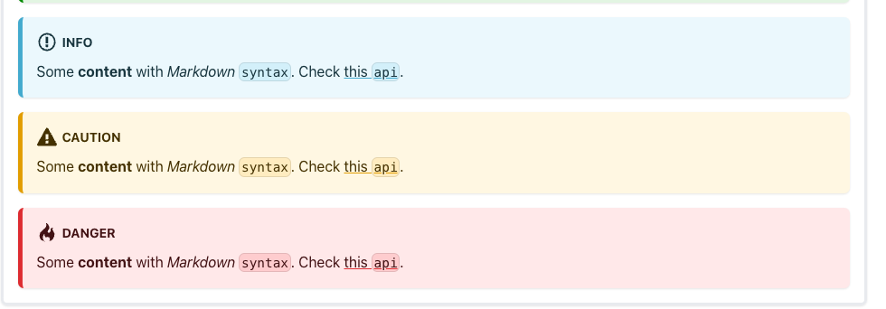
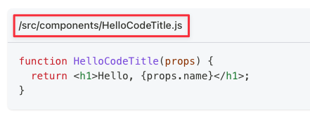

# Testkube docs

You can find the docs here: https://kubeshop.github.io/testkube/

## How to edit the docs?

System requirements:

- [npm](https://nodejs.org/en/download)

If you're editing the docs, follow this workflow:

1. Install dependencies with `npm install`
2. Spin up local development with `npm run start`
3. Update the docs inside the `/docs` folder
4. Make sure to add the new document in the `sidebar.json` file:

```diff
{
  type: "category",
  label: "Concepts",
  items: [
    {
      type: "category",
      label: "Tests",
      items: [
        "concepts/tests/tests-creating",
        "concepts/tests/tests-running",
        "concepts/tests/tests-getting-results",
        "concepts/tests/tests-variables",
+       "concepts/new-concept"
      ],
    },
}
```

5. You can preview the changes locally in your browser: http://localhost:3000

## How to style the docs

### Warning signs



If you want to add a warning/info message like the above, use [Docusuarus Admonitions](https://docusaurus.io/docs/markdown-features/admonitions).

### Code blocks title



If the content of the code blocks refers to a file, use Docusaurus [Code Block title](https://docusaurus.io/docs/markdown-features/code-blocks#code-title).

**Don't:**

````md
file.js

```js
file
content
```
````

**Do:**

````md
```js title="file.js"
file
content
```
````

