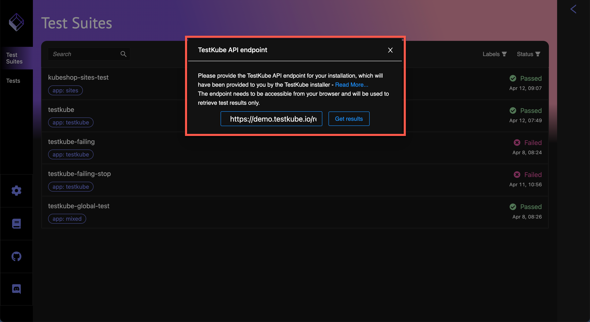
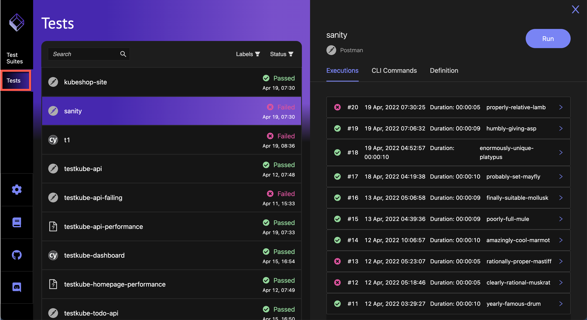
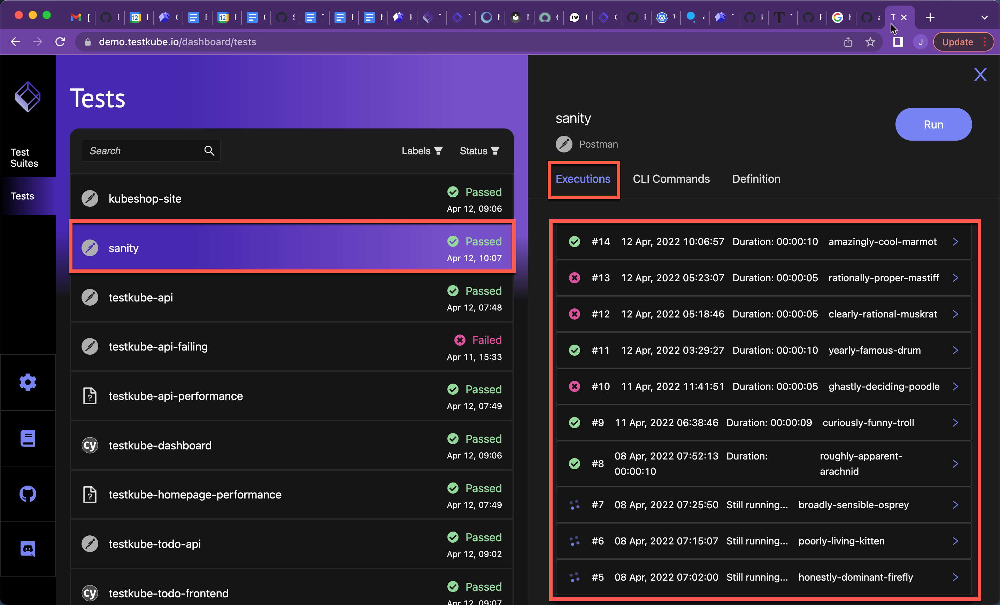
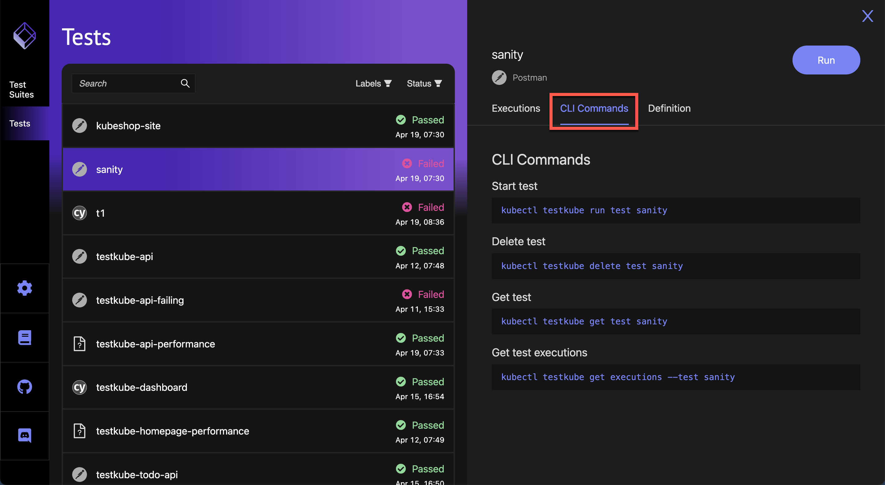

# Testkube UI

The Testkube UI provides a simple web-based user interface for monitoring Testkube test results via a web browser.


The URL to access the Testkube UI is [https://demo.testkube.io](https://demo.testkube.io), which will prompt for the results endpoint of your Testkube installation:



See the [UI Results Endpoint section](#ui-results-endpoint)  below to find the endpoint to open the dashboard. Once you have the results endpoint, you can append it to the above URL (as an apiEndpoint parameter) for a direct link to the dashboard with your results:

`https://demo.testkube.io/?apiEndpoint=...`

Alternatively, the UI can be opened on your local machine using command ```sh kubectl testkube dashboard``` which uses port forwarding for accessing your local results endpoint (see more [here](cli/testkube_dashboard.md)).

## **Explore the UI**

The Testkube UI displays the current status of Tests and Test Suites executed in your environment.




After selecting Tests or Test Suites in the left bar, the list of recent runs is displayed. Select any Test or Test Suite to see the recent executions and their statuses. 



As shown in the screenshot, under the **Execution** tab, a green checkmark denotes a successful execution, a red 'x' denotes a failed execution and circling dots denotes a current run of a test or test suite.

The **CLI Commands** tab shows the commands used to perform the selected test:



The **Definition** tab when **Tests** is selected displays the test code and provides a document icon to copy the code:


The **Definition** tab when **Test Suites** is selected displays the Test Suite steps:


## **UI Results Endpoint**

To expose the results endpoint to open the UI there are two options:

* Expose the results endpoint using an Ingress controller and use it in the UI at [https://demo.testkube.io](https://demo.testkube.io).
* Install the dashboard together with Testkube.

This is achieved by installing Testkube using the Helm Charts located at [github.com/kubeshop/helm-charts]().

## **Prerequisites**

Add the repo to Helm:

```sh
helm repo add kubeshop https://kubeshop.github.io/helm-charts && helm repo update
```

An Ingress controller is needed to expose externally. By default Testkube is using `ingress-nginx`. Any other Ingress controller can be used but will require advanced configuration. A values file for guidance can be found [here](https://github.com/kubeshop/helm-charts/blob/39f73098630b333ba66db137e7fc016c39d92876/testkube/charts/testkube/values-demo.yaml).

## **Configure Ingress for Results Endpoint**

```sh
helm install testkube kubeshop/testkube --set testkube-api.ingress.enabled="true"
```

By default, the results are using the path ```/results```, so the results will be accessible at ```ingress_host/results/```

The Ingress configuration used is available in the [Testkube Helm Repo](https://github.com/kubeshop/helm-charts).

## **Installing the Testkube UI**

Ingress can be installed for the UI together with api-server Ingress by using a Helm chart:

```sh
helm install testkube kubeshop/testkube --set testkube-dashboard.enabled="true" --set testkube-dashboard.ingress.enabled="true" --set testkube-api.ingress.enabled="true"
```

> The Testkube UI talks to an api-server via the endpoint. Hence, the api-server will need to be exposed as well.

To get the address of Ingress use:

```sh
kubectl get ing
```

## **HTTPS/TLS Configuration**

To have secure access to the UI and the results endpoint, a certificate should be provided. The Helm charts can be configured from the Ingress section of the values file:

```yaml
ingress:
    enabled: "true"
    annotations: 
      kubernetes.io/ingress.class: nginx
      nginx.ingress.kubernetes.io/force-ssl-redirect: "false"
      nginx.ingress.kubernetes.io/ssl-redirect: "false"
      nginx.ingress.kubernetes.io/enable-cors: "true"
      nginx.ingress.kubernetes.io/cors-allow-methods: "GET"
      nginx.ingress.kubernetes.io/cors-allow-credentials: "false"
      # add an annotation indicating the issuer to use.
      cert-manager.io/cluster-issuer: letsencrypt-prod
      # controls whether the ingress is modified ‘in-place’,
      # or a new one is created specifically for the HTTP01 challenge.
      acme.cert-manager.io/http01-edit-in-place: "true"
    path: /
    hosts:
      - demo.testkube.io
    tlsenabled: "true"
    tls: # < placing a host in the TLS config will indicate a certificate should be created
    - hosts:
      - demo.testkube.io
      secretName: testkube-demo-cert-secret
```
Certificates are automatically generated using encrypt and cert-manager, but can be configured for any particular case. A full values file example can be found [here](https://github.com/kubeshop/helm-charts/blob/39f73098630b333ba66db137e7fc016c39d92876/testkube/charts/testkube/values-demo.yaml).

If there is no need for TLS (Transport Layer Security) to be enabled, omit the TLS configuration.

> We highly discourage working in a non-safe environment which is exposed without the use of a TLS-based connection. Please do so in a private internal environment for testing or development purposes only.

To pass specific values to the Ingress annotations, the Helm "--set" option can be used: 

```sh
helm install testkube kubeshop/testkube --set testkube-dashboard.enabled="true" --set testkube-dashboard.ingress.enabled="true" --set testkube-api.ingress.enabled="true" --set testkube-api.ingress.annotations.kubernetes\\.io/ingress\\.class="anything_needed" 
```

A better approach is to configure and call a values file with the Ingress custom values:

```sh
helm install testkube kubeshop/testkube --values https://github.com/kubeshop/helm-charts/blob/39f73098630b333ba66db137e7fc016c39d92876/testkube/charts/testkube/values-demo.yaml
```
