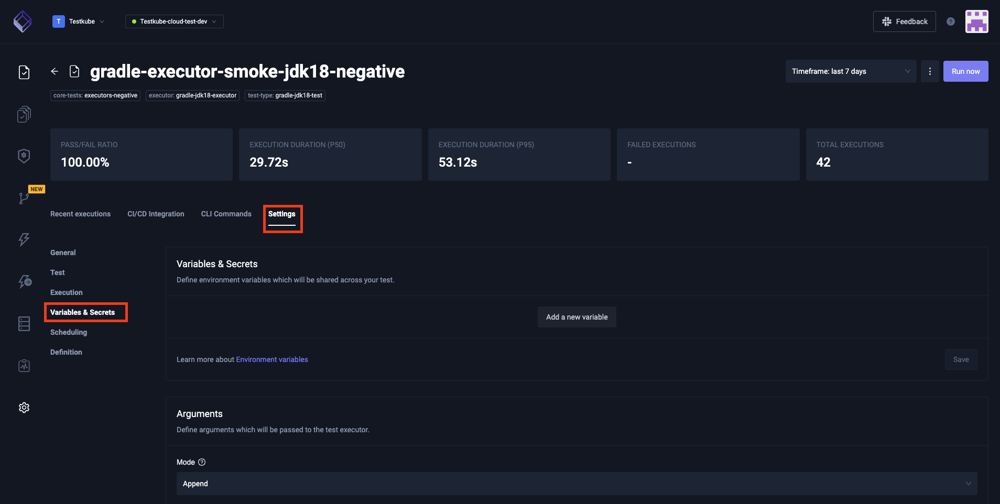
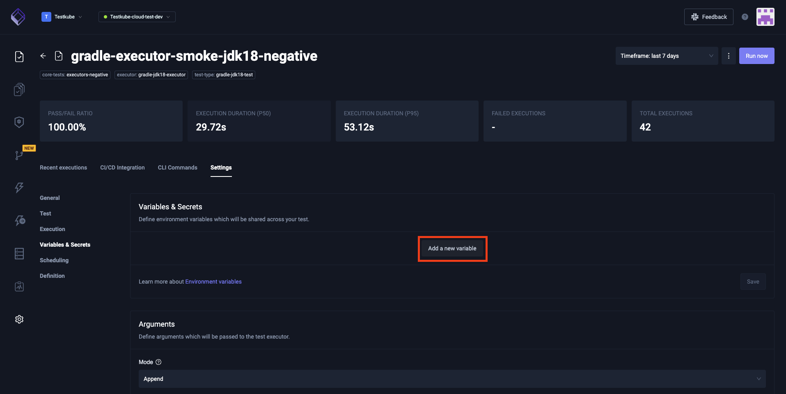
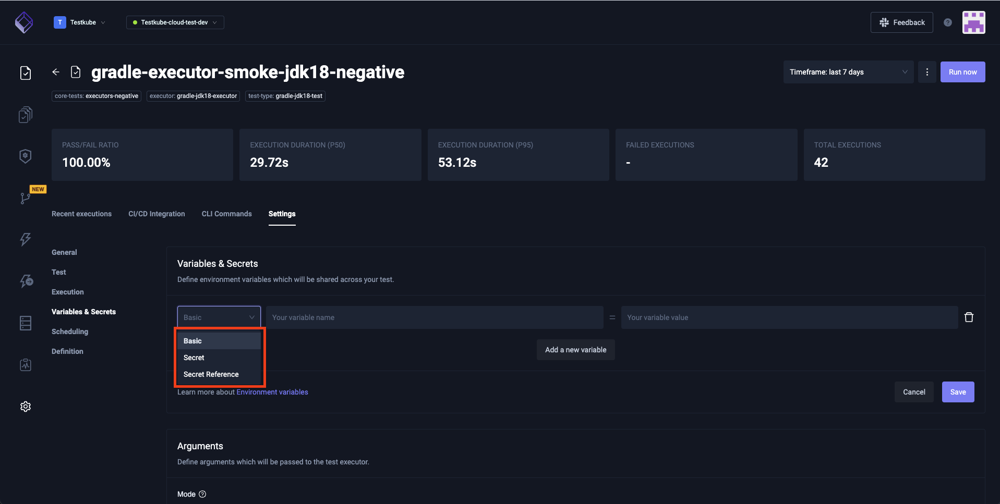

import Tabs from "@theme/Tabs";
import TabItem from "@theme/TabItem";

# Using Test Variables

<Tabs>
<TabItem value="dashboard" label="Dashboard" default>

To synchronize Testkube's feature set between the Testkube CLI and the Testkube Dashboard, Test Variables can be defined in the Testkube Dashboard. On the Tests screen, select a Test and click on the **Settings** tab and select **Variables & Secrets**:



Any variables already existing for that Test will be shown. To create a Test variable, click **Add Variable** and provide desired values.





The types available for Test variables are Basic, Secret and Secret Reference. 

</TabItem>

<TabItem value="cli" label="CLI">

Depending on the type of the variables, the CLI offers multiple options on how to set these. Check
the details on the [testkube create test](../cli/testkube_create_test.md) command.

```bash
  -s, --secret-variable stringArray                execution secret variable passed to executor
      --secret-variable-reference stringToString   secret variable references in a form name1=secret_name1=secret_key1 (default [])
  -v, --variable stringArray                       variable key value pair: --variable key1=value1
      --variable-configmap stringArray             config map name used to map all keys to basis variables
      --variable-secret stringArray                secret name used to map all keys to secret variables
      --variables-file string                      variables file path, e.g. postman env file - will be passed to executor if supported
```

</TabItem>

<TabItem value="crd" label="CRD">

Setting basic and secret variables is also possible on the CRD level. They should be under the `executionRequest` key. Consult the example below.

```yaml
apiVersion: tests.testkube.io/v3
kind: Test
metadata:
  name: example-test
  namespace: testkube
  labels:
    executor: curl-container-executor
    test-type: curl-container-test
spec:
  type: curl-container/test
  executionRequest:
    variables:
      BASIC_VAR_NAME:
        name: BASIC_VAR_NAME
        value: "BASIC_VAR_VALUE"
        type: basic
      SECRET_REF_VAR_NAME:
        name: SECRET_REF_VAR_NAME
        type: secret
        valueFrom:
          secretKeyRef:
            name: SECRET_REF_SECRET_NAME
            key: SECRET_REF_KEY
      SECRET_VAR_NAME:
        name: SECRET_VAR_NAME
        type: secret
        valueFrom:
          secretKeyRef:
            name: example-test-testvars
            key: SECRET_VAR_NAME
```

</TabItem>

</Tabs>
