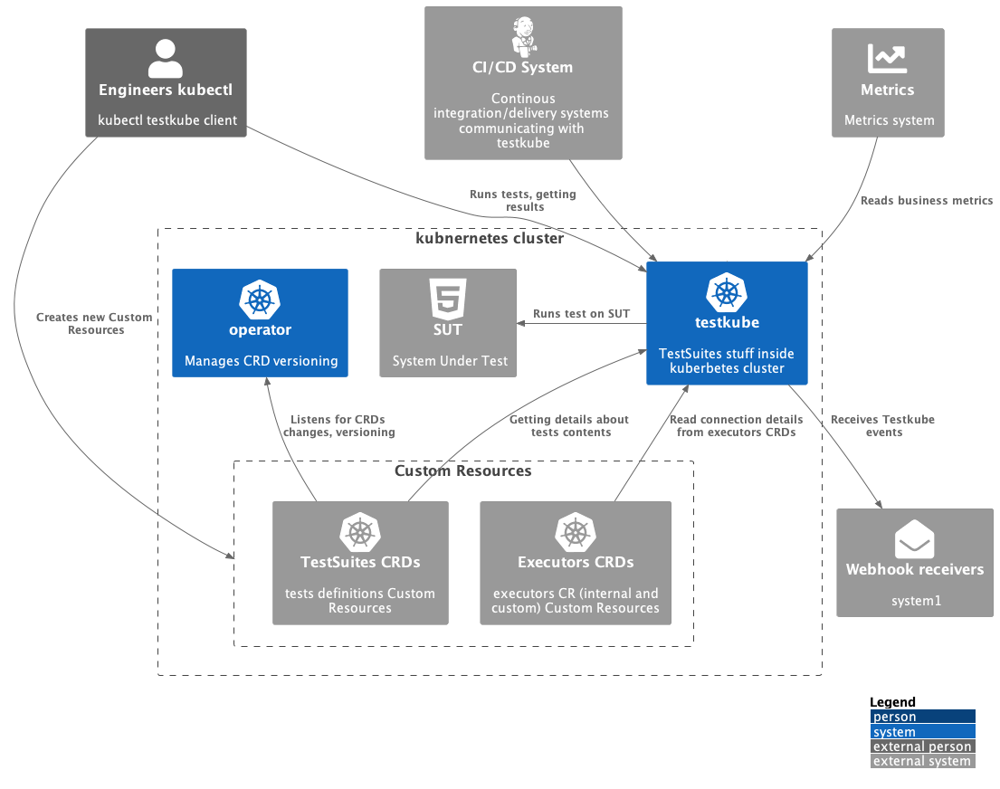
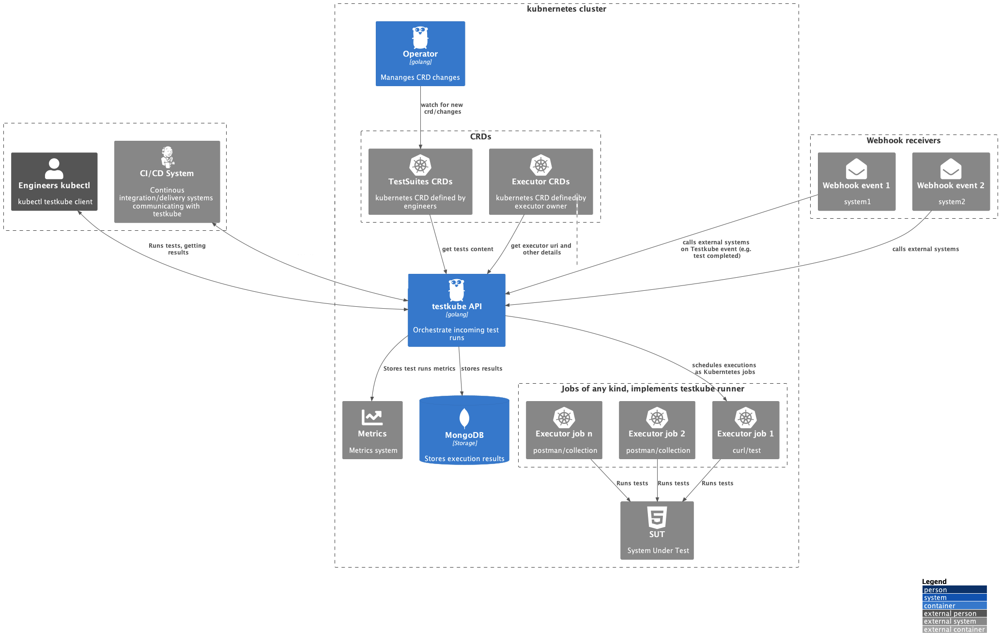
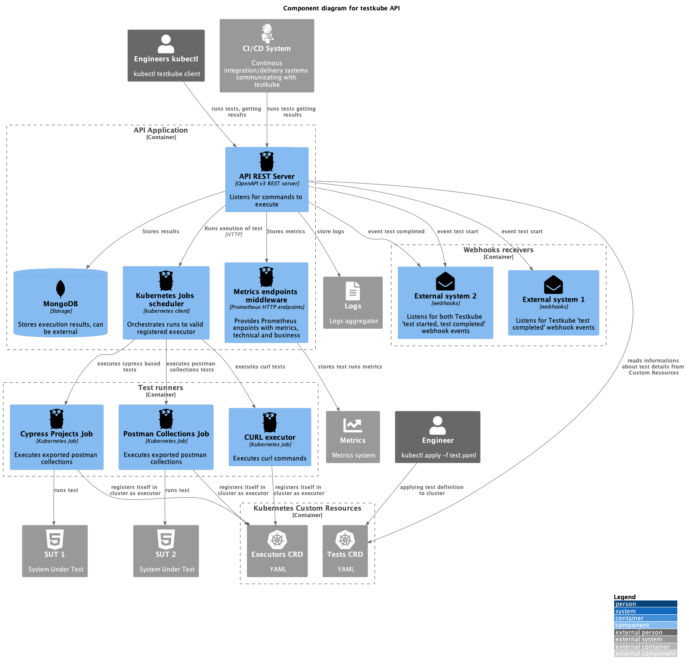
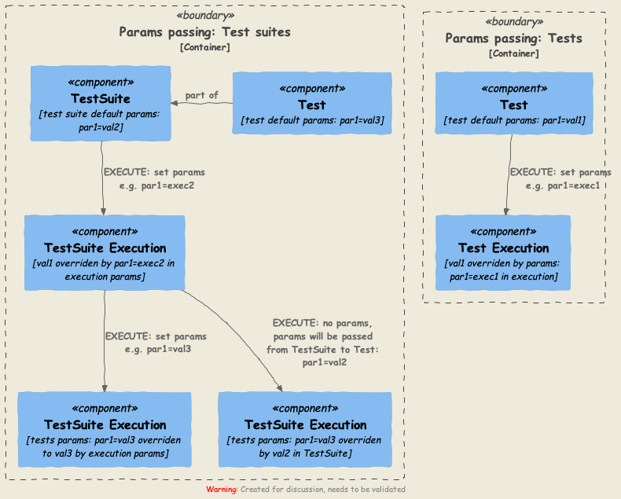

# Architecture

## Info

These diagrams were made with the C4 diagram technique
(<https://c4model.com/>). They describe the structure of Testkube Core OSS.

## Diagrams

### System Context

### Containers

See also [Dependencies for Testkube](../articles/testkube-dependencies.md) describing NATS, MinIO and MongoDB dependencies.

### Components

#### API

### TestSuites and Tests

Parameters passed through tests suites and tests priority: 

1. Test Suite execution variables overrides.
2. Test Suite variables overrides.
3. Test execution (variables passed for single test runs) overrides.
4. Test variables.

