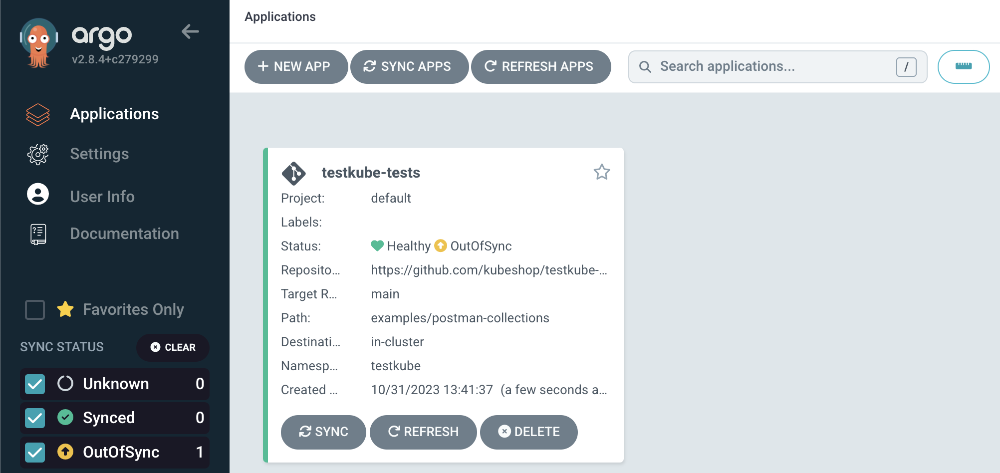
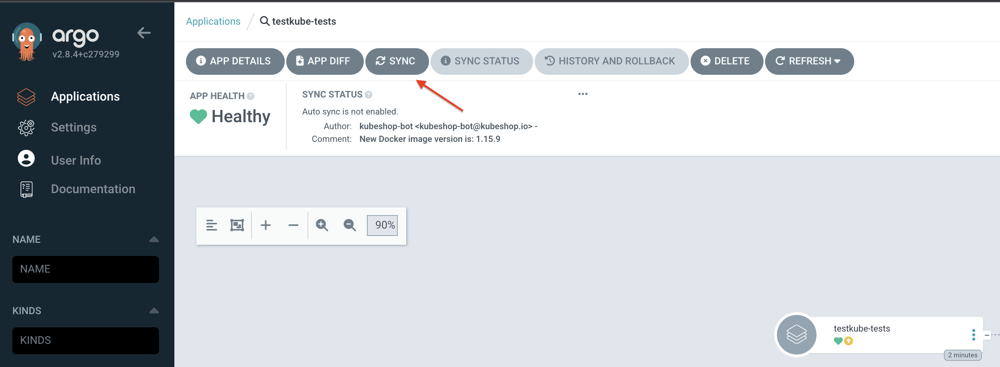
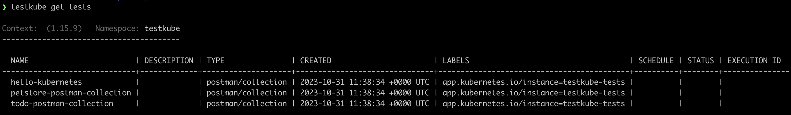
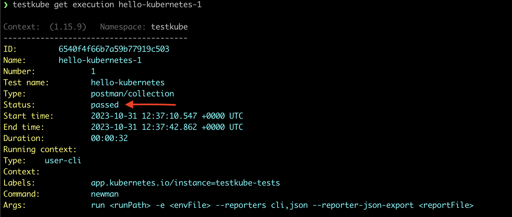
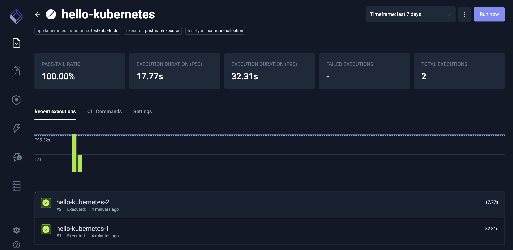

# Gitops Testing with ArgoCD

The following is a step-by-step walkthrough to test the automated application deployment and execution of Postman collections in a local Minikube cluster.

Let’s start with setting things up for our GitOps-powered testing machine!

## Tutorial

### 1. Make sure you have Testkube installed in your cluster.

If you haven't installed Testkube in your cluster yet, visit the [Getting Started guide](./getting-started) for a walkthrough on installing Testkube.
‍
### 2. Install ArgoCD.

Follow the [ArgoCD Installation Guide](https://argo-cd.readthedocs.io/en/stable/getting_started/).

Note: For step 3 in the guide, “Access The Argo CD API Server”, choose the “Port Forwarding” method, as that is the easiest way to connect to it with a Minikube cluster.

### 3. Install a “Hello Kubernetes!” application in your cluster.

We will create a YAML file for a simple `Hello Kubernetes` application that we will create our integration tests against.

Create the following `Deployment` file:

```yaml title="hello-kubernetes.yaml"
apiVersion: v1
kind: Service
metadata:
  name: hello-kubernetes-service
spec:
  ports:
    - name: http
      port: 80
      targetPort: 8080
  selector:
    app: hello-kubernetes
---
apiVersion: apps/v1
kind: Deployment
metadata:
  name: hello-kubernetes-deployment
spec:
  replicas: 1
  selector:
    matchLabels:
      app: hello-kubernetes
  template:
    metadata:
      labels:
        app: hello-kubernetes
    spec:
      containers:
        - name: hello-kubernetes
          image: gcr.io/google-samples/kubernetes-bootcamp:v1
          ports:
            - containerPort: 8080
```

And deploy the `Hello Kubernetes` deployment with:

```sh
kubectl apply -f hello-kubernetes.yaml
```

You can test that your application has been correctly installed by running:

```sh
kubectl get svc -n default hello-kubernetes-service
```

### 4. Set up a Git Repository containing some Postman collections.

We are going to use tests created by Postman and exported in a [Postman collections file](https://www.postman.com/collection/).

We can upload this to the same Git Repository as our application, but in practice the repository could be the same repository hosting the application or it could also be in a separate repository where you manage all your test artifacts.

So let’s create our `hello-kubernetes.json` in `postman-collections` folder and push it to the repository.

```json title="hello-kubernetes.json"
{
  "info": {
    "_postman_id": "02c90123-318f-4680-8bc2-640adabb45e8",
    "name": "New Collection",
    "schema": "https://schema.getpostman.com/json/collection/v2.1.0/collection.json"
  },
  "item": [
    {
      "name": "hello-world test",
      "event": [
        {
          "listen": "test",
          "script": {
            "exec": [
              "pm.test(\"Body matches string\", () => {",
              "    pm.expect(pm.response.text()).to.contain(\"Hello Kubernetes\")",
              "})",
              "",
              "pm.test(\"Body matches string\", () => {",
              "    pm.expect(pm.response.status).to.equal(\"OK\")",
              "})"
            ],
            "type": "text/javascript"
          }
        }
      ],
      "request": {
        "method": "GET",
        "header": [],
        "url": {
          "raw": "http://hello-kubernetes-service.default",
          "protocol": "http",
          "host": ["hello-kubernetes-service", "default"]
        }
      },
      "response": []
    }
  ]
}
```

You can see an example of how the repository should look [here](https://github.com/kubeshop/testkube-argocd).

### 5. Configure ArgoCD to use the Testkube plugin.

To get ArgoCD to use Testkube, we need to write a Config Management [plugin](https://argo-cd.readthedocs.io/en/stable/operator-manual/config-management-plugins/#configmap-plugin). 
To do so, please nest the plugin config file in a `ConfigMap` manifest under the `plugin.yaml` key.

```yaml title="argocd-plugins.yaml
apiVersion: v1
kind: ConfigMap
metadata:
  name: argocd-cm-plugin
  namespace: argocd
data:
  plugin.yaml: |
    apiVersion: argoproj.io/v1alpha1
    kind: ConfigManagementPlugin
    metadata:
      name: testkube
    spec:
      version: v1.0
      generate:
        command: [bash, -c]
        args:
          - |
            testkube generate tests-crds .
```

And apply it with the following command:

```sh
kubectl apply -f argocd-plugins.yaml
```
As you can see here, we’re using the command `testkube generate tests-crds` which creates the Custom Resources (manifests) that ArgoCD will then add to our cluster. 

### 6. Patch ArgoCD's deployment

To install a plugin, patch `argocd-repo-server` deployment to run the plugin container as a sidecar.

```yaml title="deployment.yaml"
apiVersion: apps/v1
kind: Deployment
metadata:
  name: argocd-repo-server
spec:
  template:
    spec:
      containers:
      - name: testkube
        command: [/var/run/argocd/argocd-cmp-server]
        image: kubeshop/testkube-argocd:latest
        securityContext:
          runAsNonRoot: true
          runAsUser: 999
        volumeMounts:
          - mountPath: /var/run/argocd
            name: var-files
          - mountPath: /home/argocd/cmp-server/plugins
            name: plugins
          - mountPath: /home/argocd/cmp-server/config/plugin.yaml
            subPath: plugin.yaml
            name: argocd-cm-plugin
          - mountPath: /tmp
            name: cmp-tmp
      volumes:
        - configMap:
            name: argocd-cm-plugin
          name: argocd-cm-plugin
        - emptyDir: {}
          name: cmp-tmp
```

Apply the patch with the command:

```sh
kubectl patch deployments.apps -n argocd argocd-repo-server --patch-file deployment.yaml
```

### 7. Configure an ArgoCD application to manage test collections in your cluster.

Create the file that will contain the ArgoCD application.

```yaml title="testkube-application.yaml"
apiVersion: argoproj.io/v1alpha1
kind: Application
metadata:
 name: testkube-tests
 namespace: argocd
spec:
 project: default
 source:
   repoURL: https://github.com/USERNAME/testkube-argocd.git
   targetRevision: HEAD
   path: postman-collections
   plugin:
     name: "testkube-v1.0"
 destination:
   server: https://kubernetes.default.svc
   namespace: testkube
```

Notice that we have defined the path `postman-collections` which is the test folder with our Postman collections from the steps earlier. With Testkube you can use multiple test executors like `curl`, for example, so it is convenient to have a folder for each. We have also defined the `.destination.namespace` to be `testkube`, which is where the tests should be deployed in our cluster.
‍

Now let’s create the application with:

```sh
kubectl apply -f testkube-application.yaml
```

### 8. Run the initial ArgoCD sync and check your cluster.

On ArgoCD’s dashboard, we will now see the newly created application. Let’s click to get into it and sync our tests.




And now click on `Sync` to see your tests created.





Voilà! Our test collection is created and managed by ArgoCD with every new test created and updated in the GitHub repository containing the tests!


### 9. Run ad-hoc tests from the CLI.

List the tests in your cluster with:

```sh
testkube get tests
```

You should see your deployed test artifacts:





To run those tests execute the following command:

```sh
testkube run test hello-kubernetes
```


‍
The test execution will start in the background. Copy the command from the image below to check the result of the execution of the test:


```sh
$ testkube get execution EXECUTION_ID
```

‍You should see that the tests have run successfully, as in the image below.




### 10. See test results in the Testkube Pro dashboard.

You can also see the results of your tests in a nice dashboard. Open the Testkube dashboard with the following command:

```sh
testkube dashboard
```


And you will be able to see the results of the execution in the Executions tab as seen in the image below:




We now have an automated test deployment and execution pipeline based on GitOps principles!

### 11. Allow adding ownerReferences to CronJobs metadata for Tests and Test Suites

You will need to enable the Helm chart variable `useArgoCDSync = true` in order to make CronJobs created for Tests and Test Suites syncronized in ArgoCD.

## GitOps Takeaways

Once fully realized - using GitOps for testing of Kubernetes applications as described above provides a powerful alternative to a more traditional approach where orchestration is tied to your current CI/CD tooling and not closely aligned with the lifecycle of Kubernetes applications.

We would love to get your thoughts on the above approach - over-engineering done right? Waste of time? Let us know on [our Slack Channel](https://testkubeworkspace.slack.com/join/shared_invite/zt-2arhz5vmu-U2r3WZ69iPya5Fw0hMhRDg#/shared-invite/email)!
