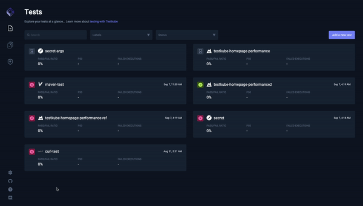

# Common Issues

## How do I expose Testkube to the Internet?

To expose Testkube to the Internet, you will need to create an Ingress for both the Testkube API and the Testkube dashboard.

Check the guides [here](./going-to-production.md) for different configurations.

## Why is the Testkube Dashboard not working or does not return results?

- Make sure the API endpoint is configured:



- Make sure the endpoint is providing data, e.g. accessing the executors path:

```sh
curl <endpoint>/v1/executors
```

- If no data is provided, make sure that all the Testkube components are running properly:

```sh
kubectl get pods -n testkube
```

```sh title="Expected output:"
NAME                                                        READY   STATUS    RESTARTS   AGE
pod/testkube-api-server-8445fd7b9f-jq5rh                    1/1     Running   0          10d
pod/testkube-dashboard-99f4c6cf5-x4dkz                      1/1     Running   0          12d
pod/testkube-minio-testkube-76786f8f64-9nl4c                1/1     Running   1          24d
pod/testkube-mongodb-74587998bb-8pzl2                       1/1     Running   0          12d
pod/testkube-operator-controller-manager-77ffbb8fdc-rxhvx   2/2     Running   0          5d23h
```

## Opening the Dashboard Using CLI Is Not Working

If there is a timeout error reported:

```sh
testkube dashboard
```

```sh title="Expected output:"
checking readiness of services (error: timed-out waiting for dashboard and api)
```

Make sure that there is not another dashboard process running in the background like in the example below:

```sh
ps aux | grep dashboard
```

```sh title="Expected output:"
user         76005   0.0  0.0 408628368   1648 s002  S+   12:32PM   0:00.00 grep dashboard
user         75985   0.0  0.1 409292320  43584 s001  S+   12:32PM   0:00.12 kubectl port-forward --namespace testkube deployment/testkube-dashboard 8080:8080
user         75984   0.0  0.1 409263376  37488 s001  S+   12:32PM   0:00.22 testkube dashboard
```

Also, there might be some other process listening on the same port. To debug this, try port-forwarding manually:

```sh
kubectl port-forward svc/testkube-dashboard 8080
kubectl port-forward svc/testkube-api-server 8088
```

Check for errors and try accessing:
[http://localhost:8081/apiEndpoint?apiEndpoint=localhost:8088/v1](http://localhost:8081/apiEndpoint?apiEndpoint=localhost:8088/v1)

If you see errors like:

```
Unable to listen on port 8080: Listeners failed to create with the following errors: [unable to create listener: Error listen tcp4 127.0.0.1:8080: bind: address already in use unable to create listener: Error listen tcp6 [::1]:8080: bind: address already in use]
error: unable to listen on any of the requested ports: [{8080 8080}]
```

Please stop the application that listens on 8080, 8088 ports.

## Access the Service Under Test (SUT) Using Testkube

- Services inside the same Kubernetes cluster can be accessed using the address `\<service-name\>.\<service-namespace\>.svc.cluster.local:\<port-number\>`. If there are network restrictions configured, Testkube will need permissions to access the SUT over the local network of the cluster.
- If Testkube and the SUT are not in the same cluster, SUT will have to be exposed to Testkube using an Ingress or a Load Balancer.

## If You're Still Having Issues

If these guides do not solve the issue that you encountered or you have other questions or comments, please contact us on [Discord](https://discord.com/invite/6zupCZFQbe).

## Other Installation Methods

### Installation on OpenShift deployed on GCP

To install Testkube you need an empty OpenShift cluster. Once the cluster is up and running update `values.yaml` file, including the configuration below.

1. Add security context for MongoDB to `values.yaml`:

```yaml
mongodb:
  securityContext:
    enabled: true
    fsGroup: 1000650001
    runAsUser: 1000650001
  podSecurityContext:
    enabled: false
  containerSecurityContext:
    enabled: true
    runAsUser: 1000650001
    runAsNonRoot: true
  volumePermissions:
    enabled: false
  auth:
    enabled: false
```

2. Add security context for `Patch` and `Migrate` jobs that are a part of Testkube Operator configuration to `values.yaml`:

```yaml
testkube-operator:
  webhook:
    migrate:
      enabled: true
      securityContext:
        allowPrivilegeEscalation: false
        capabilities:
          drop: ["ALL"]

    patch:
      enabled: true
      securityContext:
        runAsNonRoot: true
        runAsUser: 1000650000
        fsGroup: 1000650000
```

3. Install Testkube specifying the path to the new `values.yaml` file

```
helm install testkube kubeshop/testkube --create-namespace --namespace testkube --values values.yaml
```

Please notice that since we've just installed MongoDB with a `testkube-mongodb` Helm release name, you are not required to reconfigure the Testkube API MongoDB connection URI. If you've installed with a different name/namespace, please adjust `--set testkube-api.mongodb.dsn: "mongodb://testkube-mongodb:27017"` to your MongoDB service.

### Installation with S3 Storage and IAM Authentication

To use S3 as storage, the steps are as follows:

1. Create a ServiceAccount with the ARN specified.
   e.g.

```yaml
apiVersion: v1
kind: ServiceAccount
metadata:
  annotations:
    eks.amazonaws.com/role-arn: arn:aws:iam::265500248336:role/minio-example
  name: s3-access
  namespace: testkube
```
In the Helm values.yaml file:
2. Add the ARN annotation from above to `testkube-api.serviceAccount.annotations`.
3. Link the ServiceAccount to the `testkube-api.minio.serviceAccountName` and to `testkube-api.jobServiceAccountName`.
4. Leave `minio.minioRootUser`, `minio.minioRootPassword` and `storage.port` empty.
5. Set `storage.endpoint` to `s3.amazonaws.com`.

6. Install using Helm and the values file with the above modifications.

## Observability

There are two types of storage Mongo and Minio, read more details [here](./logging.md).
