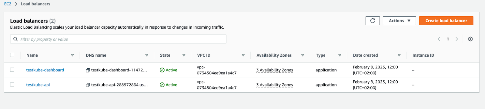
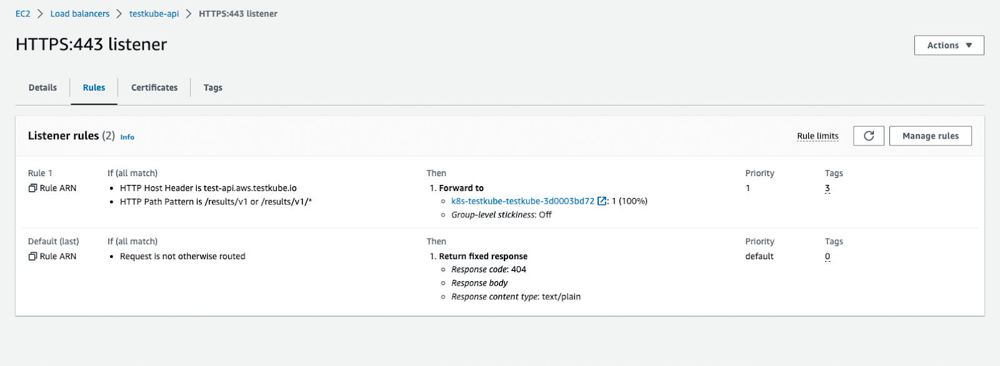
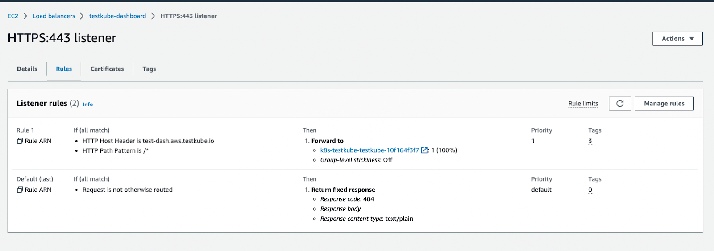
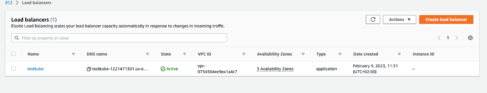

# Guide to Deploying Testkube on AWS

If you are using **Amazon Web Services**, this tutorial will show you how to deploy Testkube in EKS and expose it to the Internet with the AWS Load Balancer Controller.

## Prerequisites

First, we will need an existing Kubernetes cluster. Please see the official documentation on how to get started with an Amazon EKS cluster [here](https://docs.aws.amazon.com/eks/latest/userguide/getting-started.html).

Once the cluster is up and running we need to deploy the AWS Load Balancer Controller. For more information, see [Installing the AWS Load Balancer Controller add-on](https://docs.aws.amazon.com/eks/latest/userguide/aws-load-balancer-controller.html).

Another important point is [ExternalDNS](https://github.com/kubernetes-sigs/external-dns). It is not compulsory to deploy it into your cluster, but it helps you dynamically manage your DNS records via k8s resources.

And last, but not least - install the Testkube CLI. You can download a binary file from our [installation](./install-cli) page. For how to deploy Testkube to your cluster with all the necessary changes, please see the next section.

:::caution

Please mind that is it necessary to install [EBS CSI driver](https://docs.aws.amazon.com/eks/latest/userguide/ebs-csi.html) to mount PV into your k8s cluster.

:::

## Ingress and Service Resources Configuration

To deploy and expose Testkube to the outside world, you will need to create an ingress for Testkube's API server. In this tutorial, we will be updating `values.yaml` that later will be passed to the `helm install` command.

In order to use the AWS Load Balancer Controller we need to create a `values.yaml` file and add the following annotation to the Ingress resources:

```yaml
annotations:
  kubernetes.io/ingress.class: alb
```

Once this annotation is added, Controller creates an ALB and the necessary supporting AWS resources.

The example configuration using HTTPS protocol might look like the following:

**Testkube API Ingress:**

```yaml
uiIngress:
  enabled: true
  annotations:
    kubernetes.io/ingress.class: alb
    alb.ingress.kubernetes.io/load-balancer-name: testkube-api
    alb.ingress.kubernetes.io/target-type: ip
    alb.ingress.kubernetes.io/backend-protocol: HTTP
    alb.ingress.kubernetes.io/listen-ports: '[{"HTTP": 80},{"HTTPS": 443}]'
    alb.ingress.kubernetes.io/scheme: internet-facing
    alb.ingress.kubernetes.io/healthcheck-path: "/health"
    alb.ingress.kubernetes.io/healthcheck-port: "8088"
    alb.ingress.kubernetes.io/ssl-redirect: "443"
    alb.ingress.kubernetes.io/certificate-arn: "arn:aws:acm:us-east-1:*******:certificate/*****"
  path: /v1
  hosts:
    - test-api.aws.testkube.io
```

Once we are ready with the `values.yaml` file, we can deploy Testkube into our cluster:

```sh
helm repo add kubeshop https://kubeshop.github.io/helm-chart

helm repo update

helm install --create-namespace testkube kubeshop/testkube --namespace testkube --values values.yaml
```

After the installation command is complete, you will see the following resources created into your AWS Console.







Please note that the annotations may vary, depending on your Load Balancer schema type, backend-protocols (you may use http only), target-type, etc. However, this is the bare minimum that should be applied to your configuration.

## Expose Testkube with Only One Load Balancer

The above configuration creates two Load Balancers - one for the Dashboard, another is for the API. However, it is possible to save costs and use only 1 Balancer, thus you need to create only one Ingress manifest that will comprise configuration for both services:

```yaml
apiVersion: networking.k8s.io/v1
kind: Ingress
metadata:
  name: testkube-ingress
  annotations:
    kubernetes.io/ingress.class: alb
    alb.ingress.kubernetes.io/load-balancer-name: testkube
    alb.ingress.kubernetes.io/target-type: ip
    alb.ingress.kubernetes.io/backend-protocol: HTTP
    alb.ingress.kubernetes.io/listen-ports: '[{"HTTP": 80},{"HTTPS": 443}]'
    alb.ingress.kubernetes.io/scheme: internet-facing
    alb.ingress.kubernetes.io/ssl-redirect: "443"
    alb.ingress.kubernetes.io/certificate-arn: "arn:aws:acm:us-east-1:*****:certificate/******"
spec:
  rules:
    - host: test-dash.aws.testkube.io
      http:
        paths:
          - path: /
            pathType: Prefix
            backend:
              service:
                name: testkube-dashboard
                port:
                  number: 8080
    - host: test-api.aws.testkube.io
      http:
        paths:
          - path: /v1
            pathType: Prefix
            backend:
              service:
                name: testkube-api-server
                port:
                  number: 8088
```

Except for the Ingress annotation, you need to update the Service manifests with a healthcheck configuration as well. Include the lines below into your `values.yaml` file.

**Testkube Dashboard Service:**

```yaml
service:
  type: ClusterIP
  port: 8080
  annotations:
    alb.ingress.kubernetes.io/healthcheck-path: "/"
    alb.ingress.kubernetes.io/healthcheck-port: "8080"
```

**Testkube API Service:**

```yaml
service:
  type: ClusterIP
  port: 8088
  annotations:
    alb.ingress.kubernetes.io/healthcheck-path: "/health"
    alb.ingress.kubernetes.io/healthcheck-port: "8088"
```

:::caution

Do not forget to add `apiServerEndpoint` to the values.yaml for `testkube-dashboard`, e.g.: `apiServerEndpoint: "test-api.aws.testkube.io/v1"`.

:::

This way we will have 1 Load Balancer with a listener rule pointing to the corresponding path:



## Examples of AWS S3 Bucket configuration

If you plan to use AWS S3 Bucket for storing test artifacts, you can follow below examples

**Terraform aws iam policy:**

```json
data "aws_iam_policy_document" "testkube" {
  statement {
    sid    = "S3Buckets"
    effect = "Allow"
    actions = [
      "s3:ListAllMyBuckets", # see https://github.com/kubeshop/testkube/issues/3965
    ]
    resources = [
      "arn:aws:s3:::*",
    ]
  }
  statement {
    sid    = "S3Bucket"
    effect = "Allow"
    actions = [
      "s3:ListBucket",
      "s3:GetBucketLocation",
    ]
    resources = [
      "arn:aws:s3:::*-testkube-${terraform.workspace}",
    ]
  }
  statement {
    sid    = "S3Object"
    effect = "Allow"
    actions = [
      "s3:GetObject*",
      "s3:PutObject*",
      "s3:DeleteObject",
    ]
    resources = [
      "arn:aws:s3:::*-testkube-${terraform.workspace}/*",
    ]
  }
```

**Teskube helm values:**

```yaml
  testkube-api:
    jobServiceAccountName: testkube-api-server # reuse the service-account from testkube-api
    minio:
      enabled: true # required to be able to access AWS S3 (minio is used as a proxy)
      minioRootUser: ""
      minioRootPassword: ""
      serviceAccountName: testkube-api-server # reuse the service-account from testkube-api
    serviceAccount:
      annotations:
        eks.amazonaws.com/role-arn: arn:aws:iam::111111111111:role/my-dev-testkube
    storage:
      endpoint: s3.amazonaws.com
      accessKeyId: ""
      accessKey: ""
      location: eu-central-1
      bucket: my-testkube-dev
      SSL: true
      endpoint_port: ""
    logs:
      storage: "minio"
      bucket: my-testkube-dev
```

## Give it a go!

With just a few changes you can deploy Testkube into an EKS cluster and expose it to the outside world while all the necessary resources are created automatically.

If you have any questions you can [join our Slack Channel](https://testkubeworkspace.slack.com/join/shared_invite/zt-2arhz5vmu-U2r3WZ69iPya5Fw0hMhRDg#/shared-invite/email) or, if you have any ideas for other useful features, you can create feature requests at our [GitHub Issues](https://github.com/kubeshop/testkube) page.
