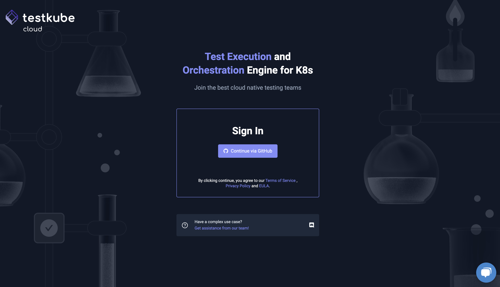
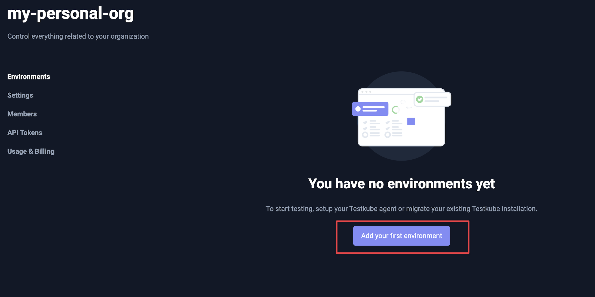

# Overview

Testkube is a Kubernetes-native test orchestration and execution framework that allows you to automate the executions of your existing testing tools inside your Kubernetes cluster, removing all the complexity from your CI/CD pipelines.

To get started, you can follow the instructions in Testkube Pro, or watch this video for a step-by-step walkthrough. 

<iframe width="100%" height="315" src="https://www.youtube.com/embed/wYldGtOB7HY?si=l5p8liIheddEMy9u" title="Video tutorial: Installing Testkube Pro" frameborder="0" allow="accelerometer; autoplay; clipboard-write; encrypted-media; gyroscope; picture-in-picture; web-share" allowfullscreen></iframe>


## Step 1: Sign up for Testkube Pro 
[Create an account](https://app.testkube.io/) using GitHub or GitLab. 



## Step 2: Connect Your Kubernetes Cluster
1. Select “Add your first environment” in the UI.




2. Name your environment.


3. Deploy the Testkube agent in your cluster by copying our Helm or Testkube CLI command.


## Step 3: Create Your First Test 

Visit [Creating Your First Test](./creating-first-test.md) for our easy to follow guide.

With Testkube you can run any kind of test in Kubernetes. Check out our [native integrations](https://docs.testkube.io/category/test-types/) or use the container executor to create your own.


### Validating the Installation 

Testkube Pro will notify if the installation is successful. 

* A green indicator means that your cluster was able to connect to the Testkube Pro.
* A red indicator indicates that the Testkube Agent can't connect to the Testkube Pro API (Testkube needs some time to establish a connection, max time is 2-3 minutes).


In the case of a RED status you can try to debug the issues with the command below:

```sh 
testkube agent debug
```
By default, Testkube is installed in the `testkube` namespace.

## Need Help? 

- Join our community on [Slack](https://testkubeworkspace.slack.com/join/shared_invite/zt-2arhz5vmu-U2r3WZ69iPya5Fw0hMhRDg#/shared-invite/email).
- [Schedule a call](https://calendly.com/bryan-3pu/support-product-feedback-call?month=2023-10) with one of our experts. 
- Check out our guides. 
  - [Integrating Testkube with your CI/CD](https://docs.testkube.io/articles/cicd-overview/).
  - Setup [webhooks](https://testkube.io/blog/empowering-kubernetes-tests-with-webhooks) to get notified in slack,teams,pagerduty, etc… when tests fail.


