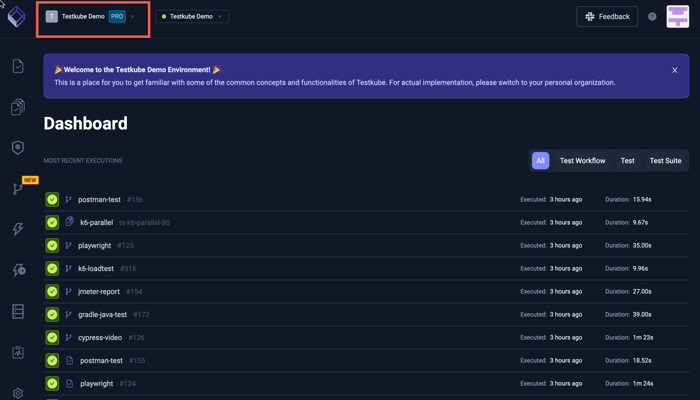

# Quickstart without Kubernetes

Local evaluation of Testkube requires you to have access to a Kubernetes cluster, either running locally on your machine or
remotely in some cloud provider like AWS, Google, Azure, etc.

If you don't have access to a Kubernetes cluster for evaluating Testkube you have two options:
1. Evaluate Testkube using the Saas Version available at [app.testkube.io](https://app.testkube.io), this includes a demo environment that contains sample resources to help you get started.
2. Install a lightweight Kubernetes cluster locally for evaluation purposes (not as hard as you might think)

Let's have a quick look at how to get started with these two options.

## SaaS Testkube Evaluation

- Go to [app.testkube.io](https://app.testkube.io)
- Sign up to the free plan with either a GitHub or Gitlab account (no credit-card details required).
- After signing in the first time, make sure to select the "Get access to a Demo Environment" option:


- Now you can select the Demo Cluster (it will be preselected) from the Environment Selector in the top right, and see/play with the predefined Tests/Workflows/etc. in it:



## Installing a Lightweight Kubernetes Cluster

There are a number of lightweight Kubernetes distributions that you can install locally on your machine. All of them require Docker Desktop to be installed,
so make sure that is up and running before moving on (download from https://www.docker.com/products/docker-desktop/).

Recommended Kubernetes distributions for local Testkube evaluation are:
- kind - https://kind.sigs.k8s.io/
- minikube - https://minikube.sigs.k8s.io/
- k3s - https://k3s.io/

### Installing Kind on MacOS or Windows

Read all about how to quickly get started with kind at https://kind.sigs.k8s.io/docs/user/quick-start/,
let's have a look how to install kind on macOS using brew:

1. First install kind itself:

```
brew install kind
```

2. Then create a default cluster:

```
kind create cluster
```

Or if you're on Windows and have Chocolatey (https://chocolatey.org/) installed

```
choco install kind
```

Then create a default cluster just as on MacOS above:

```
kind create cluster
```

That's it! Now you can go to the [Testkube Quickstart](quickstart-install.mdx) and pick up from there!

