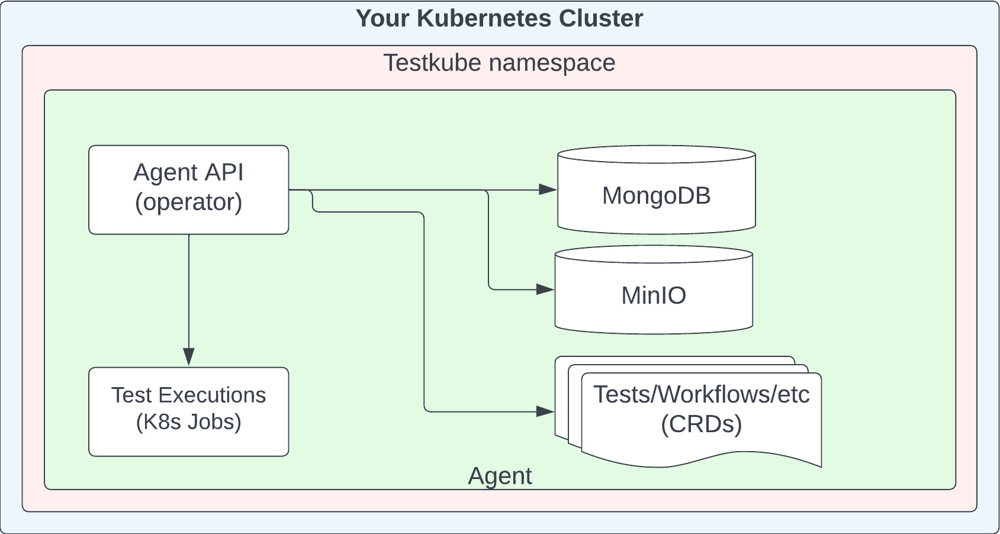
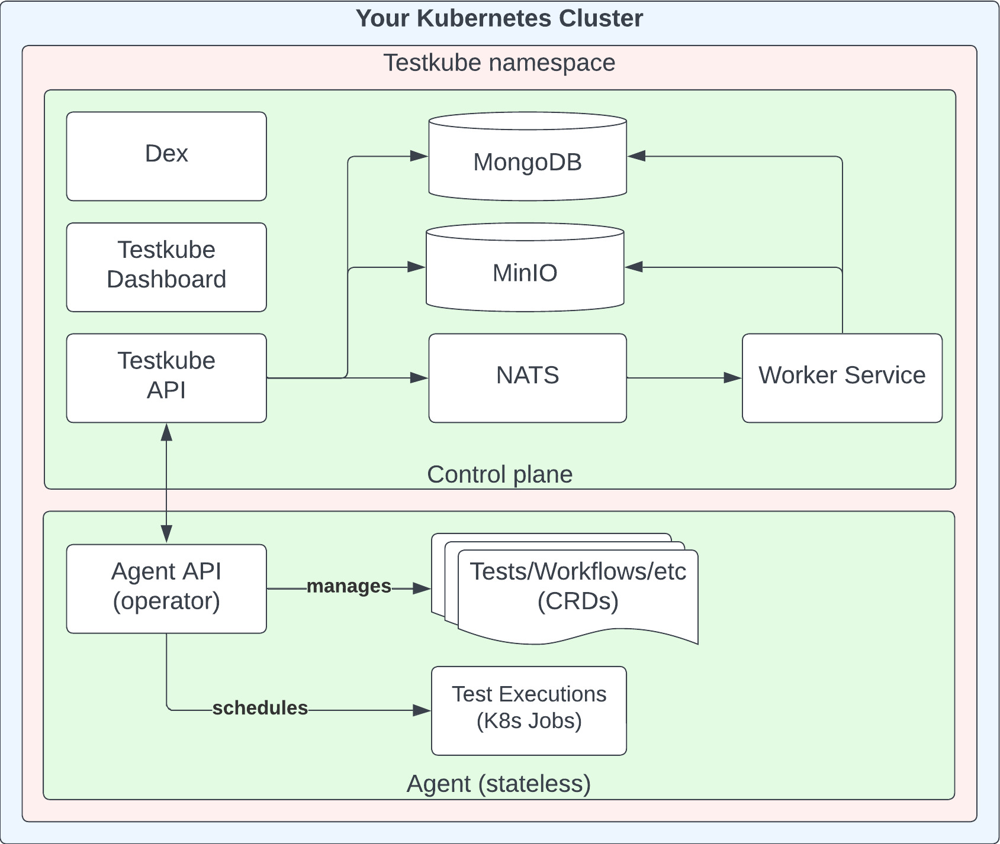
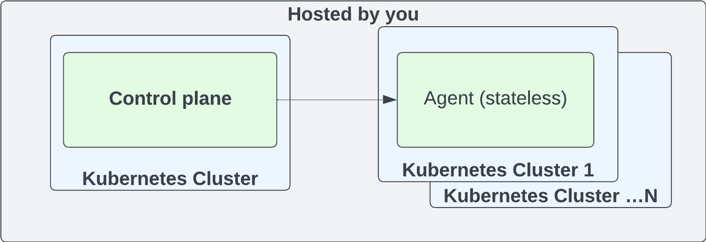
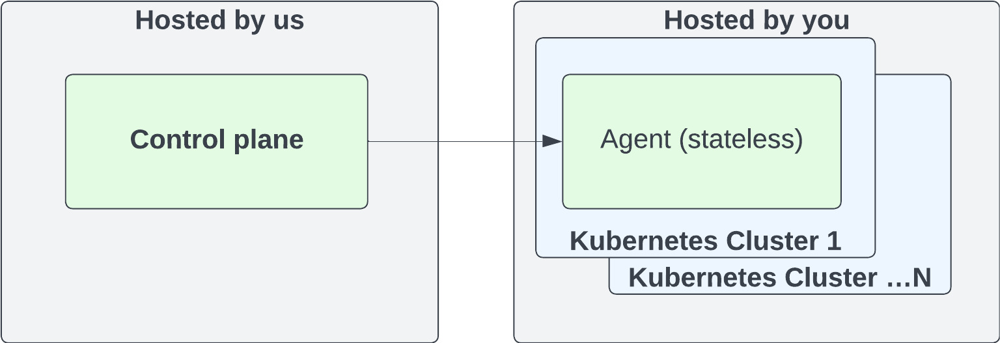

# Reference Architectures

Testkube contains two sub-systems:

- A Control Plane which includes the Dashboard, Storage for Results/Artifacts, Cluster Federation, etc
- An Agent running in your cluster that manages Testkube resources, runs tests, gathers results, etc.

The two sub-systems can be deployed in variety of ways to give flexibility into where your tests are executed and where test logs and artifacts are stored.

## Testkube OSS

Testkube OSS has a standalone agent. It's fully open-sourced and does not require a license. To deploy this you will want to look at [deploying the standalone agent][deploy-standalone].

## Testkube On-Prem

Testkube On-Prem has the control plane and a single agent deployed within the same namespace. You will have one single environment. To deploy this you will want to look at either [deploying the demo][deploy-demo] or [installing with Helm][deploy-with-helm].

You can also try [the quickstart demo][deploy-quickstart].

## Testkube On-Prem Federated

Testkube On-Prem has the control plane in one namespace with multiple agents in other namespaces or clusters. You will create an environment for each of your clusters. To deploy this you will want to look at [installing with Helm][deploy-with-helm] for the control plane and [deploying an agent][deploy-agent] for the agents.

## Testkube Cloud

Testkube Cloud has a control plane that is managed by the Testkube team.
You only have to run a stateless agent which makes operations a breeze.
To get started simply visit https://app.testkube.io.

:::info
Your proprietory code never touches our servers, only test logs and artifacts will be stored.
:::

[cloud]: https://app.testkube.io/
[deploy-quickstart]: /articles/install/quickstart-install
[deploy-standalone]: /articles/install/install-with-cli#deploy-the-open-source-standalone-agent
[deploy-agent]: /articles/install/install-with-cli#deploy-an-agent-that-will-connect-to-a-control-plane
[deploy-demo]: /articles/install/install-with-cli#deploy-an-on-prem-demo
[deploy-with-helm]: /articles/install/install-with-helm
