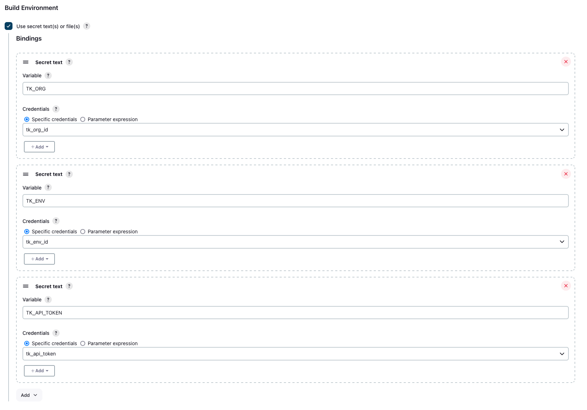
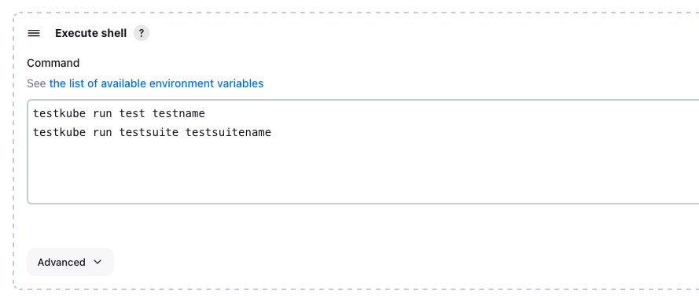

# Testkube Jenkins UI

The Testkube Jenkins integration streamlines the installation of Testkube, enabling the execution of any [Testkube CLI](https://docs.testkube.io/cli/testkube) command within Jenkins Pipelines or Freestyle Projects.  

If you're looking to use Pipelines and Groovy scripts, then look at examples from [Testkube Jenkins Pipelines](./jenkins.md).

### Testkube CLI Jenkins Plugin

Install the Testkube CLI plugin by searching for it in the "Available Plugins" section on Jenkins Plugins, or using the following url:
[https://plugins.jenkins.io/testkube-cli](https://plugins.jenkins.io/testkube-cli)

## Testkube Pro

To use Jenkins CI/CD for [Testkube Pro](https://app.testkube.io/), you need to create an [API token](https://docs.testkube.io/testkube-pro/articles/organization-management/#api-tokens).

### How to set up a Freestyle Project to run tests on Testkube Pro

1. Create a new Freestyle Project.
2. In General settings, configure the environment variables:
   - TK_ORG
   - TK_ENV
   - TK_API_TOKEN
  

3. Click on "Add Build Step" and select "Testkube Setup".

4. Specify a Testkube CLI version or leave it empty to use the latest version.

5. Add a new "Execute Shell" Build Step and run one or multiple Testkube CLI commands.

