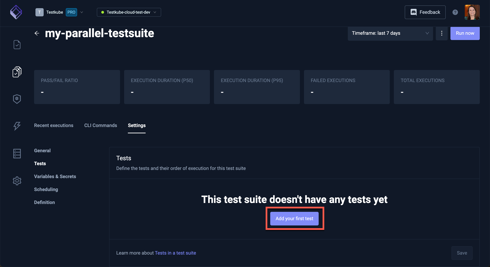
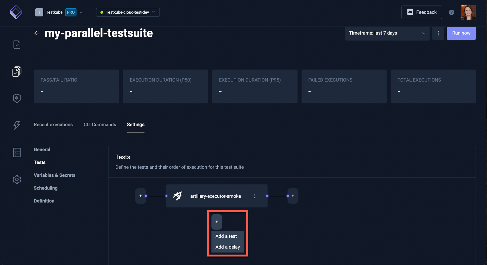
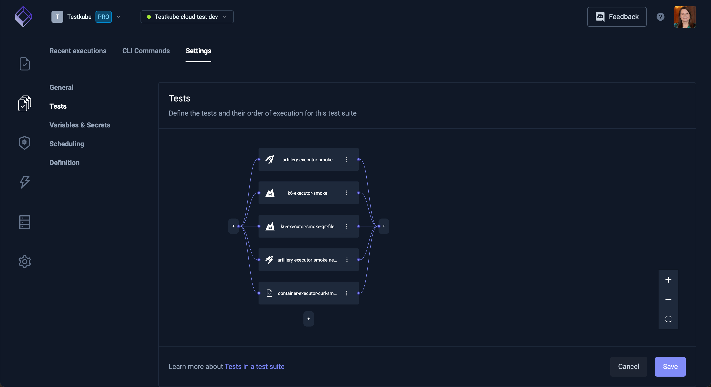

# Advanced Test Orchestration

Creating Test Suites with Tracetest allows for the orchestration of tests. Individual tests that can be run at the same time, in parallel, helps to speed up overall testing.

## Running Parallel Tests in a Test Suite

### Create a Test Suite

In the Testkube Dashboard, on the Test Suite screen, select **Add a new test suite**:

### Add Tests

The new Test Suite will be empty. Click on **Add your first test**:

Continue to add tests to your test suite. You can also add a **delay** when necessary to specify he length of time between certain tests.

For this test suite, we have added 5 tests that all run in parallel:

Here is an example of a Test Suite sequence with 2 tests running in parallel and, when they complete, a single test runs, then 2 addtional parallel tests:

