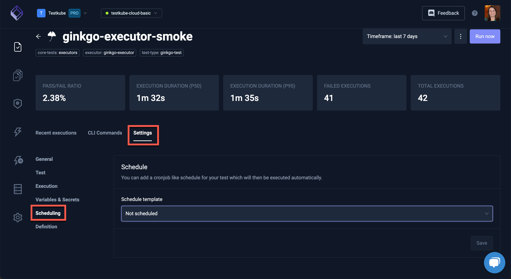
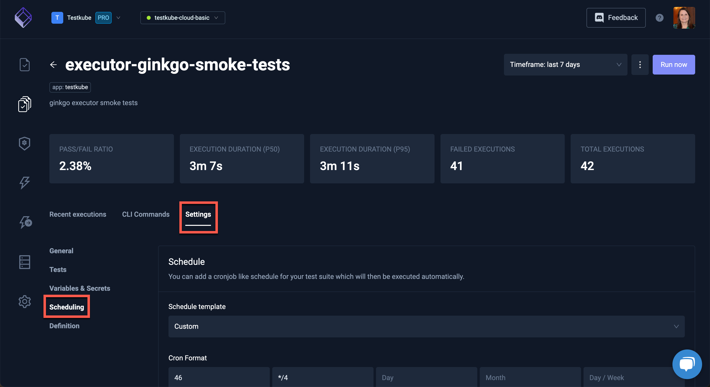

import Tabs from "@theme/Tabs";
import TabItem from "@theme/TabItem";

# Scheduling Tests

<Tabs>
<TabItem value="dashboard" label="Dashboard" default>

## Create a Scheduled Test or Test Suite from the Testkube Dashboard

In order to run Tests and Test Suites on a regular basis, we support a scheduling mechanism for these objects.
CRDs both for Tests and Test Suites contain a **schedule** field used to define rules for launching them in time.
Testkube's schedule data format is the same that is used to define Kubernetes Cron jobs (check Wikipedia Cron format for details <https://en.wikipedia.org/wiki/Cron>).

## Scheduling Architecture

Testkube uses the scheduling engine from Kubernetes Cron jobs.
In fact, for each scheduled Test or Test Suite, a special cron job is created from this [template](ttps://github.com/kubeshop/helm-charts/tree/main/charts/testkube-operator/cronjob-template.yml).

Technically, it is a callback to the Testkube API server method, launching either Test or Test Suite execution.

This works similarly to scheduled Test and Test Suite executions done by external scheduling platforms.

In the Testkube Dashboard, when you have selected a Test or Test Suite, in the **Settings** tab, click on **Scheduling** to create a schedule for the Test or Test Suite.

## Tests




## Test Suites




</TabItem>

<TabItem value="cli" label="CLI">

In order to run Tests and Test Suites on a regular basis, we support a scheduling mechanism for these objects.
CRDs both for Tests and Test Suites contain a **schedule** field used to define rules for launching them in time.
Testkube's schedule data format is the same that is used to define Kubernetes Cron jobs (check [Wikipedia Cron format](https://en.wikipedia.org/wiki/Cron) for details.

## Scheduling Architecture

Testkube uses the scheduling engine from Kubernetes Cron jobs.
In fact, for each scheduled Test or Test Suite, a special cron job is created from this [template](https://github.com/kubeshop/helm-charts/tree/main/charts/testkube-operator/cronjob-template.yml).

Technically, it is a callback to the Testkube API server method, launching either Test or Test Suite execution.
This works similarly to scheduled Test and Test Suite executions done by external scheduling platforms.

## Create a Test with a Schedule

Let's create a test with a required schedule using Testkube CLI command:

```sh
kubectl testkube create test --file test/postman/TODO.postman_collection.json --name scheduled-test --schedule="*/1 * * * *"
```

```sh title="Expected output:"
Detected test type postman/collection
Test created  / scheduled-test 🥇
```

We successfully created a scheduled test and can check the list of the available tests:

```sh
kubectl testkube get tests
```

```sh title="Expected output:"
  NAME              | TYPE               | CREATED                       | LABELS | SCHEDULE    | STATUS | EXECUTION ID
+-------------------+--------------------+-------------------------------+--------+-------------+--------+--------------------------+
  scheduled-test    | postman/collection | 2022-04-13 12:37:40 +0000 UTC |        | */1 * * * * |        |
```

The scheduled test was created and successfully scheduled for execution.

Let's check a Cron job connected to this test:

```sh
kubectl get cronjobs -A
```

```sh title="Expected output:"
NAMESPACE   NAME                   SCHEDULE      SUSPEND   ACTIVE   LAST SCHEDULE   AGE
testkube    scheduled-test-tests   */1 * * * *   False     1        42s           3m22s
```

The Cron job for this test was successfully created and the test was executed.

To the check Cron job details:

```sh
kubectl describe cronjob scheduled-test-tests -n testkube
```

```sh title="Expected output:"
Name:                          scheduled-test-tests
Namespace:                     testkube
Labels:                        testkube=tests
Annotations:                   <none>
Schedule:                      */1 * * * *
Concurrency Policy:            Forbid
Suspend:                       False
Successful Job History Limit:  3
Failed Job History Limit:      1
Starting Deadline Seconds:     <unset>
Selector:                      <unset>
Parallelism:                   <unset>
Completions:                   <unset>
Pod Template:
  Labels:  <none>
  Containers:
   curlimage:
    Image:      curlimages/curl
    Port:       <none>
    Host Port:  <none>
    Command:
      sh
      -c
    Args:
      curl -X POST -H "Content-Type: application/json" -d '{}' "http://testkube-api-server:8088/v1/tests/scheduled-test/executions?callback=true"
    Environment:     <none>
    Mounts:          <none>
  Volumes:           <none>
Last Schedule Time:  Wed, 13 Apr 2022 15:50:00 +0300
Active Jobs:         scheduled-test-tests-27497570
Events:
  Type    Reason            Age                  From                Message
  ----    ------            ----                 ----                -------
  Normal  SuccessfulCreate  5m41s                cronjob-controller  Created job scheduled-test-tests-2749757
```

As mentioned above, we have a scheduled callback for launching our test.

## Getting Scheduled Test Results

Now we can check if the test is executed every minute per the schedule we provided.

```sh
kubectl testkube get execution
```

```sh title="Expected output:"
  ID                       | NAME                | TYPE               | STATUS  | LABELS
+--------------------------+---------------------+--------------------+---------+--------+
  6256c98f418062706814e1fc | scheduled-test      | postman/collection | passed  |
  6256c953418062706814e1fa | scheduled-test      | postman/collection | passed  |
  6256c91e418062706814e1f8 | scheduled-test      | postman/collection | passed  |
  6256c8db418062706814e1f6 | scheduled-test      | postman/collection | passed  |
  6256c89f418062706814e1f4 | scheduled-test      | postman/collection | passed  |
  6256c885418062706814e1f2 | scheduled-test      | postman/collection | passed  |
  6256c87e418062706814e1f0 | scheduled-test      | postman/collection | passed  |
```

The test is successfully executed on the stated schedule.

## Create a Test Suite with a Schedule

Let's create a Test Suite with a required schedule using the Testkube CLI command:

```sh
cat test/suites/testsuite.json | kubectl testkube create testsuite --name scheduled-testsuite --schedule="*/1 * * * *"
```

```sh title="Expected output:"
TestSuite created scheduled-testsuite 🥇
```

We successfully created a scheduled Test Suite and can view a list of the available Test Suites:

```sh
kubectl testkube get testsuites
```

```sh title="Expected output:"
  NAME                | DESCRIPTION            | STEPS | LABELS | SCHEDULE    | STATUS | EXECUTION ID
+---------------------+------------------------+-------+--------+-------------+--------+--------------+
  scheduled-testsuite | Run test several times |     2 |        | */1 * * * * |        |
```

The scheduled Test Suite was created and successfully scheduled for execution.
We will skip the Cron job details, they are fully similar to test one described above.

## Getting Scheduled Test Suite Results

The Test Suite is executed every minute per the schedule we provided.

```sh
kubectl testkube get tse
```

```sh title="Expected output:"
  ID                       | TEST SUITE NAME     | EXECUTION NAME                             | STATUS | STEPS | LABELS
+--------------------------+---------------------+--------------------------------------------+--------+-------+--------+
  6256ce3f418062706814e210 | scheduled-testsuite | scheduled-testsuite.abnormally-in-lark     | passed |     2 |
  6256ce04418062706814e20c | scheduled-testsuite | scheduled-testsuite.kindly-evolved-primate | passed |     2 |
  6256cdcc418062706814e208 | scheduled-testsuite | scheduled-testsuite.formerly-champion-dodo | passed |     2 |
```

The Test Suite is successfully executed on the stated schedule.

</TabItem>
</Tabs>
