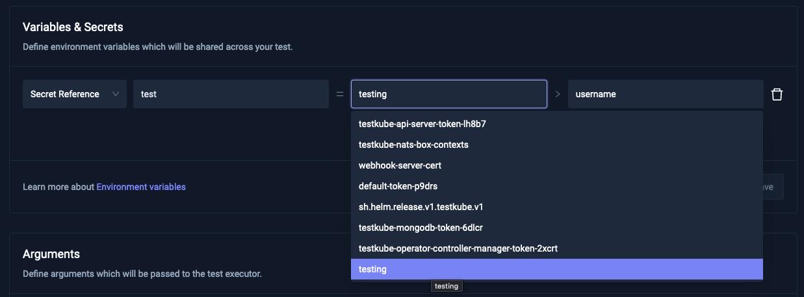

# Enable Secrets Endpoint

Activating the secrets endpoint will enable autocomplete features. 
You can activate the endpoint by setting the `testkube-api.enableSecretsEndpoint` helm chart value to `true`.
This functionality applies to inputs that reference secret names and keys. It is available across all forms and pages where inputs for secrets references are present.

For example, in the Settings panel of a Test:

[Back to Helm Chart reference](./helm-chart.md)
