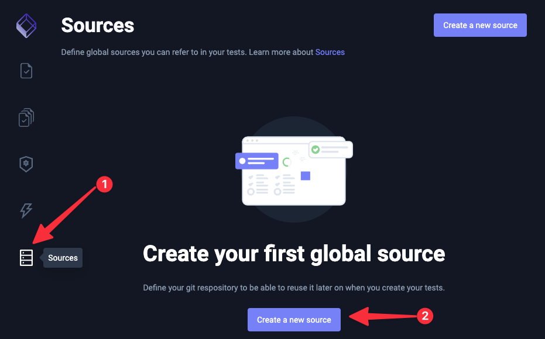

import Tabs from "@theme/Tabs";
import TabItem from "@theme/TabItem";

# Sources

Testkube connect to your git repository through a Test Source. Once you create a Test Source you can use it in as many tests as you have.

To connect a Git Repository as a Test Source, follow the following instructions:

<Tabs groupId="dashboard-cli">
<TabItem value="dash" label="Dashboard">

Go to the Test Sources page and click on the "Create New Source" button:




Fill the form:

:::note

If you are connecting a public repository, you can leave the `Username` and `Git Token` fields empty.

:::


</TabItem>

<TabItem value="cli" label="CLI">

Run the following command to create a Test Source:

```sh
testkube create testsource --name cypress-test --git-uri <RESPOSITORY-URL>
```

:::note

To add a private repository, you will need the `Username` and `Git Token` of the repository. Check the `testkube create testsource --help` for more information.

:::


</TabItem>
</Tabs>

Once you've created the Test Source, you can [Create a Test](./creating-tests) that uses the Test Source. 
