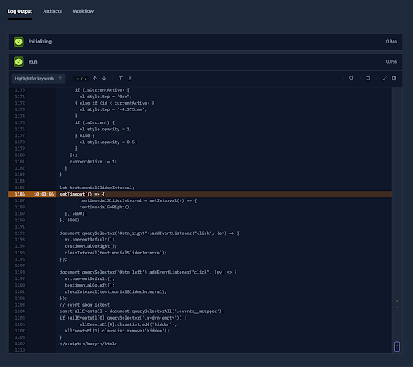
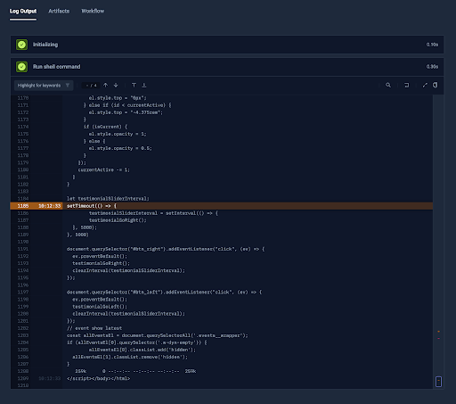
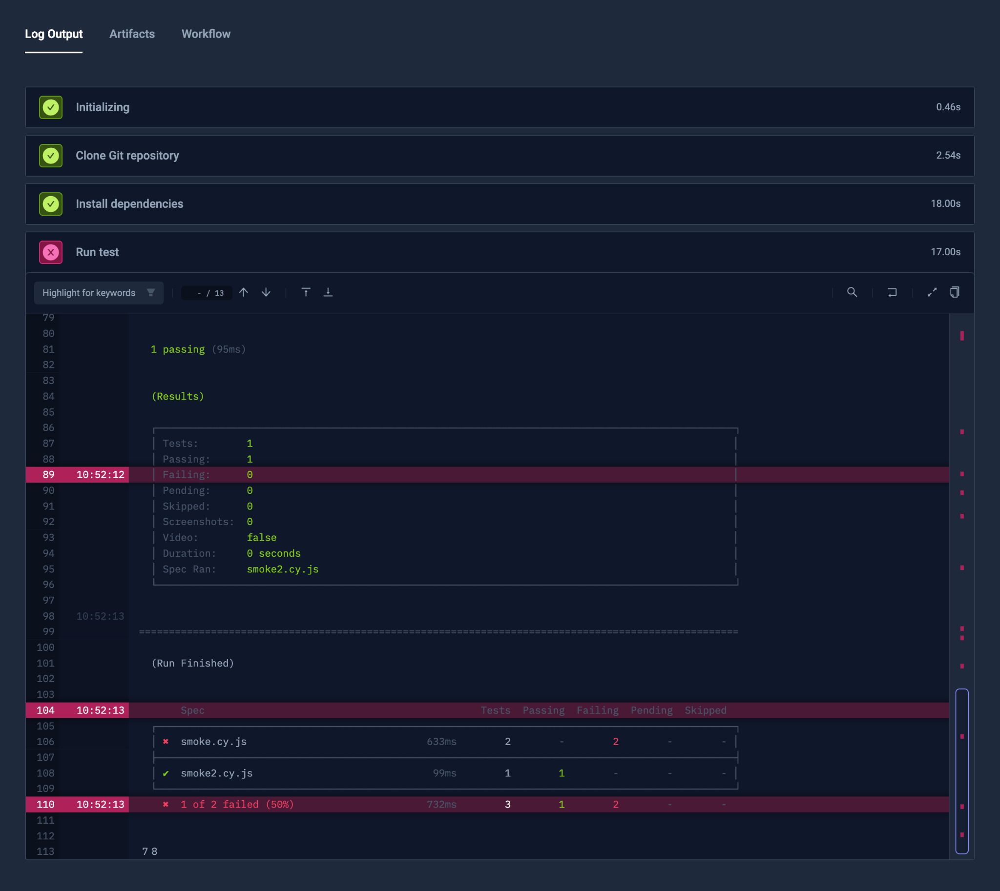
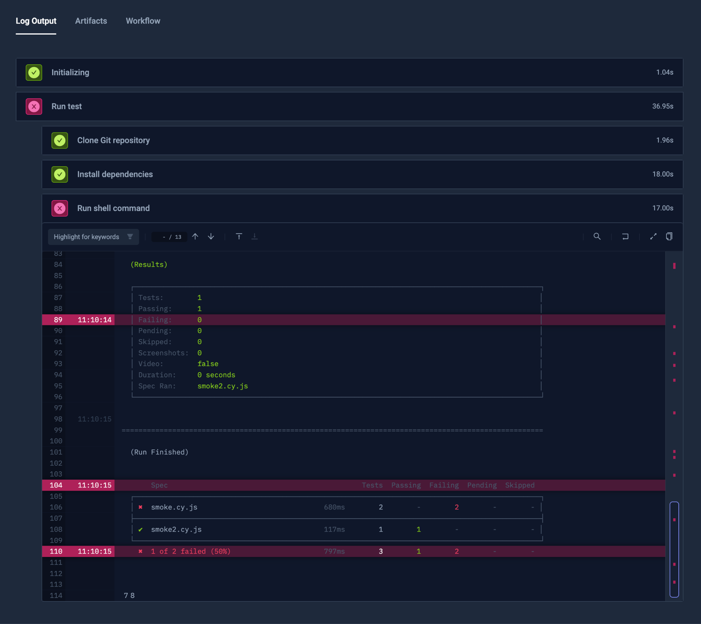
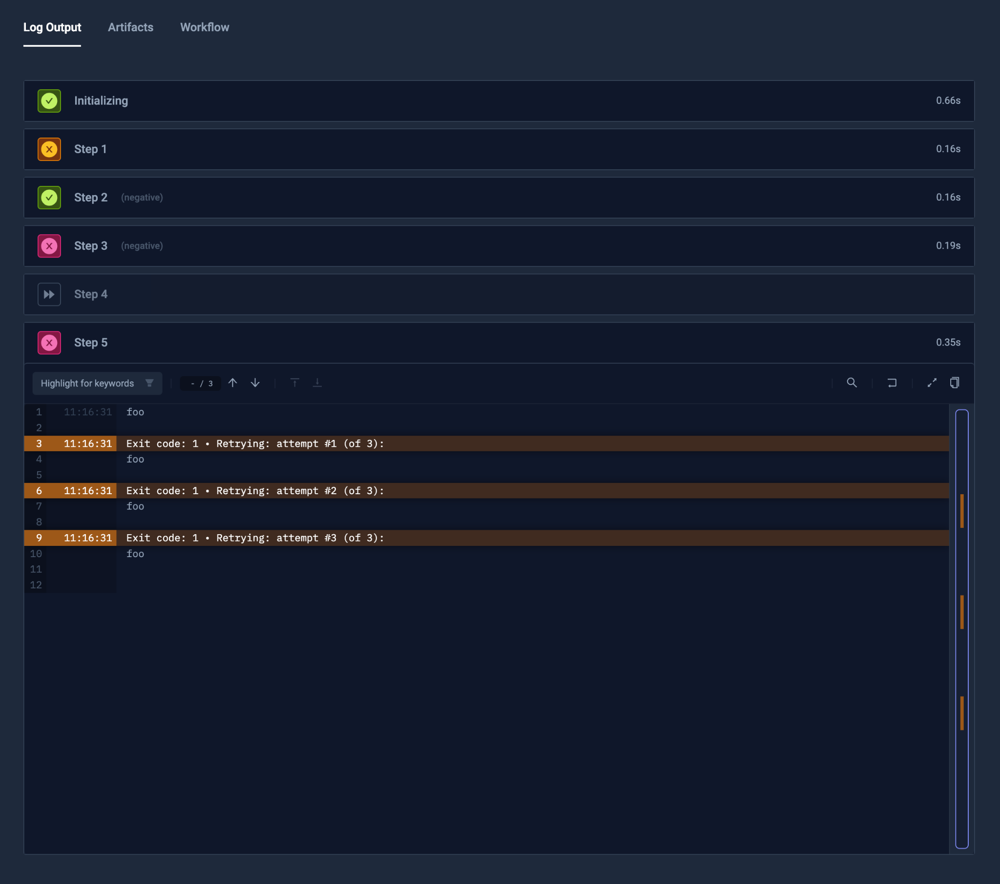
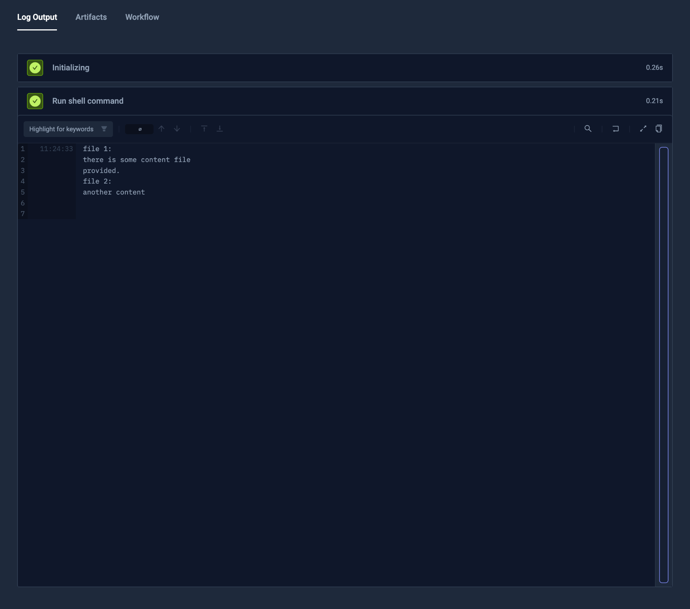
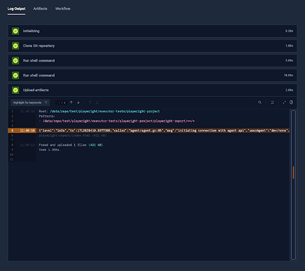
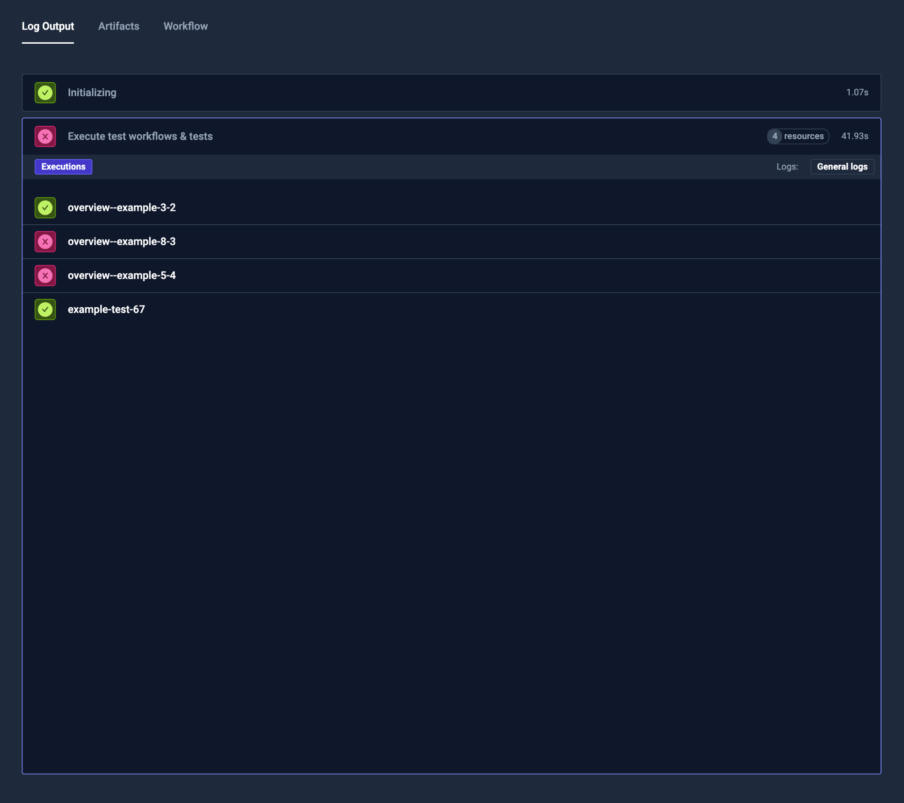

# Test Workflows Examples - Basics

## Running the Image

The Test Workflows spec allows you to provide instructions in setup, steps and after properties.

### Syntax

Both setup, steps and after have the same syntax - they are a list of steps. The step is an object that has execution instructions.

```yaml
apiVersion: testworkflows.testkube.io/v1
kind: TestWorkflow
metadata:
  name: overview--example-1
spec:
  steps:
  - run:
      image: 'curlimages/curl:7.78.0'
      args:
      - 'https://testkube.io'
```
### Running the Image

Use a run instruction that has similar syntax to the native Kubernetes’ container. A command exiting with code > 0 is considered a failure.




## Using Shell

### Running Shell Commands

For simplicity, you can also run shell commands with the **run** instruction and the **shell** property.
The script is automatically prepended with **set -e**, so, by default, it will fail the step on any error.

```yaml
apiVersion: testworkflows.testkube.io/v1
kind: TestWorkflow
metadata:
  name: overview--example-2
spec:
  steps:
  - run:
      image: 'curlimages/curl:7.78.0'
      shell: |
        curl https://testkube.io
```        

### Alternative Syntax

Alternatively, you can use **shell** directly as an instruction and a default image will be used.




## Fetching the Git Repository

### Fetching Data from Git

To fetch data from the Git, use the git property of content. You may provide the address, revision (commit, branch or tag), along with i.e. token.

To avoid fetching all files in mono-repository, you can use paths for sparse checkout.

```yaml
apiVersion: testworkflows.testkube.io/v1
kind: TestWorkflow
metadata:
  name: overview--example-3
spec:
  content:
    git:
      uri: 'https://github.com/kubeshop/testkube'
      revision: 'main'
      paths:
      - 'test/cypress/executor-tests/cypress-12'

  steps:
  - shell: 'tree /data/repo'
```  

### Mounting

By default the repository is mounted to /data/repo directory. You can control it with mountPath property though.


## Fetching a Secured Git Repository

### Usinga Token from A Secret

You may provide the Git token and username either as plain-text, or via the tokenFrom and usernameFrom clauses that are the same as native Kubernetes env.*.valueFrom.

```yaml
apiVersion: testworkflows.testkube.io/v1
kind: TestWorkflow
metadata:
  name: overview--example-4
spec:
  content:
    git:
      uri: 'https://github.com/kubeshop/testkube'
      tokenFrom:
        secretKeyRef:
          name: 'private-repo-secret-token'
          key: 'token'

  steps:
  - shell: 'tree /data/repo'
```

## Using Multiple Steps

### Running Multiple Steps

To run multiple steps, simply add another step with next instructions.

```yaml
apiVersion: testworkflows.testkube.io/v1
kind: TestWorkflow
metadata:
  name: overview--example-5
spec:
  content:
    git:
      uri: 'https://github.com/kubeshop/testkube'
      revision: 'main'
      paths:
      - 'test/cypress/executor-tests/cypress-12'

  steps:
  - name: 'Install dependencies'
    run:
      image: 'cypress/included:13.6.4'
      workingDir: '/data/repo/test/cypress/executor-tests/cypress-12'
      shell: 'npm install'
  - name: 'Run test'
    run:
      image: 'cypress/included:13.6.4'
      workingDir: '/data/repo/test/cypress/executor-tests/cypress-12'
      shell: 'cypress run'
```



## Container Defaults

### Setting Up Defaults

To configure default container settings, you may use the container property.
It has a similar syntax to the Kubernetes’ native [Container](https://kubernetes.io/docs/reference/generated/kubernetes-api/v1.23/#container-v1-core) spec.

```yaml
apiVersion: testworkflows.testkube.io/v1
kind: TestWorkflow
metadata:
  name: overview--example-6b
spec:
  content:
    git:
      uri: 'https://github.com/kubeshop/testkube'
      revision: 'main'
      paths:
      - 'test/cypress/executor-tests/cypress-12'

  container:
    image: 'cypress/included:13.6.4'
    workingDir: '/data/repo/test/cypress/executor-tests/cypress-12'
    resources:
      requests:
        memory: '2Gi'
        cpu: 2

  steps:
  - name: 'Install dependencies'
    shell: 'npm install'
  - name: 'Run test'
    shell: 'cypress run'
```    


### Notable Nuances

Thanks to the container and run instructions being similar to native Kubernetes’ container specs, you can easily set the required resources for running.


## Step Isolation

### Nested Steps

You can also pass nested setup steps in the step list.

```yaml
apiVersion: testworkflows.testkube.io/v1
kind: TestWorkflow
metadata:
  name: overview--example-7
spec:
  steps:
  - name: 'Run test'
    content:
      git:
        uri: 'https://github.com/kubeshop/testkube'
        revision: 'main'
        paths:
        - 'test/cypress/executor-tests/cypress-12'
    container:
      image: 'cypress/included:13.6.4'
      workingDir: '/data/repo/test/cypress/executor-tests/cypress-12'
    steps:
    - name: 'Install dependencies'
      shell: 'npm install'
    - shell: 'cypress run'
```

### Content and Defaults

Defaults configured in the step will work similarly to top-level defaults but will be accessible only by the step itself and all steps inside. For example, previous and subsequent steps will not have access to mounted repositories or environment variables.



## Step Orchestration

### Optional Steps

You can add **optional:true** for the step, so that step will not effect the outcome of the orchestration.

```yaml
apiVersion: testworkflows.testkube.io/v1
kind: TestWorkflow
metadata:
  name: overview--example-8
spec:
  steps:
  - name: 'Step 1'
    optional: true
    shell: exit 1
  - name: 'Step 2'
    negative: true
    shell: exit 1
  - name: 'Step 3'
    negative: true
    shell: exit 0
  - name: 'Step 4'
    shell: echo hello
  - name: 'Step 5'
    condition: always
    retry:
      count: 3
    shell: echo foo; exit 1
```    
### Conditional Steps

By default, the next step will run only when the previous steps have succeeded. This can be controlled with the **condition** property.

As an example, **condition: always** will cause the step to always be executed, even if the previous step has failed.

### Retry Mechanism

It’s possible to automatically retry the step on a failure (or any other condition).



## Content Files

### Provide Static Files

A part of the Git repository and regular commands, the Test Workflow can use some static files directly from the spec.

These files are mounted from a ConfigMap automatically (unless, instead of content, there is **contentFrom** used with a similar schema as Kubernetes’ **env.*.valueFrom**).

*When the path is relative, it will be mounted in the container’s working directory.*

```yaml
apiVersion: testworkflows.testkube.io/v1
kind: TestWorkflow
metadata:
  name: overview--example-9
spec:
  content:
    files:
    - path: /some/path
      content: |
        there is some content file
        provided.
    - path: another-file.txt
      content: |
        another content
  steps:
  - workingDir: /foo/bar
    shell: |
      echo "file 1:"
      cat /some/path
      echo "file 2:"
      cat another-file.txt
```


## Artifacts

### Saving the Artifacts

Saving the artifacts is as simple as defining the artifacts instruction and providing the file masks to fetch. There is no need to create additional volumes, the artifacts step has access to all the files.

```yaml
apiVersion: testworkflows.testkube.io/v1
kind: TestWorkflow
metadata:
  name: overview--example-10
spec:
  content:
    git:
      uri: 'https://github.com/kubeshop/testkube'
      paths:
      - 'test/playwright/executor-tests/playwright-project'

  container:
    image: 'mcr.microsoft.com/playwright:v1.32.3'
    workingDir: '/data/repo/test/playwright/executor-tests/playwright-project'
    resources:
      requests:
        memory: '2Gi'
        cpu: 2

  steps:
  - shell: 'npm ci'
  - shell: 'npx playwright test --workers 2 --reporter html'
  - condition: always
    artifacts:
      paths:
      - 'playwright-report/**/*'
```
  

## Test Suite Like Runs

### Run Dependent Test Workflows or Tests

To run other Test Workflows or Tests, you can use the **execute** instruction.

You can define the number of concurrent executions with **parallelism** as well.

```yaml
apiVersion: testworkflows.testkube.io/v1
kind: TestWorkflow
metadata:
  name: overview--example-11
spec:
  steps:
  - execute:
      tests:
      - name: 'example-test'
      workflows:
      - name: 'overview--example-3'
      - name: 'overview--example-5'
      - name: 'overview--example-8'
```

 

## Job/Pod Configuration

### Configuring the Job

By using the **job** property, you can configure labels, annotations and execution namespace of the Job.
In case of supplying namespace you will need to setup execution namespaces in your helm chart values. It's possible to generate all required RBAC or just manually supply them.

```yaml
apiVersion: testworkflows.testkube.io/v1
kind: TestWorkflow
metadata:
  name: overview--example-12
spec:
  job:
    labels:
      job-label: 'foobar'
    annotations:
      this.is.important: false    
    namespace: "default"
```

### Configuring the Pod

By using the **pod** property, you can configure labels, annotations, serviceAccountName, imagePullSecrets, volumes, or other properties of a [PodSpec](https://kubernetes.io/docs/reference/generated/kubernetes-api/v1.23/#podspec-v1-core).

```yaml
apiVersion: testworkflows.testkube.io/v1
kind: TestWorkflow
metadata:
  name: overview--example-13
spec:
  job:
    labels:
      job-label: 'foobar'
  pod:
    labels:
      pod-label: 'barfoo'
    serviceAccountName: 'testkube-api-server'
    imagePullSecrets:
    - name: 'dockerhub-secret'
```


