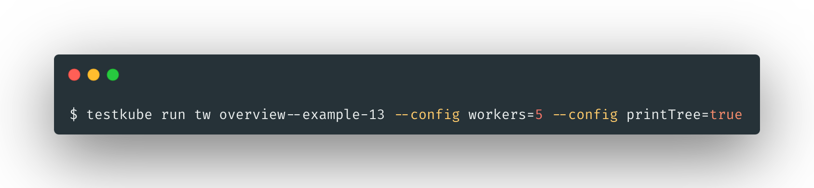

# Test Workflows Examples - Configuration

## Declaring the Configuration

Test Workflows may define some configuration variables that should be used.
The configuration schema is OpenAPI-like.

When the configuration variable doesn’t already have a default clause, it’s required.

### Using the Variables

The configuration variables can be used in the specification as an expression, i.e. `cypress run {{config.args}}`.

You can use the variables in most of the places - commands, paths, images, static files, or even conditions.

```yaml
apiVersion: testworkflows.testkube.io/v1
kind: TestWorkflow
metadata:
  name: overview--example-13
spec:
  config:
    version:
      type: string
      default: '1.32.3'
    workers:
      type: integer
      default: 2
    printTree:
      type: boolean
      default: 'false'

  content:
    git:
      uri: 'https://github.com/kubeshop/testkube'
      paths:
      - 'test/playwright/executor-tests/playwright-project'

  container:
    image: 'mcr.microsoft.com/playwright:v{{ config.version }}'
    workingDir: '/data/repo/test/playwright/executor-tests/playwright-project'

  steps:
  - shell: 'npm ci && npx playwright test --workers {{ config.workers }}'
  - condition: 'config.printTree'
    shell: 'tree /data/repo'
```    

## UI

### Running in the UI

After clicking “Run now” in the UI, if the Test Workflow has additional configuration parameters, you will be prompted to enter them.

 

## CLI  

#### Running with the CLI

With the CLI, you can provide the variables with **--config** arguments. 

 

## Test Suite (Execute)

### Running with Execute (Test Suite Like)

Configurable Test Workflows may also be parameterized in the **execute** step. Use this for passing dynamic data.

```yaml
apiVersion: testworkflows.testkube.io/v1
kind: TestWorkflow
metadata:
  name: overview--example-14
spec:
  steps:
  - execute:
      workflows:
      - name: 'overview--example-13'
        config:
          workers: 2
      - name: 'overview--example-13'
        config:
          workers: 4
      - name: 'overview--example-13'
        config:
          version: '1.23.4'
```          
