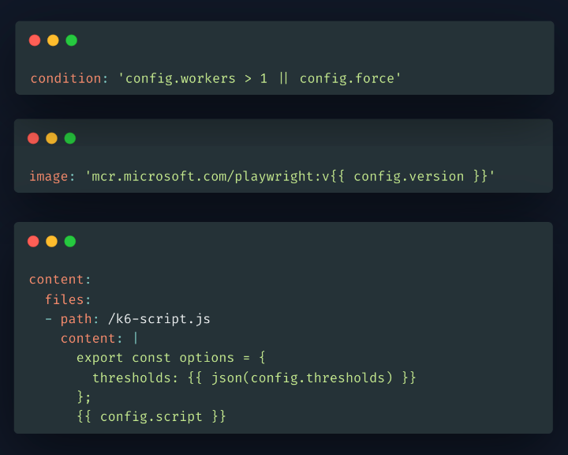
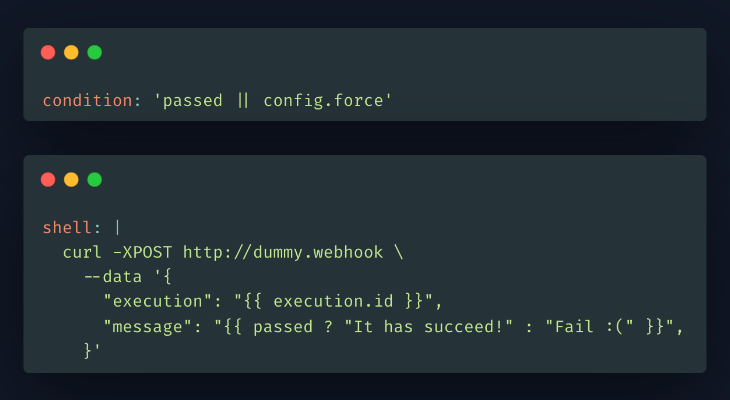

# Test Workflows Examples - Expressions

## Expressions Language

We have designed a simple expressions language, that allows dynamic evaluation of different values.

## JSON-Native

It is built on JSON, so every JSON syntax is a valid expression value as well, like `[ "a", "b", "c" ]`.

## Math

You can do basic math easily, like **config.workers * 5**.

 

## Built-in Variables

### General Variables

There are some built-in variables available in most of the places;

- **env** - Object has a reference to the environment variables.
- **config** - Object has a reference to defined configuration variables.
- **execution** - Object has some execution data.

### Contextual Variables

In some contexts, there are additional variables available.

As an example, while writing the condition, you can use variables like passed (bool), failed (bool), always (true), never (false), status (string) that refer to current status of the TestWorkflow.

 

## Built-in Functions

### Casting Functions

There are some functions that help to cast or serialize values, such as **int**, **json**, **tojson**, **yaml**, and **toyaml**.

### General Functions

There are some functions that aid in working with data, i.e. **join**, **split**, **floor**, **round**, **trim**, **len**, **map**, **filter**, **jq**, **shellparse** or **shellquote**.

### File System Functions

You can as well read the file system in the Test Workflow to determine values based on that. You can read files with **file** function, or list files with **glob**.

 

