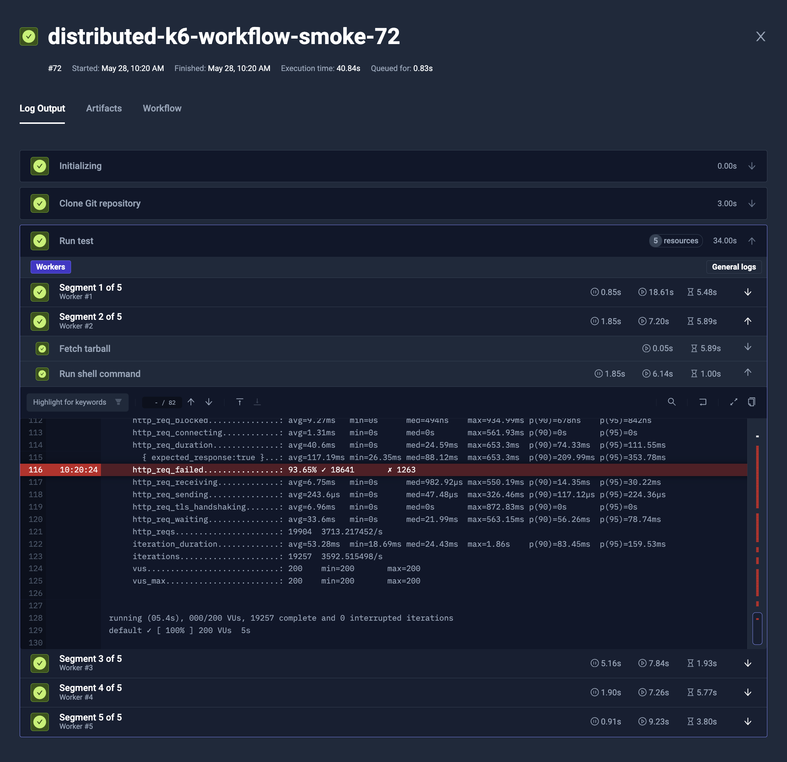
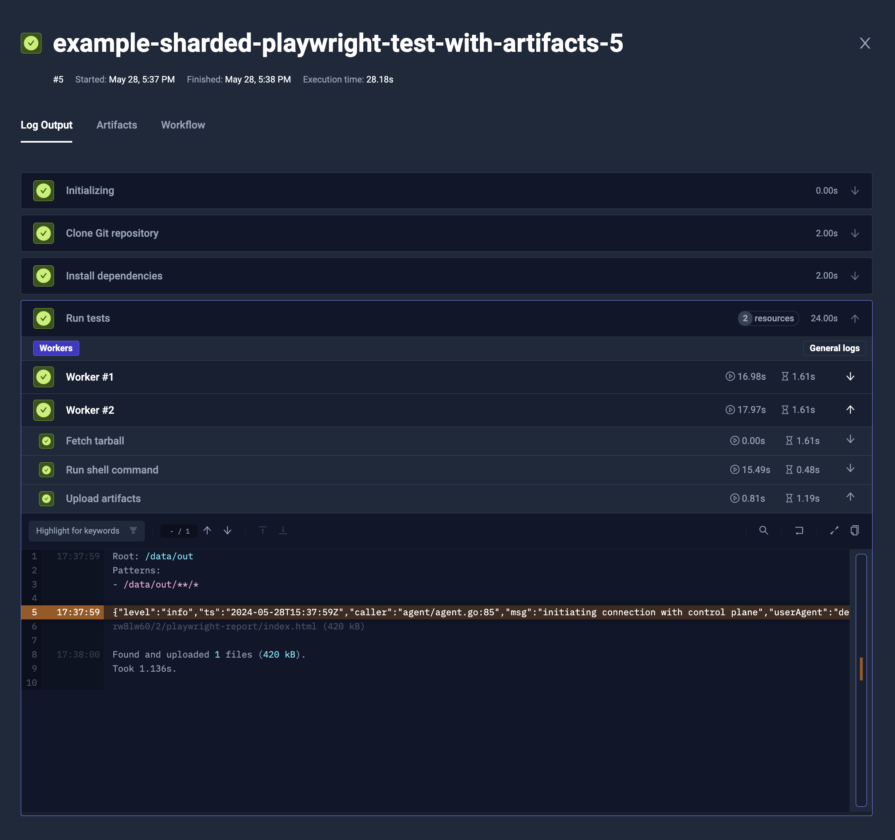
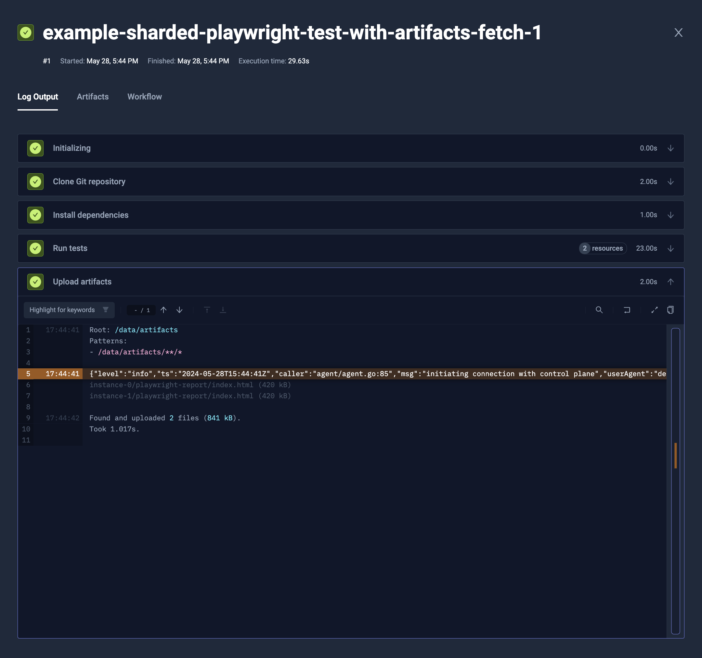
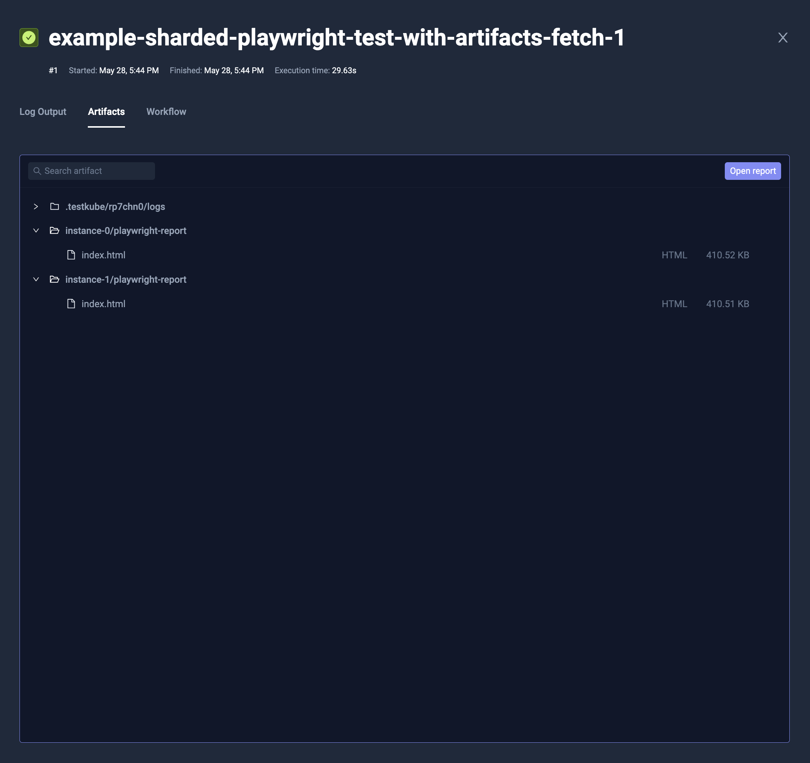
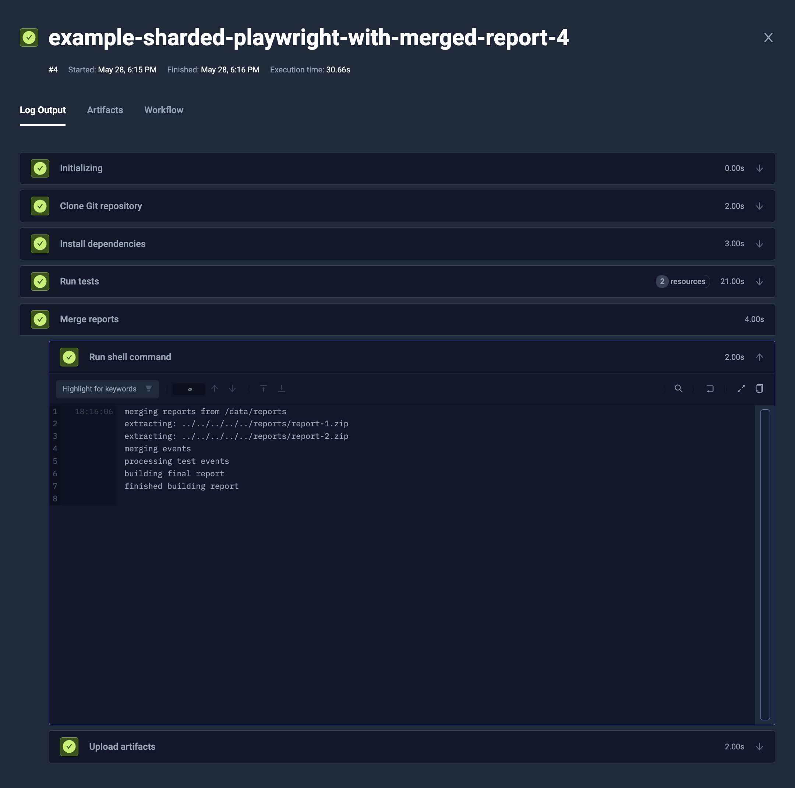
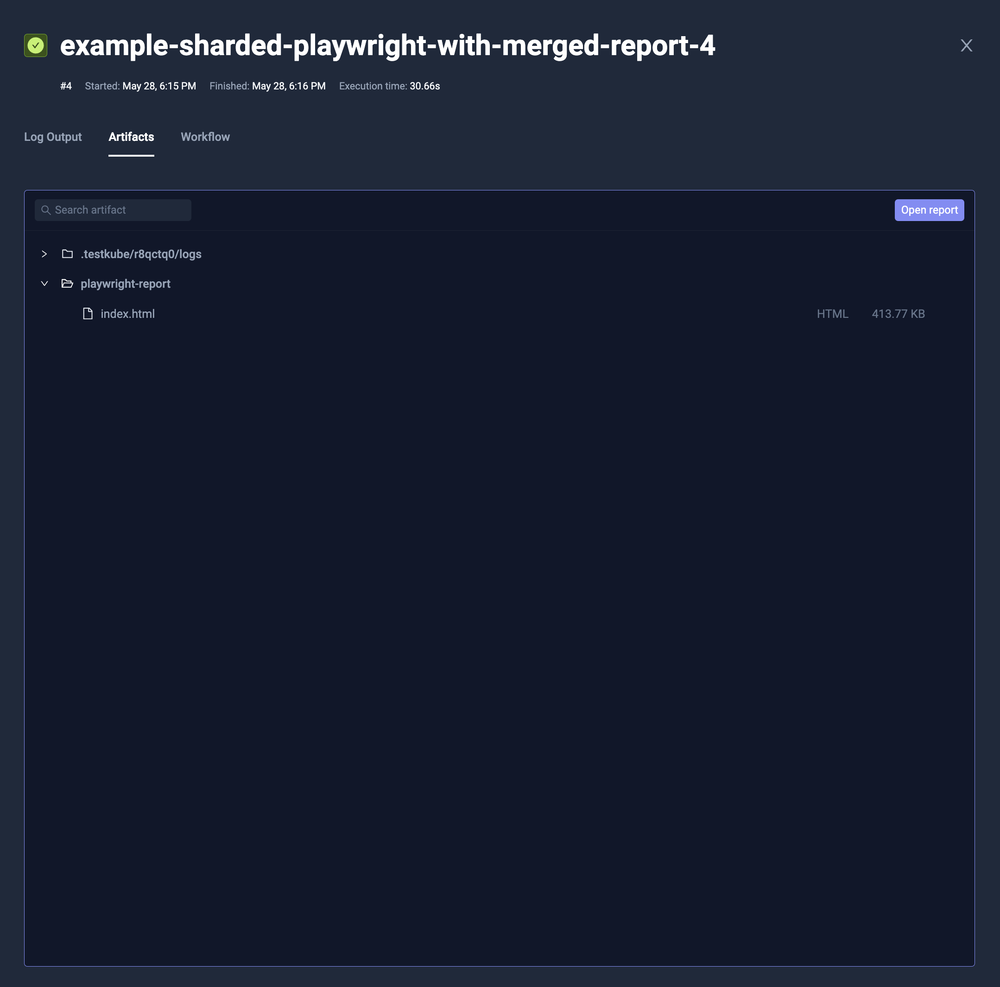
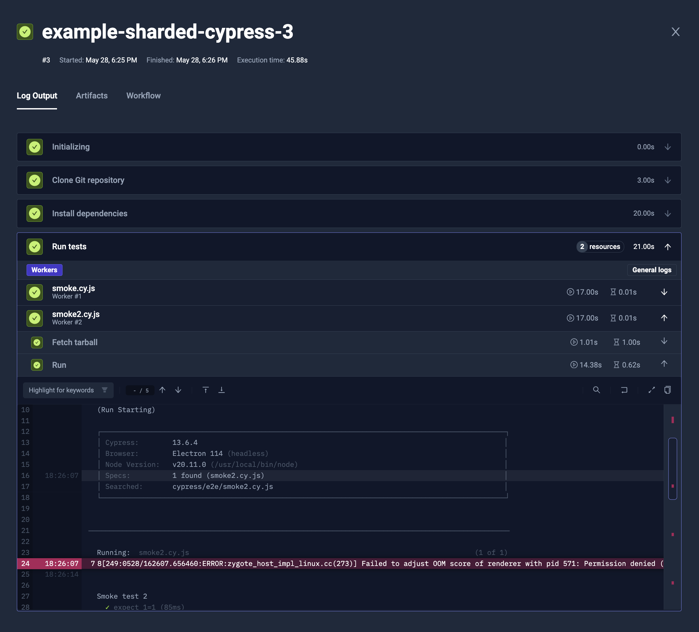
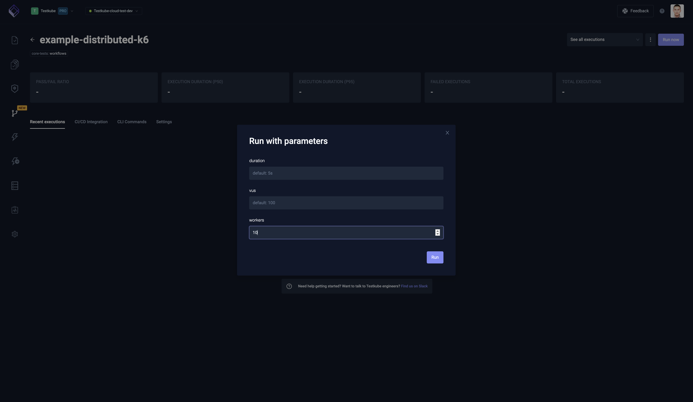
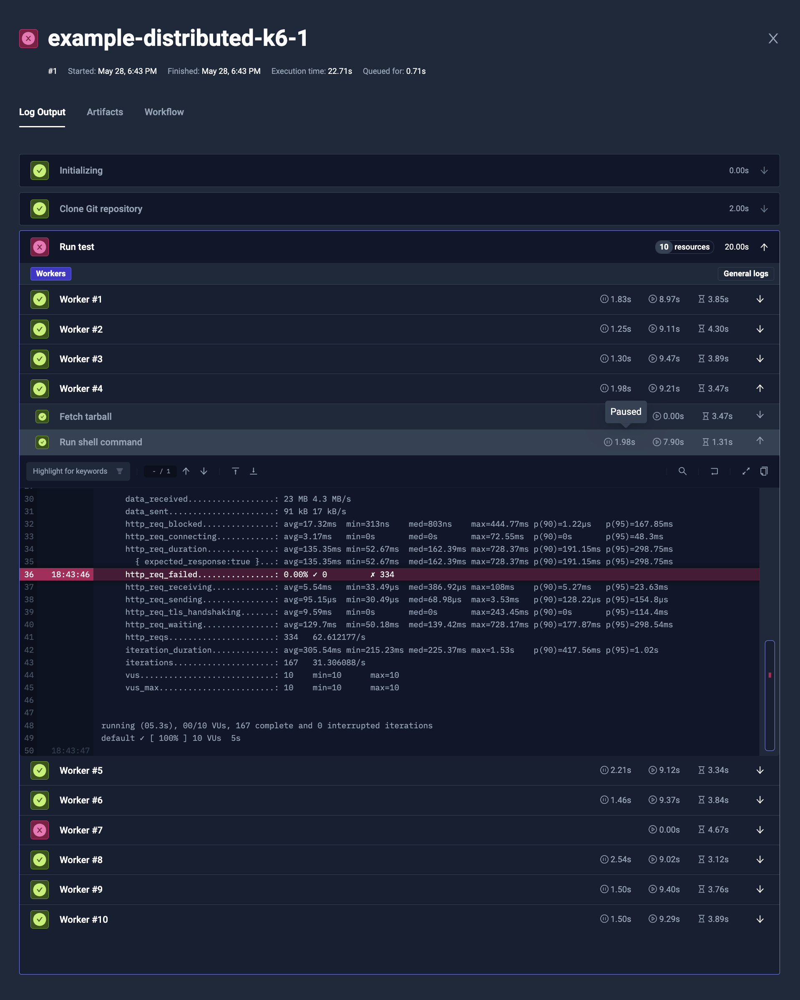

import Tabs from "@theme/Tabs";
import TabItem from "@theme/TabItem";

# Test Workflows - Parallel Steps

Often you would like to speed up the test execution, by distributing the load across multiple runs.

Test Workflows have `parallel` steps, that allow you to distribute your test even dynamically, and among multiple cluster nodes.

## Syntax

To declare the parallel step, you need to specify the step with `parallel` clause.

### Basic configuration

It allows to provide:
* similar properties as any other kind of step, i.e. `container`, `run`, `shell` or `steps`
* general Test Workflow properties, like `job`, `pod` or `content`
* [**matrix and sharding**](./test-workflows-matrix-and-sharding.md) properties
* `parallelism` to define maximum number of instances to run at once
* `description` that may provide human-readable information for each instance separately

### Fetching logs

By default the logs for the parallel steps are saved. To disable them or make them conditional, you can use `logs` property.
It takes an expression condition, so you can dynamically choose whether it should be saved or not. Often you will use:

* `logs: never` to never store the logs
* `logs: failed` to store logs only if the step has failed



### Pod and Job configuration

The parallel steps are started as a separate jobs/pods, so you can configure `pod` and `job` similarly to general Test Workflow.

### Lifecycle

Similarly to regular steps, you can configure things like `timeout` (`timeout: 30m`), `optional: true`, or `negative: true` for expecting failure.

### Matrix and sharding

The parallel steps are meant to support matrix and sharding, to run multiple replicas and/or distribute the load across multiple instances.
It is supported by regular matrix/sharding properties (`matrix`, `shards`, `count` and `maxCount`).

You can read more about it in the general [**Matrix and Sharding**](./test-workflows-matrix-and-sharding.md) documentation.

## Providing content

There are multiple ways to provide the files for the parallel steps.

:::info

As the parallel steps are started in separate pods, they don't share the file system with the Test Workflow execution.

:::

### Copying content inside

It is possible to copy the files from the original Test Workflow into the parallel steps.
As an example, you may want to fetch the repository and install the dependencies on the original TestWorkflow,
and then distribute it across the parallel steps.

To do so, you can use `transfer` property. It takes list of files to transfer:

* `{ from: "/data/repo/build" }` will copy the `/data/repo/build` directory from execution's Pod into `/data/repo/build` in the instance's Pod
* `{ from: "/data/repo/build", to: "/out" }` will copy the `/data/repo/build` directory from execution's Pod into `/out` in the instance's Pod
* `{ from: "/data/repo/build", to: "/out", "files": ["**/*.json"] }` will copy only JSON files from the `/data/repo/build` directory from execution's Pod into `/out` in the instance's Pod

#### Example

The example below will:

* Clone the Git repository (`content`)
* Install the Node.js dependencies (`steps[0].shell`)
* Run Playwright tests (`steps[1].parallel`)
  * Specify 2 instances of that step (`steps[1].parallel.count`)
  * Copy the `/data/repo` along with already installed `node_modules` (`steps[1].parallel.transfer`)
  * Run the Playwright test with customized `--shard` parameter for each instance (`1/2` and `2/2` respectively, via `steps[1].parallel.shell`)

<Tabs>
<TabItem value="yaml" label="YAML" default>

```yaml
apiVersion: testworkflows.testkube.io/v1
kind: TestWorkflow
metadata:
  name: example-sharded-playwright-test
spec:
  content:
    git:
      uri: https://github.com/kubeshop/testkube
      paths:
      - test/playwright/executor-tests/playwright-project
  container:
    image: mcr.microsoft.com/playwright:v1.32.3-focal
    workingDir: /data/repo/test/playwright/executor-tests/playwright-project

  steps:
  - name: Install dependencies
    shell: 'npm ci'

  - name: Run tests
    parallel:
      count: 2
      transfer:
      - from: /data/repo
      shell: 'npx playwright test --shard {{ index + 1 }}/{{ count }}'
```

</TabItem>
<TabItem value="ui" label="Log Output">


</TabItem>
</Tabs>

### Static content or a Git repository

:::tip

For distributed testing, it's better to avoid cloning repository in each step.
Instead, that could be run on sequential step, and then transferred to parallel steps with [`transfer`](#copying-content-inside).

This way you will spare the resources, as the computation and transferring over internet will happen only once. 

:::

Parallel steps allow to provide the `content` property similar to the one directly in the Test Workflow. As an example, you may clone the repository:

```yaml
apiVersion: testworkflows.testkube.io/v1
kind: TestWorkflow
metadata:
  name: example-parallel-with-static-files
spec:
  steps:
  - parallel:
      count: 2
      content:
        files:
        - path: /k6.js
          content: |
            import http from 'k6/http';
            export const options = {
              thresholds: {
                http_req_failed: ['rate<0.01'],
              }
            };
            export default function () {
              http.get('https://testkube.io/');
            }
      run:
        image: grafana/k6:latest
        shell: "k6 run /k6.js --iterations 100"
```

## Synchronising the parallel steps execution

By default, each parallel step is executed as soon as it is possible. There is an option to override it though, so they won't start until all the instances are ready.
The pods may start at different time, especially with [node auto-provisioning](https://cloud.google.com/kubernetes-engine/docs/how-to/node-auto-provisioning).

It's especially useful for load testing, like K6, as you want to have the distributed load test executed at the same time.

To achieve that with parallel steps, simply add `paused: true` clause directly under the parallel, or to the specific step that it should stay at.
This way, the tests won't get started, until all steps have reached that point.

<Tabs>
<TabItem value="yaml" label="YAML" default>

```yaml
apiVersion: testworkflows.testkube.io/v1
kind: TestWorkflow
metadata:
  name: example-parallel-with-static-files
spec:
  steps:
  - parallel:
      count: 2
      paused: true
      content:
        files:
        - path: /k6.js
          content: |
            import http from 'k6/http';
            export const options = {
              thresholds: {
                http_req_failed: ['rate<0.01'],
              }
            };
            export default function () {
              http.get('https://testkube.io/');
            }
      run:
        image: grafana/k6:latest
        shell: "k6 run /k6.js --iterations 100"
```

</TabItem>
<TabItem value="log" label="Log Output">


</TabItem>
</Tabs>

## Reading files from parallel steps

In the opposite to copying the files into the parallel steps pod, you may want to read reports or other data **from** them too.
There are 2 basic methods to achieve that.

### Artifacts

The parallel steps may expose data as artifacts, just the same way as sequential step. The artifacts from different steps will be isolated.

<Tabs>
<TabItem value="yaml" label="YAML" default>

```yaml
apiVersion: testworkflows.testkube.io/v1
kind: TestWorkflow
metadata:
  name: example-sharded-playwright-test-with-artifacts
spec:
  content:
    git:
      uri: https://github.com/kubeshop/testkube
      paths:
      - test/playwright/executor-tests/playwright-project
  container:
    image: mcr.microsoft.com/playwright:v1.32.3-focal
    workingDir: /data/repo/test/playwright/executor-tests/playwright-project

  steps:
  - name: Install dependencies
    shell: 'npm ci'

  - name: Run tests
    parallel:
      count: 2
      transfer:
      - from: /data/repo
      container:
        env:
        - name: PLAYWRIGHT_HTML_REPORT
          value: /data/out/playwright-report
      shell: 'npx playwright test --output /data/out --shard {{ index + 1 }}/{{ count }}'
      artifacts:
        workingDir: /data/out
        paths:
        - '**/*'
```

</TabItem>
<TabItem value="log" label="Log Output">



</TabItem>
<TabItem value="artifacts" label="Artifacts">


</TabItem>
</Tabs>

### Fetching files back to execution's Pod

Alternatively, you can use `fetch` instruction. `fetch` syntax is similar to `transfer`, but instead of copying data from execution's Pod into parallel instance's Pod,
it's copying the other way - from parallel instance's Pod back to execution's.

Afterward, you can process these files, or i.e. build not isolated artifacts.

<Tabs>
<TabItem value="yaml" label="YAML" default>

```yaml
apiVersion: testworkflows.testkube.io/v1
kind: TestWorkflow
metadata:
  name: example-sharded-playwright-test-with-artifacts-fetch
spec:
  content:
    git:
      uri: https://github.com/kubeshop/testkube
      paths:
      - test/playwright/executor-tests/playwright-project
  container:
    image: mcr.microsoft.com/playwright:v1.32.3-focal
    workingDir: /data/repo/test/playwright/executor-tests/playwright-project

  steps:
  - name: Install dependencies
    shell: 'npm ci'

  - name: Run tests
    parallel:
      count: 2
      transfer:
      - from: /data/repo
      fetch:
      - from: /data/out
        to: /data/artifacts/instance-{{ index }}
      container:
        env:
        - name: PLAYWRIGHT_HTML_REPORT
          value: /data/out/playwright-report
      shell: 'npx playwright test --output /data/out --shard {{ index + 1 }}/{{ count }}'

  - condition: always
    artifacts:
      workingDir: /data/artifacts
      paths:
      - '**/*'
```

</TabItem>
<TabItem value="log" label="Log Output">



</TabItem>
<TabItem value="artifacts" label="Artifacts">



</TabItem>
</Tabs>

## Examples

### Sharded Playwright with single report

:::info

Blob reporter and merging reports have landed in Playwright 1.37.0, so it's not available before.

:::

Playwright provides nice toolset for sharding, which can be used easily with the Test Workflows.

The example below:

* Load the Git repository with Playwright test (`content`)
* Install the project dependencies (`steps[0].shell`)
* Run the Playwright tests split to 2 shards (`steps[1].parallel`)
  * Reserve 1 CPU and 1GB RAM for each shard (`steps[1].parallel.container.resources`)
  * Copy the repository and `node_modules` inside (`steps[1].parallel.transfer`)
  * Run Playwright test - with `blob` reporter, and with specific shard segment (`steps[1].parallel.shell`)
  * Fetch the Blob reporter's data to corresponding directory on Execution's pod (`steps[1].parallel.fetch`)
* Merge the reports using Playwright's tooling (`steps[2].shell`)
* Save the merged report as an artifact (`steps[2].artifacts`)

<Tabs>
<TabItem value="yaml" label="YAML" default>

```yaml
apiVersion: testworkflows.testkube.io/v1
kind: TestWorkflow
metadata:
  name: example-sharded-playwright-with-merged-report
spec:
  content:
    git:
      uri: https://github.com/kubeshop/testkube
      paths:
      - test/playwright/executor-tests/playwright-project
  container:
    image: mcr.microsoft.com/playwright:v1.38.0-focal
    workingDir: /data/repo/test/playwright/executor-tests/playwright-project

  steps:
  - name: Install dependencies
    shell: 'npm install --save-dev @playwright/test@1.38.0 && npm ci'

  - name: Run tests
    parallel:
      count: 2
      transfer:
      - from: /data/repo
      fetch:
      - from: /data/repo/test/playwright/executor-tests/playwright-project/blob-report
        to: /data/reports
      container:
        resources:
          requests:
            cpu: 1
            memory: 1Gi
      shell: |
        npx playwright test --reporter blob --shard {{ index + 1 }}/{{ count }}

  - name: Merge reports
    condition: always
    shell: 'npx playwright merge-reports --reporter=html /data/reports'
    artifacts:
      paths:
      - 'playwright-report/**'
```

</TabItem>
<TabItem value="log" label="Log Output">



</TabItem>
<TabItem value="artifacts" label="Artifacts">



</TabItem>
</Tabs>

### Automatically sharded Cypress tests

Cypress doesn't have any built-in way for sharding, but Test Workflow's [**matrix and sharding**](./test-workflows-matrix-and-sharding.md)
works well with all kinds of tests.

While the example here is not a perfect solution, it's sharding the Cypress tests based on the available test files.

The example below:

* Load the Cypress tests from the Git repository (`content`)
* Sets the working directory to the tests one (`container.workingDir`)
* Install the project dependencies (`steps[0].shell`)
* Run Cypress tests with dynamic sharding (`steps[1].parallel`)
  * The shards will be built off the test files in `cypress/e2e` directory (`steps[1].parallel.shards.testFiles`)
  * It will have maximum of 5 shards (`steps[1].parallel.maxCount`)
    * When there is less than or equal to 5 test files, it will run 1 shard per test file
    * When there will be more than 5 test files, it will distribute them across 5 shards
  * Each shard will run only selected test files with `--spec` Cypress' argument (`steps[1].parallel.run.args`)

<Tabs>
<TabItem value="yaml" label="YAML" default>

```yaml
apiVersion: testworkflows.testkube.io/v1
kind: TestWorkflow
metadata:
  name: example-sharded-cypress
spec:
  content:
    git:
      uri: https://github.com/kubeshop/testkube
      paths:
      - test/cypress/executor-tests/cypress-13
  container:
    image: cypress/included:13.6.4
    workingDir: /data/repo/test/cypress/executor-tests/cypress-13

  steps:
  - name: Install dependencies
    shell: 'npm ci'

  - name: Run tests
    parallel:
      maxCount: 5
      shards:
        testFiles: 'glob("cypress/e2e/**/*.js")'
      description: '{{ join(map(shard.testFiles, "relpath(_.value, \"cypress/e2e\")"), ", ") }}'
      transfer:
      - from: /data/repo
      container:
        resources:
          requests:
            cpu: 1
            memory: 1Gi
        env:
        - name: CYPRESS_CUSTOM_ENV
          value: CYPRESS_CUSTOM_ENV_value
      run:
        args:
        - --env
        - NON_CYPRESS_ENV=NON_CYPRESS_ENV_value
        - --spec
        - '{{ join(shard.testFiles, ",") }}'
```

</TabItem>
<TabItem value="log" label="Log Output">



</TabItem>
</Tabs>

### Distributed K6 load testing

:::tip

If you have multiple suites, you may consider exposing such executor as a Test Workflow Template,
and declare contents by `config` parameters. Alternatively, you can use `config` directly in Test Workflow.

:::

You can simply run K6 load tests distributed across all your nodes. The mechanism is similar to what [**k6-operator**](https://grafana.com/docs/k6/latest/testing-guides/running-distributed-tests/) has under the hood,
but it's much more powerful and flexible.

The example below:

* Takes optional run configuration parameters (`config`)
  * `vus` to declare Virtual Users to distribute
  * `duration` to declare Load Test time
  * `workers` to declare number of K6 instances to create
* Load the K6 script from Git repository (`content`)
* Run distributed K6 tests (`steps[0].parallel`)
  * It's using built-in `distribute/evenly` Test Workflow Template, that sets [`pod.topologySpreadConstraints`](https://kubernetes.io/docs/concepts/scheduling-eviction/topology-spread-constraints/) to distribute pods evenly across nodes (`steps[0].parallel.use`)
  * It's creating as many K6 workers as has been declared in `workers` config (`steps[0].parallel.count`)
  * It copies the test case from Git repository into workers (`steps[0].parallel.transfer`)
  * It reserves 1/8 CPU and 128MB for each worker (`steps[0].parallel.container.resources`)
  * It ensures that all workers will start load tests at the same time, when all are ready (`steps[0].parallel.paused`)
  * It runs K6 executable against that test case (`steps[0].parallel.run.shell`)
    * It passes number of Virtual Users and test duration via K6 parameters
    * It uses K6 [**--execution-segment**](https://grafana.com/docs/k6/latest/using-k6/k6-options/reference/#execution-segment) argument to select the fraction of tests to run

<Tabs>
<TabItem value="yaml" label="YAML" default>

```yaml
apiVersion: testworkflows.testkube.io/v1
kind: TestWorkflow
metadata:
  name: example-distributed-k6
  labels:
    core-tests: workflows
spec:
  config:
    vus: {type: integer, default: 100}
    duration: {type: string, default: '5s'}
    workers: {type: integer, default: 10}
  content:
    git:
      uri: https://github.com/kubeshop/testkube
      paths:
      - test/k6/executor-tests/k6-smoke-test.js

  steps:
  - name: Run test
    parallel:
      count: 'config.workers'
      transfer:
      - from: /data/repo
      use:
      - name: distribute/evenly
      container:
        workingDir: /data/repo/test/k6/executor-tests
        resources:
          requests:
            cpu: 128m
            memory: 128Mi
        env:
        - name: K6_SYSTEM_ENV
          value: K6_SYSTEM_ENV_value
      paused: true
      run:
        image: grafana/k6:0.49.0
        shell: |
          k6 run k6-smoke-test.js \
            -e K6_ENV_FROM_PARAM=K6_ENV_FROM_PARAM_value \
            --vus {{ config.vus }} \
            --duration {{ shellquote(config.duration) }} \
            --execution-segment {{ index }}/{{ count }}:{{ index + 1 }}/{{ count }}
```

</TabItem>
<TabItem value="run" label="Run Options">



</TabItem>
<TabItem value="log" label="Log Output">



</TabItem>
</Tabs>