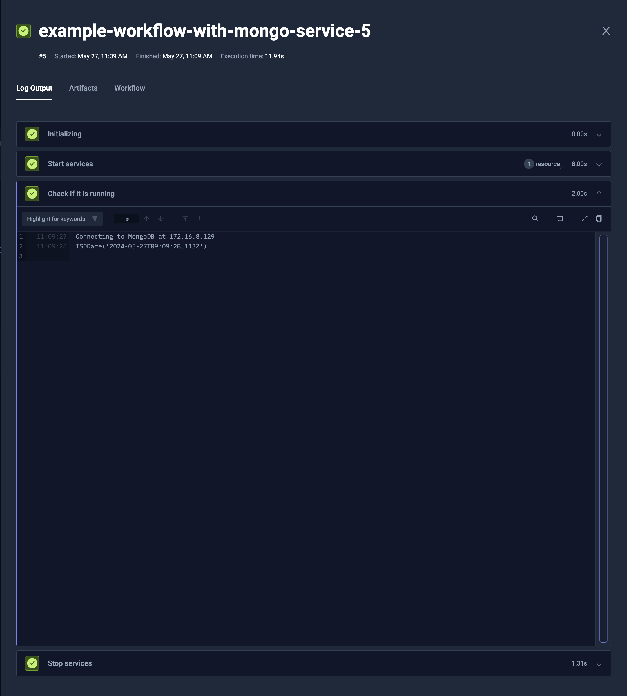
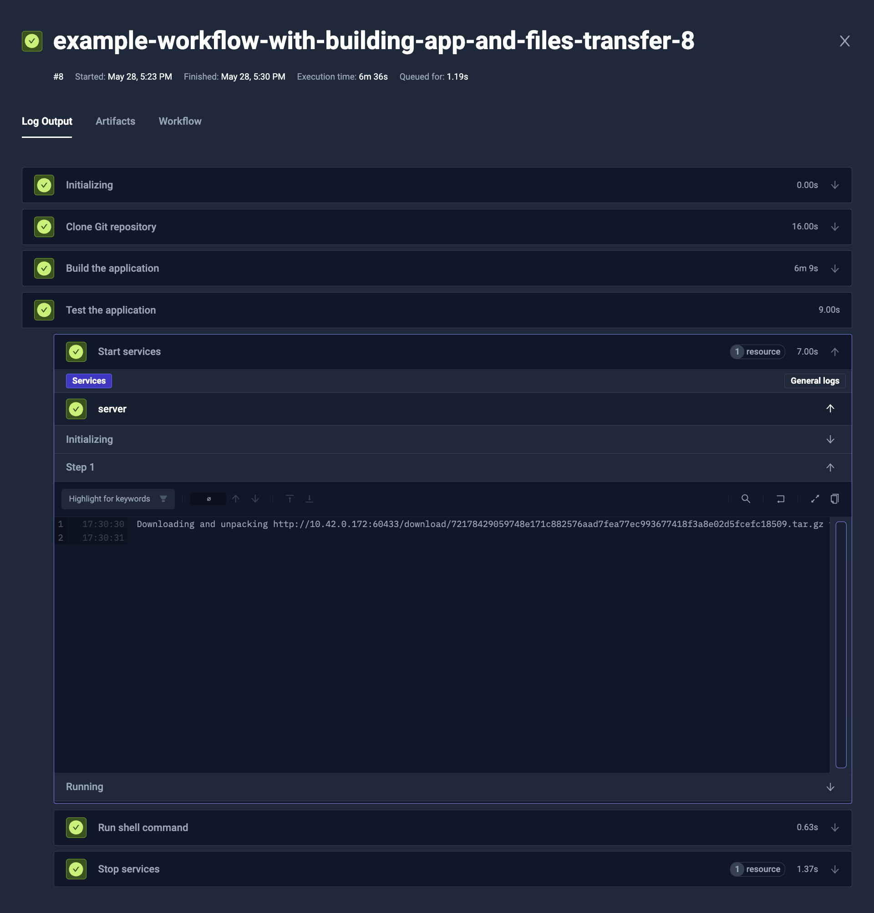
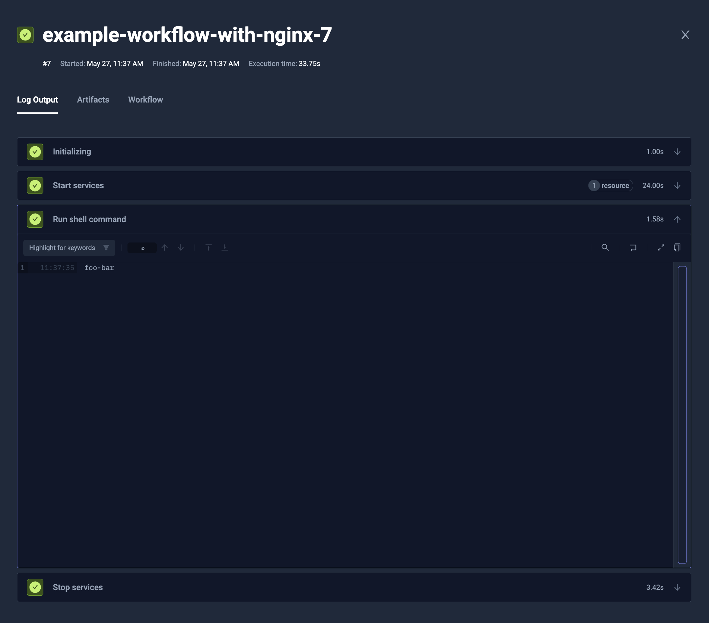

import Tabs from "@theme/Tabs";
import TabItem from "@theme/TabItem";

# Test Workflows - Services

Often if your use-case is more complex, you may need additional services for the Tests you are running. Common use cases are:
* Database, i.e. [**MongoDB**](https://hub.docker.com/_/mongo) or [**PostgreSQL**](https://hub.docker.com/r/bitnami/postgresql)
* Workers, i.e. [**remote JMeter workers**](https://hub.docker.com/r/justb4/jmeter) or [**Selenium Grid's remote browsers**](https://hub.docker.com/r/selenium/standalone-firefox)
* Service under test, i.e. your API to run E2E tests against it

Testkube allows you to run such services for the Test Workflow, communicate with them and debug smoothly.

## How it works

When you define the service, the Test Workflow is creating a new pod and any other require resources for each of instances,
read its status and logs, and provides its information (like IP) for use in further steps. After the service is no longer needed, it's cleaned up.

:::info

As the services are started in a separate pod, they don't share the file system with the Test Workflow execution.
There are multiple ways to share data with them - either using [**one of techniques described below**](#providing-content), or advanced Kubernetes' native ways like [**ReadWriteMany volumes**](https://kubernetes.io/docs/concepts/storage/persistent-volumes/#access-modes). 

:::

## Syntax

To add some services, you need to specify the `services` clause.
It can be either directly on the `spec` level (to be available for the whole execution), or on specific step (to isolate it).

:::tip

You may want to use services in [Test Workflow Template](./test-workflows-examples-templates.md), to reuse them for multiple tests.

:::


<Tabs>
<TabItem value="yaml" label="YAML" default>

```yaml
apiVersion: testworkflows.testkube.io/v1
kind: TestWorkflow
metadata:
  name: example-workflow-with-mongo-service
spec:
  services:
    db:
      timeout: 5m
      image: mongo:latest
      env:
      - name: MONGO_INITDB_ROOT_USERNAME
        value: root
      - name: MONGO_INITDB_ROOT_PASSWORD
        value: p4ssw0rd
      readinessProbe:
        tcpSocket:
          port: 27017
        periodSeconds: 1
  steps:
  - name: Check if it is running
    run:
      image: mongo:latest
      shell: |
        echo Connecting to MongoDB at {{ services.db.0.ip }}
        mongosh -u root -p p4ssw0rd {{ services.db.0.ip }} --eval 'db.serverStatus().localTime'
```

</TabItem>
<TabItem value="log" label="Log Output">



</TabItem>
</Tabs>

### Connecting to the services

To connect to create services, you can simply use `services.<SVC_NAME>.<INDEX>.ip` expression in the place you need its address (i.e. environment variable, or shell command).

* `services.db.0.ip` will return `string` - IP of the 1st instance of the `db` service
* `services.db.*.ip` will return `[]string` - list of IPs of all the `db` service instances

### Basic configuration

The service allows similar fields as the `run` command, i.e.:
* `image`, `env`, `volumeMounts`, `resources` - to configure the container
* `command`, `args` - to specify command to run
* `shell` - to specify script to run (instead of `command`/`args`)
* `description` that may provide human-readable information for each instance separately

### Fetching logs

By default we are not saving the logs for the services. If you would like to fetch the logs, you can use `logs` property.
It takes an expression condition, so you can dynamically choose whether it should be saved or not. Often you will use:

* `logs: always` to always store the logs
* `logs: failed` to store the logs only if the Test Workflow has failed

### Pod configuration

The service is started as a separate job/pod, so you can configure `pod` and `job` similarly to general Test Workflow.

### Lifecycle

You can apply [**readinessProbe**](https://kubernetes.io/docs/tasks/configure-pod-container/configure-liveness-readiness-startup-probes/#define-a-tcp-liveness-probe) to ensure that the service will be available for the next step.

The Test Workflow won't continue until the container will be ready then. To ensure that the execution won't get stuck, you can add `timeout` property (like `timeout: 1h30m20s`),
so it will fail if the service is not ready after that time.

### Matrix and sharding

The services are meant to support matrix and sharding, to run multiple replicas and/or distribute the load across multiple instances.
It is supported by regular matrix/sharding properties (`matrix`, `shards`, `count` and `maxCount`).

You can read more about it in the general [**Matrix and Sharding**](./test-workflows-matrix-and-sharding.md) documentation.

## Providing content

There are multiple ways to provide the files inside the services.

:::info

As the services are started in a separate pod, they don't share the file system with the Test Workflow execution.

:::

### Copying content inside

It is possible to copy the files from the original Test Workflow into the services.
As an example, you may want to fetch the repository and install the dependencies on the original TestWorkflow,
and then distribute it to the services.

To do so, you can use `transfer` property. It takes list of files to transfer:

* `{ from: "/data/repo/build" }` will copy the `/data/repo/build` directory from execution's Pod into `/data/repo/build` in the service's Pod
* `{ from: "/data/repo/build", to: "/out" }` will copy the `/data/repo/build` directory from execution's Pod into `/out` in the service's Pod
* `{ from: "/data/repo/build", to: "/out", "files": ["**/*.json"] }` will copy only JSON files from the `/data/repo/build` directory from execution's Pod into `/out` in the service's Pod

#### Example

<Tabs>
<TabItem value="yaml" label="YAML" default>

```yaml
apiVersion: testworkflows.testkube.io/v1
kind: TestWorkflow
metadata:
  name: example-workflow-with-building-app-and-files-transfer
spec:
  content:
    git:
      uri: https://github.com/kubeshop/testkube-docs.git
      revision: main
  container:
    workingDir: /data/repo
    resources:
      requests:
        cpu: 1
        memory: 2Gi

  steps:
  - name: Build the application
    run:
      image: node:21
      shell: npm i && npm run build

  - name: Test the application
    services:
      server:
        timeout: 1m
        transfer:
        - from: /data/repo/build
          to: /usr/share/nginx/html
        image: nginx:1.25.4
        logs: always
        readinessProbe:
          httpGet:
            path: /
            port: 80
          periodSeconds: 1
    steps:
    - shell: wget -q -O - {{ services.server.0.ip }}
```

</TabItem>
<TabItem value="log" label="Log Output">



</TabItem>
</Tabs>

### Static content or a Git repository

Services allow to provide the `content` property similar to the one directly in the Test Workflow. As an example, you may provide static configuration files to the service:

<Tabs>
<TabItem value="yaml" label="YAML" default>

```yaml
apiVersion: testworkflows.testkube.io/v1
kind: TestWorkflow
metadata:
  name: example-workflow-with-nginx
spec:
  services:
    http:
      timeout: 5m
      content:
        files:
        - path: /etc/nginx/nginx.conf
          content: |
            events { worker_connections 1024; }
            http {
              server {
                listen 8888;
                location / { root /www; }
              }
            }
        - path: /www/index.html
          content: "foo-bar"
      image: nginx:1.25.4
      readinessProbe:
        httpGet:
          path: /
          port: 8888
        periodSeconds: 1
  steps:
  - shell: wget -q -O - {{ services.http.0.ip }}:8888
```

</TabItem>
<TabItem value="ui" label="Log Output">



</TabItem>
</Tabs>

## Examples

### JMeter with distributed Remote Workers

You can easily run JMeter with distributed remote workers, that could be even spread evenly across all the Kubernetes nodes.

The example below:

* Read JMX configuration from Git repository (`spec.content.git`)
* Start 5 remote workers (`spec.services.slave.count`)
  * Distribute them evenly across nodes (`spec.services.slave.use[0]` - `distribute/evenly` template is setting common [`pod.topologySpreadConstraints`](https://kubernetes.io/docs/concepts/scheduling-eviction/topology-spread-constraints/))
  * Reserve 1/8 CPU and 128MB memory for each instance (`spec.services.slave.container.resources`)
  * Wait until they will accept connection at port 1099 (`spec.services.slave.readinessProbe`)
* Run JMeter controller against all the remote workers (`spec.services.steps[0].run`)
  * It uses `{{ services.slave.*.ip }}` as an argument - `services.slave.*.ip` will return list of IPs, and they will be joined by comma (`,`) to convert to text

```yaml
apiVersion: testworkflows.testkube.io/v1
kind: TestWorkflow
metadata:
  name: distributed-jmeter-example
spec:
  content:
    git:
      uri: https://github.com/kubeshop/testkube
      revision: main
      paths:
      - test/jmeter/executor-tests/jmeter-executor-smoke.jmx
  container:
    workingDir: /data/repo/test/jmeter/executor-tests
  services:
    slave:
      use:
      - name: distribute/evenly
      count: 5
      timeout: 30s
      image: justb4/jmeter:5.5
      command:
      - jmeter-server
      - -Dserver.rmi.localport=60000
      - -Dserver_port=1099
      - -Jserver.rmi.ssl.disable=true
      container:
        resources:
          requests:
            cpu: 128m
            memory: 128Mi
      readinessProbe:
        tcpSocket:
          port: 1099
        periodSeconds: 1
  steps:
  - name: Run tests
    run:
      image: justb4/jmeter:5.5
      shell: |
        jmeter -n \
          -X -Jserver.rmi.ssl.disable=true -Jclient.rmi.localport=7000 \
          -R {{ services.slave.*.ip }} \
          -t jmeter-executor-smoke.jmx
```

### Selenium tests with multiple remote browsers

You can initialize multiple remote browsers, and then [**run tests against them in parallel**](./test-workflows-parallel.md).

The example below:

* Clone the test code (`content`)
* Start 3 instances of `remote` service (`services.remote`)
  * Each instance have different browser used (`image` of `services.remote.matrix.browser` passed to `services.remote.image`)
  * Each instance expose the driver name in their description (`driver` of `services.remote.matrix.browser` passed to `services.remote.description`)
  * Wait until the browser is ready to connect (`services.remote.readinessProbe`)
  * Always save the browser logs (`services.remote.logs`)
* Run tests in parallel for each of the browser (`steps[0].parallel`)
  * Run for each `remote` service instance (`steps[0].parallel.matrix.browser`)
  * Transfer the code from the repository to the parallel step (`steps[0].parallel.transfer`)
  * Sets the environment variables based on the service instance's description and IP (`steps[0].parallel.container.env`)
  * Run tests (`steps[0].parallel.shell`)

<Tabs>
<TabItem value="yaml" label="YAML" default>

```yaml
kind: TestWorkflow
apiVersion: testworkflows.testkube.io/v1
metadata:
  name: selenium-remote-browsers-example
spec:
  content:
    git:
      uri: https://github.com/cerebro1/selenium-testkube.git
      paths:
      - selenium-java
  services:
    remote:
      matrix:
        browser:
        - driver: chrome
          image: selenium/standalone-chrome:4.21.0-20240517
        - driver: edge
          image: selenium/standalone-edge:4.21.0-20240517
        - driver: firefox
          image: selenium/standalone-firefox:4.21.0-20240517
      logs: always
      image: "{{ matrix.browser.image }}"
      description: "{{ matrix.browser.driver }}"
      readinessProbe:
        httpGet:
          path: /wd/hub/status
          port: 4444
        periodSeconds: 1
  steps:
  - name: Run cross-browser tests
    parallel:
      matrix:
        browser: 'services.remote'
      transfer:
      - from: /data/repo/selenium-java
      container:
        workingDir: /data/repo/selenium-java
        image: maven:3.9.6-eclipse-temurin-22-alpine
        env:
        - name: SELENIUM_BROWSER
          value: '{{ matrix.browser.description }}'
        - name: SELENIUM_HOST
          value: '{{ matrix.browser.ip }}:4444'
      shell: mvn test
```

</TabItem>
<TabItem value="log" label="Log Output">


</TabItem>
</Tabs>

### Run database for integration tests

To test the application, you often want to check if it works well with the external components too.
As an example, unit tests won't cover if there is a syntax error in SQL query, or there are deadlocks in the process, unless you will run it against actual database.

The example below:

* Start single MongoDB instance as `db` service (`services.db`)
  * Configure initial credentials to `root`/`p4ssw0rd` (`services.db.env`)
  * Wait until the MongoDB accept connections (`services.db.readinessProbe`)
* Run integration tests (`steps[0].run`)
  * Configure `API_MONGO_DSN` environment variable to point to MongoDB (`steps[0].run.env[0]`)
  * Install local dependencies and run tests (`steps[0].run.shell`)

```yaml
apiVersion: testworkflows.testkube.io/v1
kind: TestWorkflow
metadata:
  name: database-service-example
spec:
  content:
    git:
      uri: https://github.com/kubeshop/testkube.git
      revision: develop
  services:
    db:
      image: mongo:latest
      env:
      - name: MONGO_INITDB_ROOT_USERNAME
        value: root
      - name: MONGO_INITDB_ROOT_PASSWORD
        value: p4ssw0rd
      readinessProbe:
        tcpSocket:
          port: 27017
        periodSeconds: 1
  container:
    workingDir: /data/repo
  steps:
    - name: Run integration tests
      run:
        image: golang:1.22.3-bookworm
        env:
        - name: API_MONGO_DSN
          value: mongodb://root:p4ssw0rd@{{services.db.0.ip}}:27017
        shell: |
          apt-get update
          apt-get install -y ca-certificates libssl3 git skopeo
          go install gotest.tools/gotestsum@v1.9.0

          INTEGRATION=y gotestsum --format short-verbose -- -count 1 -run _Integration -cover ./pkg/repository/...
```