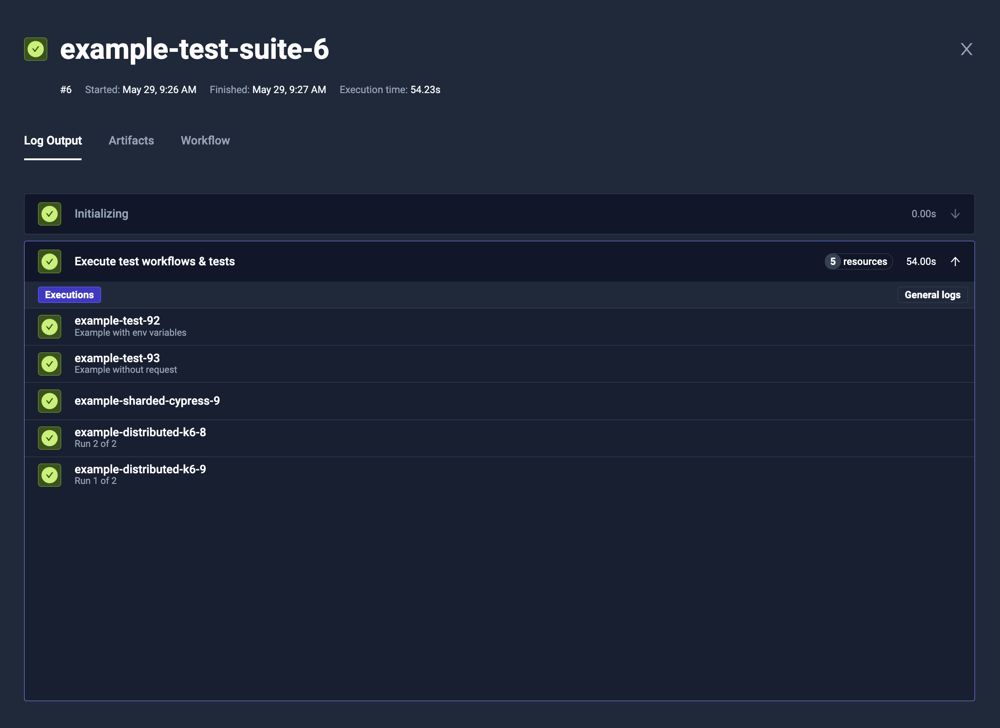
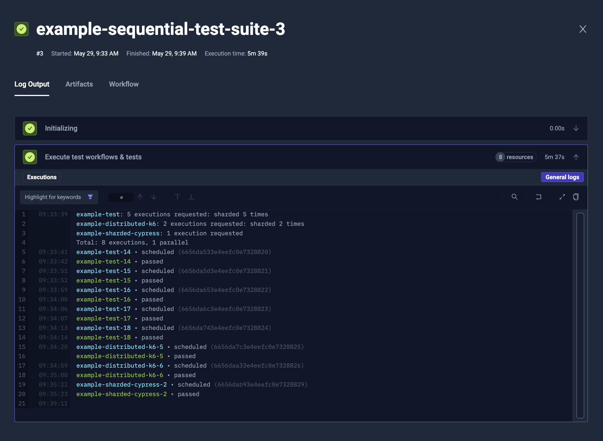

import Tabs from "@theme/Tabs";
import TabItem from "@theme/TabItem";

# Test Workflows - Test Suites

With Test Workflows it is possible to run downstream Test Workflows and Tests with `execute` operation,
similarly to what you can do in Test Suites.

## Advantages over original Test Suite

:::tip

We consider Test Workflows as a long-term solution, so keep in mind that the original Test Suites will [**become deprecated**](https://testkube.io/blog/the-future-of-testkube-with-test-workflows).

:::

As it is regular Test Workflow, where a single step is dispatching downstream Test Workflows and Tests,
the execution is very flexible. You can:

* Fetch input data before (i.e. by using `curl`/`wget` to download data, or fetching Git repository)
* Run setup operations (i.e. start shared instance of database, or generate API key)
* Process the results (i.e. by notifying about the status)
* Run other tests based on the previous results

## Syntax

You have to use `execute` operation in the step, and provide definition of the Test Workflows and Tests to run.

<Tabs>
<TabItem value="yaml" label="YAML" default>

```yaml
apiVersion: testworkflows.testkube.io/v1
kind: TestWorkflow
metadata:
  name: example-test-suite
spec:
  steps:
  - execute:
      workflows:
      - name: example-distributed-k6
        description: Run {{ index + 1 }} of {{ count }}
        count: 2
        config:
          vus: 8
          duration: 1s
          workers: 2
      - name: example-sharded-cypress
      tests:
      - name: example-test
        description: Example without request
      - name: example-test
        description: Example with env variables
        executionRequest:
          variables:
            SOME_VARIABLE:
              type: basic
              name: SOME_VARIABLE
              value: some-value
```

</TabItem>
<TabItem value="log" label="Log Output">



</TabItem>
</Tabs>

### Running Test Workflows

To run Test Workflow as part of the `execute` step, you have to add its reference in the `workflows` list.

You need to provide `name`, along with optional `config` values for parametrization.

### Running Tests

:::tip

We consider Test Workflows as a long-term solution, so keep in mind that the Tests will [**become deprecated**](https://testkube.io/blog/the-future-of-testkube-with-test-workflows).

:::

To run Tests as part of the `execute` step, you have to add its reference in the `tests` list.

You need to provide `name`, along with optional `executionRequest` values for parametrization,
that are similar to the regular Test execution request.

### Controlling the concurrency level

You can use `parallelism` property to control how many Test Workflows and Tests will be running at once.

In example, to run all the downstream jobs sequentially, you can use `parallelism: 1`.
It affects jobs instantiated by [**matrix and sharding**](./test-workflows-matrix-and-sharding.md) properties (like `count`) too.

<Tabs>
<TabItem value="yaml" label="YAML" default>

```yaml
apiVersion: testworkflows.testkube.io/v1
kind: TestWorkflow
metadata:
  name: example-sequential-test-suite
spec:
  steps:
  - execute:
      parallelism: 1
      workflows:
      - name: example-distributed-k6
        count: 2
        config:
          vus: 8
          duration: 1s
          workers: 2
      - name: example-sharded-cypress
      tests:
      - name: example-test
        count: 5
```

</TabItem>
<TabItem value="log" label="Log Output">



</TabItem>
</Tabs>

## Passing input from files

It may happen that you will need to pass information from the file system. You can either pass the files using Test Workflow expressions (like `file("./file-content.txt")`) or using a `tarball` syntax.

### Specific files

You can easily use Test Workflow expressions to fetch some files and send them as a configuration variable:

```yaml
apiVersion: testworkflows.testkube.io/v1
kind: TestWorkflow
metadata:
  name: example-test-suite-with-file-input
spec:
  content:
    git:
      uri: https://github.com/kubeshop/testkube
      revision: main
      paths:
      - test/k6/executor-tests/k6-smoke-test-without-envs.js
  steps:
  - execute:
      workflows:
      - name: example-distributed-k6
        config:
          vus: 8
          duration: 1s
          workers: 2
          script: '{{ file("/data/repo/test/k6/executor-tests/k6-smoke-test-without-envs.js") }}'
```

### Multiple files transfer

To transfer multiple files, similarly to `transfer` in [**Parallel Steps**](./test-workflows-parallel.md#copying-content-inside),
you can use a `tarball` syntax that will pack selected files and return the URL to download them:

```yaml
apiVersion: testworkflows.testkube.io/v1
kind: TestWorkflow
metadata:
  name: example-test-suite-with-file-input-packaged
spec:
  content:
    git:
      uri: https://github.com/kubeshop/testkube
      revision: main
      paths:
      - test/k6/executor-tests/k6-smoke-test-without-envs.js
  steps:
  - execute:
      workflows:
      - name: example-test-reading-files
        tarball:
          scripts:
            from: /data/repo
        config:
          input: '{{ tarball.scripts.url }}'
```

You can later use i.e. `content.tarball` to unpack them in destination test:

```yaml
apiVersion: testworkflows.testkube.io/v1
kind: TestWorkflow
metadata:
  name: example-test-reading-files
spec:
  config:
    input: {type: string}
  content:
    tarball:
    - url: "{{ config.input }}" # extract provided tarball
      path: "/data/repo"        # to local /data/repo directory (or any other)
  steps:
  - shell: tree /data/repo
```

### Matrix and sharding

The `execute` operation supports matrix and sharding, to run multiple replicas and/or distribute the load across multiple runs.
It is supported by regular matrix/sharding properties (`matrix`, `shards`, `count` and `maxCount`) for each Test Workflow or Test reference.

You can read more about it in the general [**Matrix and Sharding**](./test-workflows-matrix-and-sharding.md) documentation.