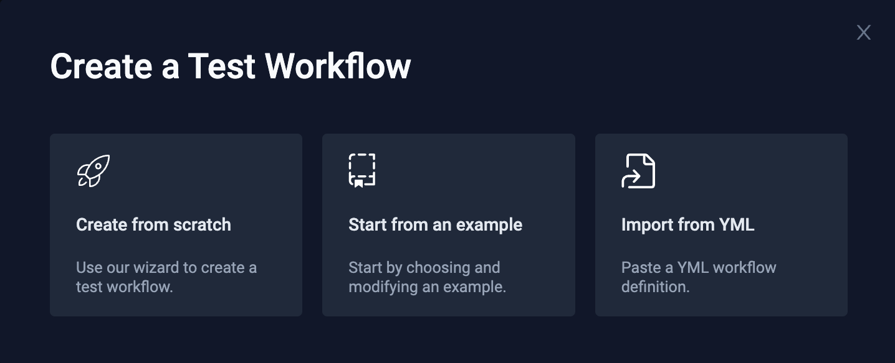
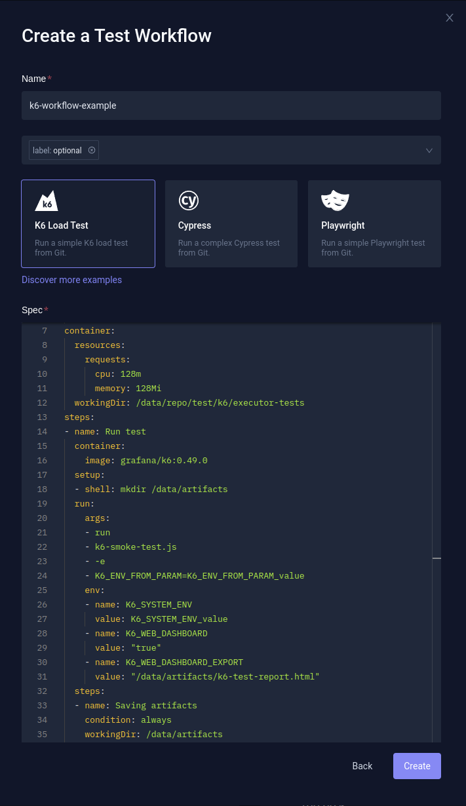
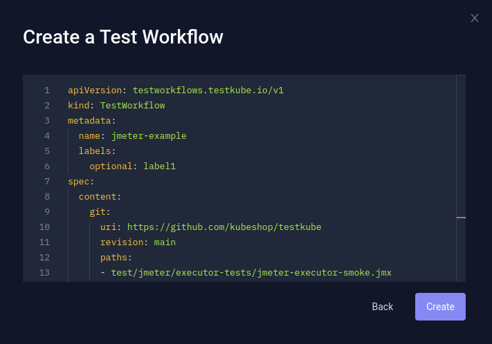

# Test Workflows

## Introduction
TestWorkflows are an easy and extremely powerful way to define and run your tests in 
your Kubernetes clusters. Thanks to their flexibility, TestWorkflows solve many of the 
problems that can occur with standard Tests, including:

- Running Tests using different testing tool versions and dependencies.
- Defining multiple steps for the execution of the tests.
- Having more control over how your tests are executed, including resource consumption and setup/tearDown processes.
- Being able to configure tool-specific commands and arguments.

## Test Workflow structure

TestWorkflows are defined using a specific workflow language wrapped in a CRD. The high-level structure
of a TestWorkflow is as follows:

```yaml title="testworkflows-outline.yaml"
apiVersion: testworkflows.testkube.io/v1
kind: TestWorkflow
metadata:
  name: ... # name of the Test Workflow
spec:
  content: # content specifies where to find the actual test definition(s) to run 
    git: # checking out from git repository - see below
      ...
    files: # defines files to create containing the actual tests - see below
      ...
  container: # settings applied to all images used in the workflow, can be overridden
    resources: # resource settings
      requests: # resource requests
        ...
      limits: # resource limits
        ...
    workingDir: # default workingDir in the containers
    env: # global env variables
      ...
  steps: # steps that will be executed by this Test Workflow, can be nested
  - name: ... # name of step
    run: # action to perform for this step - see below for possible values
      ...
```

The different properties are described with examples and in more detail below.

## Example - Test Workflow for Postman
Example Test Workflow for running Postman collection from Testkube repository: [/test/postman/executor-tests/postman-executor-smoke-without-envs.postman_collection.json](https://raw.githubusercontent.com/kubeshop/testkube/develop/test/postman/executor-tests/postman-executor-smoke-without-envs.postman_collection.json)

```yaml title="postman-example.yaml"
apiVersion: testworkflows.testkube.io/v1
kind: TestWorkflow
metadata:
  name: postman-workflow-example # name of the Test Workflow
spec:
  content:
    git: # checking out from git repository
      uri: https://github.com/kubeshop/testkube
      revision: main
      paths:
      - test/postman/executor-tests/postman-executor-smoke-without-envs.postman_collection.json
  container: # container settings
    resources: # resource settings (optional)
      requests: # resource requests
        cpu: 256m
        memory: 128Mi
    workingDir: /data/repo/test/postman/executor-tests # default workingDir
  steps: # steps that will be executed by this Test Workflow
  - name: Run test
    run:
      image: postman/newman:6-alpine # image used while running specific step
      args: # args passed to the container
      - run
      - postman-executor-smoke-without-envs.postman_collection.json
```

## metadata
### name
`metadata.name` is mandatory - it's a name of the Test Workflow (for example `postman-workflow-example`)
### labels
Labels can be set to allow easier filtering of Test Workflows.
```yaml
metadata:
  name: example-workflow
  labels:
    example: label
    another: one
    one: more
```
## content
### git
`spec.content.git` allows checking out from the Git repository:

```yaml
spec:
  content:
    git:
      uri: https://github.com/kubeshop/testkube # repository URI
      revision: main # branch/revision
      paths:
      - test/cypress/executor-tests/cypress-13 # path to check out
```

`path` can be a directory, or a single file
### files
`spec.content.files` allow creating specific files from strings.

```yaml
spec:
  content:
    files:
    - path: k6.js # created in working dir
        content: |
        import http from 'k6/http';
        export const options = {
            thresholds: {
            http_req_failed: ['rate<0.01'],
            }
        };
        export default function () {
            http.get('https://testkube.io/');
        }
    - path: /example-file.js # created in root directory
        content: another file contents
    steps:
    - name: Run test
    shell: k6 run k6.js --iterations 100
    container:
        image: grafana/k6:latest
```
## steps
Steps are the main building blocks in Test Workflows. They describe actions, that should be executed in specific order.
```yaml
spec:
  ...
  steps:
  - name: Example step 1
    ...
  - name: Example step 2
    ...
  - name: Example step 3
    ...
```
### sub-steps
Steps can also be nested:
```yaml
spec:
  steps:
  - name: Step 1
    ...
    steps:
    - name: Sub-step 1-1
      ...
    - name: Sub-step 1-2
      ...
  - name: Step 2
    ...
    steps:
    - name: Sub-step 2-1
      ...
    - name: Sub-step 2-2
      ...
```

### run
#### command
`command` allows to set the command, or override the default one:

```yaml
spec:
  steps:
  - name: Run tests
    run:
      image: gradle:8.5.0-jdk11
      command:
      - gradle
```

#### args
Arguments can be passed to container using `args`:
```yaml
  steps:
  - name: Run tests
    run:
      image: cypress/included:13.6.4
      args:
      - --env
      - NON_CYPRESS_ENV=NON_CYPRESS_ENV_value
      - --config
      - video=true
```
#### command + args
Command can be combined with args:
```yaml
  - name: Run tests
    run:
      image: mcr.microsoft.com/playwright:v1.32.3-focal
      command:
      - "npx"
      args:
      - "--yes"
      - "playwright@1.32.3"
      - "test"
```

Args can be also set directly with command:
```yaml
  - name: Run tests
    run:
      image: mcr.microsoft.com/playwright:v1.32.3-focal
      command:
      - "npx"
      - "--yes"
      - "playwright@1.32.3"
      - "test"
```

#### ENVs
ENVs can be defined with `env` keyword on the step level:
```yaml
steps:
  - name: Run tests
    run:
      ...
      env:
      - name: EXAMPLE_ENV_NAME
        value: "example-env-value"
```

or "globally":
```yaml
spec:
  container:
    ...
    env:
    - name: EXAMPLE_ENV_NAME
      value: "example-env-value"
```

#### shell
`shell` provides an ability to run command, or multiple commands inside the shell.

```yaml
steps:
  - shell: command1 && command2
```

The same can be achieved with command and args, but `shell` may be more convenient.
```yaml
steps:
  - shell: mkdir ~/some-directory
```
is an equivalent of:

```yaml
steps:
  - run:
      comand: [/bin/sh, -c]
      args:
        - mkdir
        - ~/some-directory
```

## container
`container` defines container-related settings.

### image
`container.image`` defines an image which will be used for executing steps.

```yaml
steps:
  - name: Run tests
    shell: jmeter -n -t jmeter-executor-smoke.jmx -j /data/artifacts/jmeter.log -o /data/artifacts/report -l /data/artifacts/jtl-report.jtl -e
    container:
      image: justb4/jmeter:5.5
```

### resources
Resources can be configured for specific container.

#### resource requests
```yaml
spec:
  ...
  container:
    resources:
      requests:
        cpu: 2
        memory: 2Gi
```
#### resource limits
```yaml
spec:
  ...
  container:
    resources:
      limits:
        cpu: 4
        memory: 4Gi
```
## workingDir
By default, everything will be executed in the context of working dir from specific container.

Working dir can be set globally:
```yaml
spec:
  ...
  container:
    workingDir: /data/repo/test/cypress/executor-tests/cypress-13
```

Or, for specific step:
```yaml
steps:
- name: Saving artifacts
  workingDir: /data/repo/test/cypress/executor-tests/cypress-13/cypress/videos
```

or on the Step level:

## artifacts
Files directly in `working dir`
```yaml
- name: Saving artifacts
  workingDir: /data/artifacts
  artifacts:
    paths:
    - '*'
```

Files in directories inside `working dir``
```yaml
- name: Saving artifacts
  workingDir: /data/artifacts
  artifacts:
    paths:
    - '**/*'
```

Artifacts can also be configured for project directories (inside `/data/repo`):

```yaml
- name: Saving artifacts
  workingDir: /data/repo/test/cypress/executor-tests/cypress-13/cypress/videos
  artifacts:
    paths:
    - '**/*'
```

### condition: always
It's a common thing to save artifacts in case of failure. By default the `artifacts` have `condition: always` set if added directly on step. So, they will be always scraped - even if the step fails:

```yaml
- name: Example step with artifacts
  shell: example-command
  artifacts:
    paths:
    - '**/*'
```

If artifacts are saved in a separate step, or in a sub-step, they won't be scraped by default in case of earlier failure. In that case, setting `condition: always` specifically would be needed.

Separate step:

```yaml
- name: Step 1
  shell: example-command
- name: Step 2 - Saving artifacts
  condition: always
  artifacts:
    paths:
    - '**/*'
```

Sub-step:
```yaml
- name: Step 1
  shell: example-command
  steps:
  - name: Sub-step - Saving artifacts
    condition: always
    artifacts:
      paths:
      - '**/*'
```


### Example - Cypress project
Example Cypress project with artifacts (video recordings):

```yaml
apiVersion: testworkflows.testkube.io/v1
kind: TestWorkflow
metadata:
  name: cypress-example-video-artifact
  labels:
    core-tests: workflows
spec:
  content:
    git:
      uri: https://github.com/kubeshop/testkube
      revision: main
      paths:
      - test/cypress/executor-tests/cypress-13
  container:
    resources:
      requests:
        cpu: 2
        memory: 2Gi
    workingDir: /data/repo/test/cypress/executor-tests/cypress-13
  steps:
  - name: Run tests
    run:
      image: cypress/included:13.6.4
      args:
      - --env
      - NON_CYPRESS_ENV=NON_CYPRESS_ENV_value
      - --config
      - video=true
      env:
      - name: CYPRESS_CUSTOM_ENV
        value: CYPRESS_CUSTOM_ENV_value
    steps:
    - name: Saving artifacts
      workingDir: /data/repo/test/cypress/executor-tests/cypress-13/cypress/videos
      artifacts:
        paths:
        - '**/*'
```
## `template` - executing from Test Workflow Template
`template` allows to execute from - [Test Workflow Template](./test-workflow-templates.md):
```yaml
  steps:
  - name: Run from template
    ...
    template:
      name: example-template/cypress
      config:
        version: 13.5.0
        params: "--env NON_CYPRESS_ENV=NON_CYPRESS_ENV_value --config '{\"screenshotsFolder\":\"/data/artifacts/screenshots\",\"videosFolder\":\"/data/artifacts/videos\"}'"
```

# Creating Test Workflow
## CLI
Testkube CLI allows managing Test Workflows in the similar way as Test, and TestSuites.

### Create
`testkube create testworkflow -f EXAMPLE_FILE.yaml`

#### kubectl apply
Alternatively, the `kubectl apply` can be used:
`kubectl apply -f EXAMPLE_FILE.yaml`

### Get
The Test Workflow details can be displayed using `testkube get testworkflow` command using Test Workflow name:
`testkube get testworkflow TEST_WORKFLOW_NAME`

#### Filtering by labels
Test Workflows can also be filtered using labels with `--label`:
`testkube get testworkflow --label example=label`

### Run
The Test Workflow can be run using `testkube run testworkflow` command using Test Workflow name:
`testkube run testworkflow TEST_WORKFLOW_NAME`

Optionally, the follow option can be used to watch execution, and get log summary directly:
`testkube run testworkflow TEST_WORKFLOW_NAME -f`

### Delete
The Test Workflow can be deleted using `testkube delete testworkflow` command using Test Workflow name:
`testkube delete testworkflow TEST_WORKFLOW_NAME`

### Alias
`tw` alias can be used instead of `testworkflow` - for example:
`testkube get tw`

## Testkube Pro UI (Dashboard)
If you prefer to use the Dashboard, just go to Test Workflows:


and click the `Add a new test workflow` button.

### Creation options
Currently, the Test Workflow can be created using example, or by importing YML.



#### Example
You can choose one of the predefined examples, and adjust it.



#### YML
You can also paste the complete TestWorkflow definition


# Additional Test Workflow examples
Additional Test Workflow examples can be found in the Testkube repository.

- [Cypress](https://github.com/kubeshop/testkube/blob/develop/test/cypress/executor-tests/crd-workflow/smoke.yaml)

- [Gradle](https://github.com/kubeshop/testkube/blob/develop/test/gradle/executor-smoke/crd-workflow/smoke.yaml)

- [JMeter](https://github.com/kubeshop/testkube/blob/develop/test/jmeter/executor-tests/crd-workflow/smoke.yaml)

- [k6](https://github.com/kubeshop/testkube/blob/develop/test/k6/executor-tests/crd-workflow/smoke.yaml)

- [Maven](https://github.com/kubeshop/testkube/blob/develop/test/maven/executor-smoke/crd-workflow/smoke.yaml)

- [Playwright](https://github.com/kubeshop/testkube/blob/develop/test/playwright/executor-tests/crd-workflow/smoke.yaml)

- [Postman](https://github.com/kubeshop/testkube/blob/develop/test/postman/executor-tests/crd-workflow/smoke.yaml)

- [SoapUI](https://github.com/kubeshop/testkube/blob/develop/test/soapui/executor-smoke/crd-workflow/smoke.yaml)
