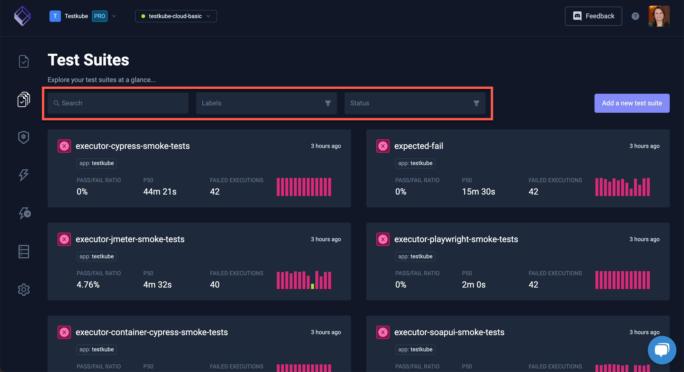
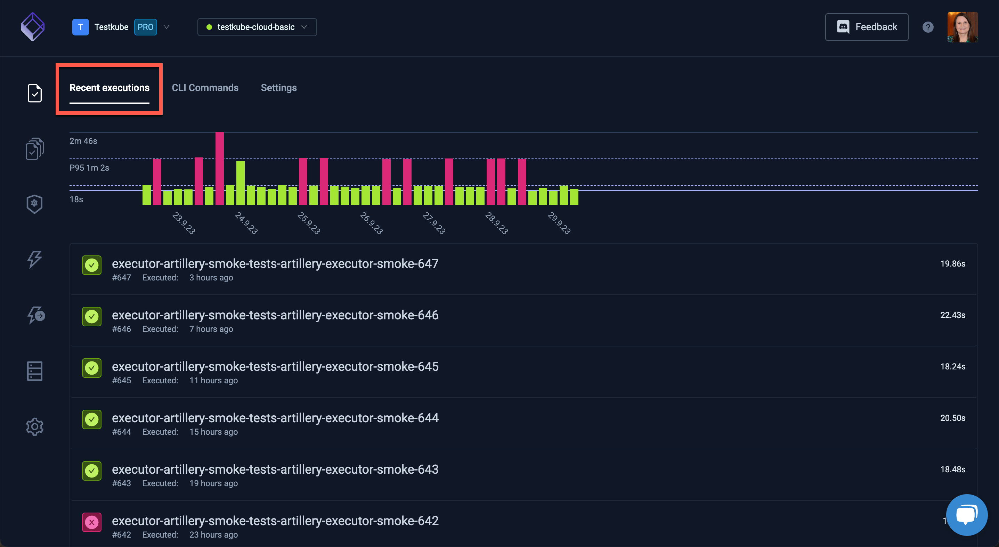
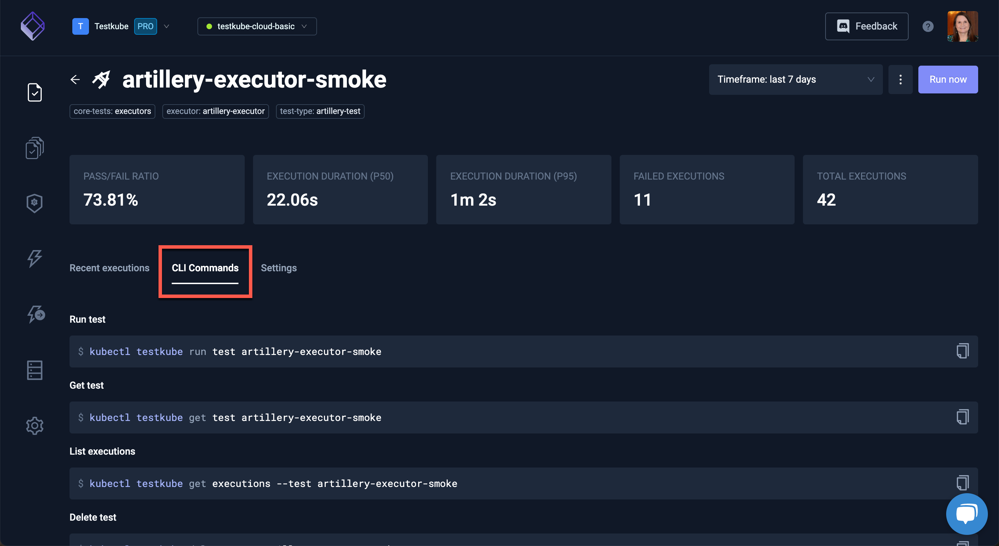
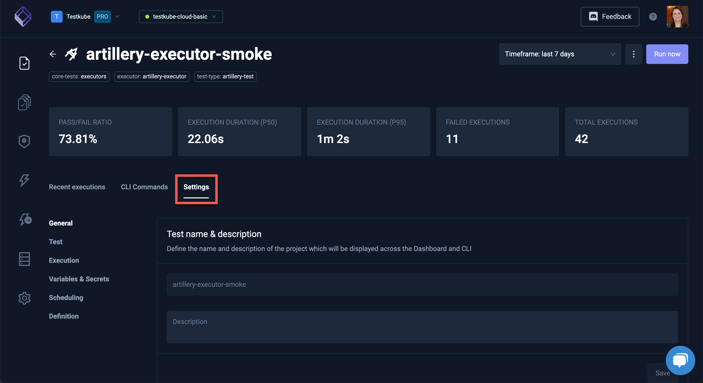

# Explore the Testkube Dashboard

The Testkube Dashboard displays the current status of Tests and Test Suites executed in your environment.

After selecting Tests or Test Suites in the left bar, the list of recent runs is displayed. At the top of the list, a Search field and filters for Labels and Status make finding tests in a large list easier:

Select any Test or Test Suite to see the recent executions and their statuses.

The execution statistics of the chosen Test or Test Suite are at the top of the screen, along with a graph of success or failure for the executions.

The **Recent executions** tab has the list of executions. A green checkmark denotes a successful execution, a red 'x' denotes a failed execution and circling dots denotes a current run of a Test or Test Suite.

The **CLI Commands** tab shows the commands used to perform the selected test:

Use the **Settings** to view or change the local settings of the Test or Test Suite.

