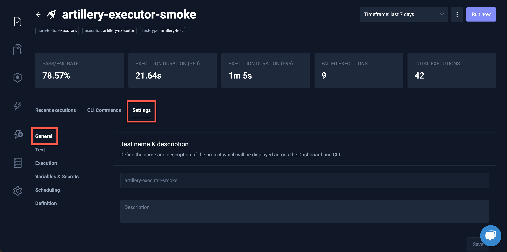
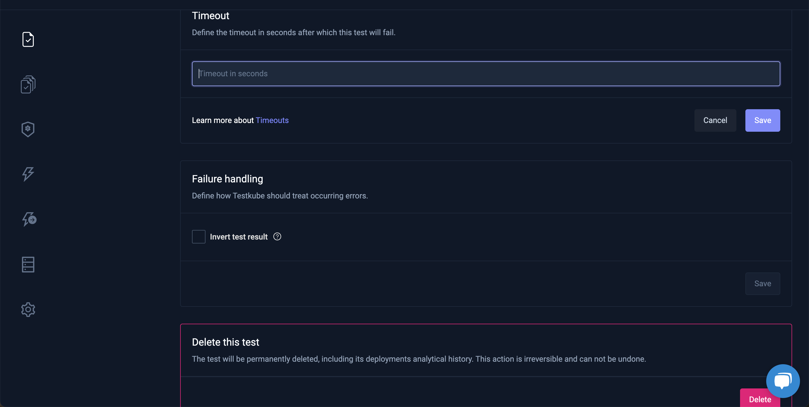
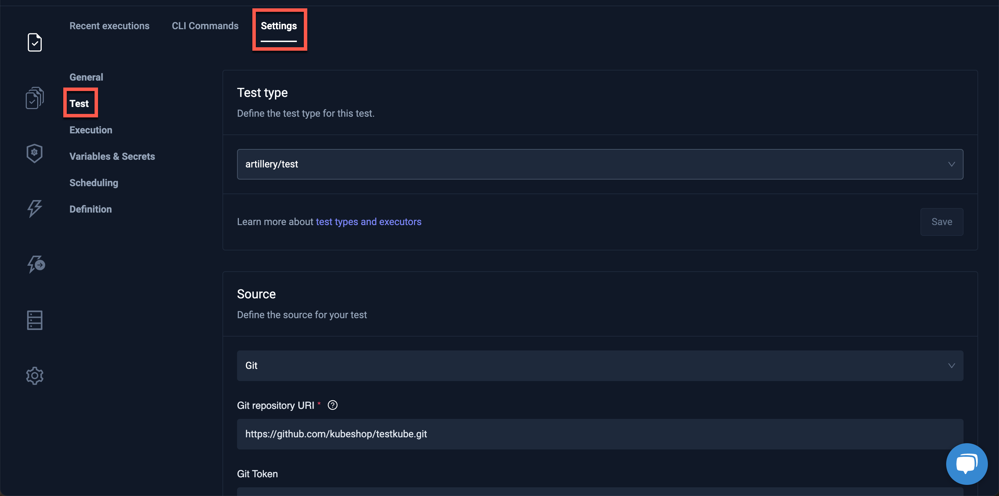
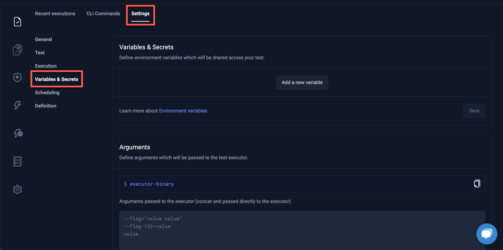
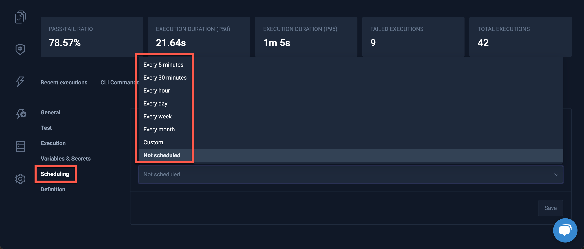

# General Settings

Clicking the **General** box under the **Settings** tab displays the **Test name & description** and **Labels** for the Test or Test Suite:

It is also the place to configure a Timeout or Failure Handling or delete a Test or Test Suite:

## Test

Clicking **Test** will display more details for the selected Test:

If you have selected a Test Suite, the Tests contained in that Test Suite will be shown. In this view, you will also see which test are run in parallel and which are run sequentially. Please see the [Scheduling Tests](./scheduling-tests.mdx) doc to learn more about how to schedule tests.

## Execution

Testkube allows for the Pre-Run or Post-Run of commands for a test.

In the Execution section of the Settings tab, you can set up a command or a script (relative to your source root) which will be executed before or after the test itself is started.

## Variables & Secrets

Visit [Using Test Variables](./adding-tests-variables.mdx) for a description of adding Variables and Secrets.

## Scheduling

Add a cronjob-like schedule for your test which will then be executed automatically.

## Definition

Clicking the **Definition** section under the **Settings** tab allows the validation and export of the configuration for the Test or Test Suite:

