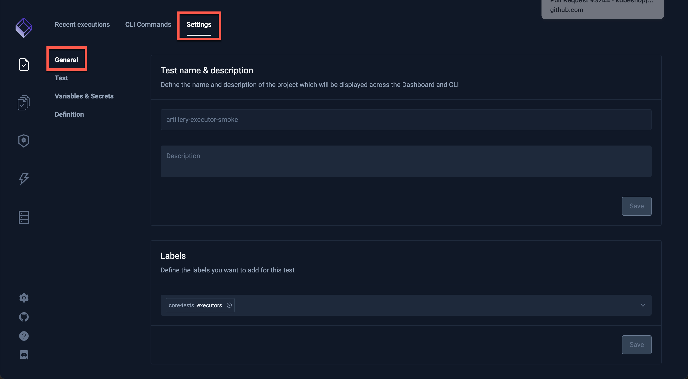
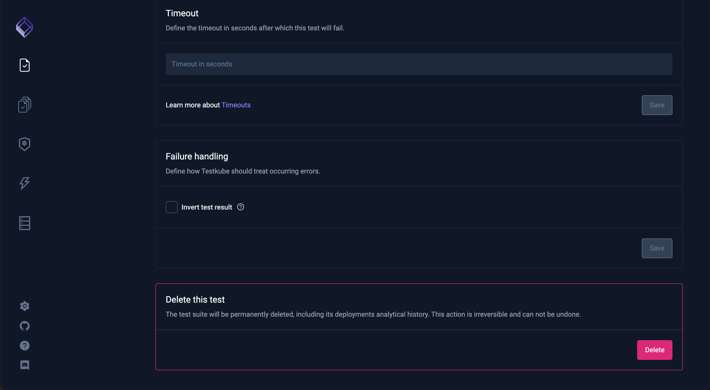
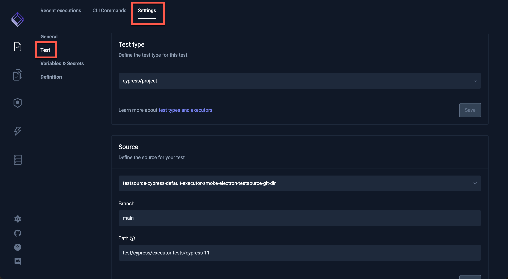
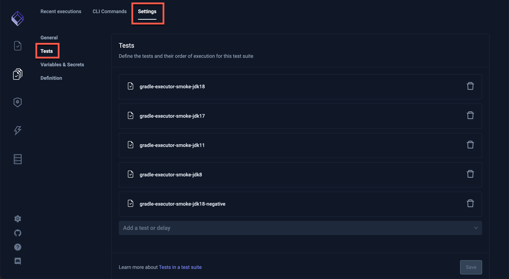
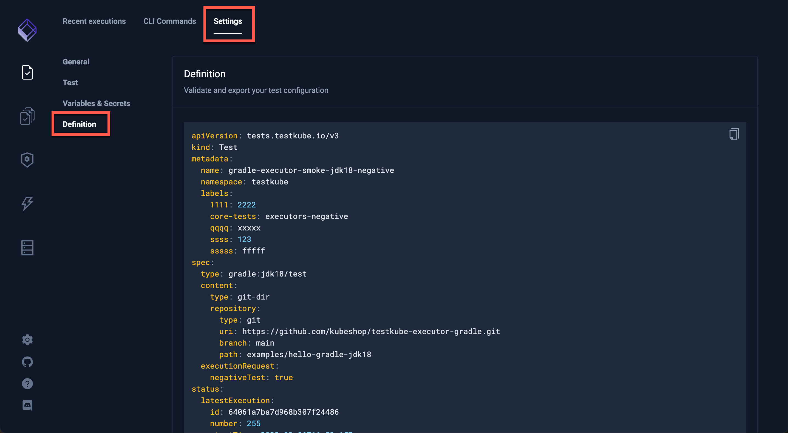

# General Settings

Clicking the **General** box under the **Settings** tab displays the **Test name & description** and **Labels** for the Test or Test Suite:

It is also the place to configure a Timeout or Failure Handling or delete a Test or Test Suite:

## Test

Clicking **Test** will display more details for the selected Test:

If you have selected a Test Suite, the Tests contained in that Test Suite will be shown.

## Variables & Secrets

Visit [Using Tests Variables](./adding-tests-variables.md) for a description of adding Variables and Secrets.

## Definition

Clicking the **Definition** box under the **Settings** tab allows the validation and export of the configuration for the Test or Test Suite:

