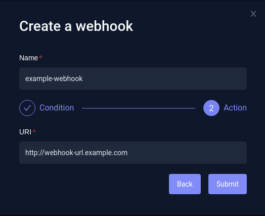
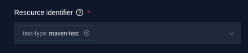
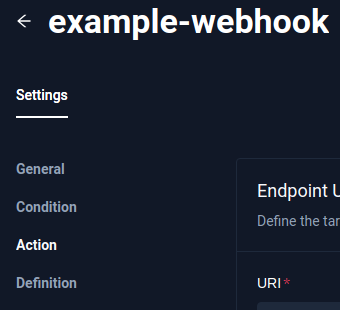
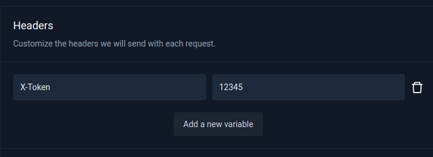

import Tabs from "@theme/Tabs";
import TabItem from "@theme/TabItem";

# Webhooks

Webhooks allow you to integrate Testkube with external systems by sending HTTP POST payloads containing information about Testkube executions and their current state when specific events occur. To set up webhooks in Testkube, you'll need to have an HTTPS endpoint to receive the events and a payload template to be sent along with the data.

:::note
Please visit our Blog, [Empowering Kubernetes Tests with Webhooks](https://testkube.io/blog/empowering-kubernetes-tests-with-webhooks) for a tutorial on setting up webhooks for Slack and Grafana Dashboard.
:::

## Benefits of using Webhooks in Testkube

Testkube uses webhooks to integrate with external systems, allowing you to effortlessly synchronize your testing workflows with other tools and platforms. These webhooks are designed to carry critical information regarding your tests as HTTP POST payloads. The information can include the execution and real-time status depending on how you configure it.

To leverage webhooks, you need to ensure that the platform that you want to send information to has an HTTPS endpoint to receive the events. Testkube also allows you to customize the payloads.

You can create a webhook from the dashboard, use the CLI, or create it as a custom resource. Before we show how it’s done, let’s understand a few scenarios where Webhooks in Testkube shine:

- Incident Management & Response: Webhooks can be used to create incidents and alert on-call teams when a critical test fails. This ensures a timely response and avoids any potential disruption due to failures and bugs. With Testkube, you can configure incident management tools like PagerDuty and OpsGenie to receive alerts based on critical events for your tests.

- Communication and Collaboration: You can configure Webhooks in Testkube to send alerts to your teams in your communication tool. This will notify your team of any critical event that needs attention and attend to it before the issue escalates. Some of the popular communications tools like Slack and MS Teams can be configured to receive alerts from Testkube.

- Monitoring and Observability: Webhooks can also be used to send alerts and notifications to your monitoring and observability tools like Prometheus and Grafana. This provides visibility into your tests, alerts you, and ensures that timely corrective actions can be taken.

## Creating a Webhook

The webhook can be created using the Dashboard, CLI, or a Custom Resource.

<Tabs>
<TabItem value="dash" label="Dashboard">
If you prefer to use the Dashboard, you can view existing webhooks by going to the Webhooks tab.


Here you can also create a new webhook by clicking the `Create a new webhook` button.

Then, fill in the webhook details:


- Name - your webhook name (in this case `example-webhook`)
- Resource identifier - the resource (or resources) selected by `label` for which the webhook can be triggered (in the example: `test-type:postman-collection` - any postman test)
- Triggered events - events that will trigger the webhook (in this case `start-test`, `end-test-success`, and `end-test-failed`). All available trigger events can be found in the [Supported Event types](#supported-event-types) section.



Set your webhook URI - the HTTPS endpoint where you want to receive the webhook events.
After the webhook is created, the custom payload and headers can be set in Settings->Action.

</TabItem>

<TabItem value="cli" label="CLI">
Webhooks can be created with Testkube CLI using the `create webhook` command.

```sh
testkube create webhook --name example-webhook --events start-test --events end-test-success --events end-test-failed --uri <YOUR_ENDPOINT_URL>
```

`--name` - Your webhook name (in this case `example-webhook`).
`--events` - Event that will trigger a webhook. Multiple `--events` can be defined (in this case `--events start-test --events end-test-success --events end-test-failed`). All available trigger events can be found in the [Supported Event types](#supported-event-types) section.
`--uri` - The HTTPS endpoint where you want to receive the webhook events.

</TabItem>

<TabItem value="crd" label="Custom Resource">

```yaml title="webhook.yaml"
apiVersion: executor.testkube.io/v1
kind: Webhook
metadata:
  name: example-webhook
  namespace: testkube
spec:
  uri: <YOUR_ENDPOINT_URL>
  events:
    - start-test
    - end-test-success
    - end-test-failed
  selector: ""
```

Where <YOUR_ENDPOINT_URL> should be replaced with the HTTPS endpoint URL where you want to receive the webhook events.

And then apply with:

```sh
kubectl apply -f webhook.yaml
```

</TabItem>

</Tabs>

### Resource Selector (labels)

In order to limit webhook triggers to a specific resource, or resources, the Resource Selector can be used. It allows you to select the specific resource by label, or labels.

<Tabs>
<TabItem value="dash" label="Dashboard">



</TabItem>

<TabItem value="cli" label="CLI">

The Resource Selector can be set with `--selector`.
For example, `--selector test-type=postman-collection` will limit the resources to the postman tests (label: `test-type=postman-collection`)

</TabItem>

<TabItem value="crd" label="Custom Resource">

```yaml
spec:
  selector: test-type=postman-collection
```

So, the complete definition may look like this:

```yaml title="webhook.yaml"
apiVersion: executor.testkube.io/v1
kind: Webhook
metadata:
  name: example-webhook
  namespace: testkube
spec:
  uri: <YOUR_ENDPOINT_URL>
  events:
    - start-test
    - end-test-success
    - end-test-failed
  selector: test-type=postman-collection
```

</TabItem>
</Tabs>

### Webhook Payload

Webhook payload can be configured - in this example, `event id`:

```
{"text": "event id {{ .Id }}"}
```

<Tabs>
<TabItem value="dash" label="Dashboard">
When you have selected an existing Webhook, its payload can be configured in Webhook Settings->Action.




</TabItem>

<TabItem value="cli" label="CLI">
Create a webhook payload template file:

```json title="template.json"
{
  "text": "event id {{ .Id }}"
}
```

And set it with `--payload-template template.json`.

```sh
testkube create webhook --name example-webhook --events start-test --events end-test-passed --events end-test-failed --payload-template template.json --uri <YOUR_ENDPOINT_URL>
```

Where <YOUR_ENDPOINT_URL> should be replaced with the HTTPS endpoint URL where you want to receive the webhook events.

```sh title="Expected output:"
Webhook created example-webhook 🥇
```

</TabItem>

<TabItem value="crd" label="Custom Resource">

Payload template can be configured with `spec.payloadTemplate`.

```
  payloadTemplate: |
    {"text": "event id {{ .Id }}"}
```

Example:

```
apiVersion: executor.testkube.io/v1
kind: Webhook
metadata:
  name: example-webhook
  namespace: testkube
spec:
  uri: <YOUR_ENDPOINT_URL>
  events:
    - start-test
    - end-test-success
    - end-test-failed
  selector: ""
  payloadObjectField: ""
  payloadTemplate: |
    {"text": "event id {{ .Id }}"}
```

</TabItem>

</Tabs>

### Webhook Payload Variables

Webhook payload can contain **event-specific** variables - they will be replaced with actual data when the events occurs. In the above examples, only the event `Id` is being sent.
However, any of these [supported Event Variables](#supported-event-variables) can be used.

For example, the following payload:

```
{"text": "Event {{ .Type_ }} - Test '{{ .TestExecution.TestName }}' execution ({{ .TestExecution.Number }}) finished with '{{ .TestExecution.ExecutionResult.Status }}' status"}
```

will result in:

```
{"text": "Event end-test-success - Test 'postman-executor-smoke' execution (948) finished with 'passed' status"}
```

#### testkube-api-server ENV variables

In addition to event-specific variables, it's also possible to pass testkube-api-server ENV variables:

```sh title="template.txt"
TESTKUBE_PRO_URL: {{ index .Envs "TESTKUBE_PRO_URL" }}
```

### URI and HTTP Headers

You can add additional HTTP headers like `Authorization` or `x-api-key` to have a secret token.
It's possible to use golang based template string as header or uri value.

### Helper methods

We also provide special helper methods to use in the webhook template:
`executionstatustostring` is the method to convert a pointer to a execution status to a string type.
`testsuiteexecutionstatustostring` is the method to convert a pointer to a test suite execution status to a string type.
`testworkflowstatustostring` is the method to convert a pointer to a test workflow status to a string type.

Usage example:

```yaml
  - name: TEXT_COLOUR
    value: {{ if eq (.TestSuiteExecution.Status | testsuiteexecutionstatustostring ) "passed" }}"00FF00"{{ else }}"FF0000"{{ end }}
```

<Tabs>
<TabItem value="dash" label="Dashboard">

Webhook headers can be configured in Webhook Settings->Action.




</TabItem>

<TabItem value="cli" label="CLI">
Custom headers can be set using `--header` - for example:

`--header X-Token="12345"`

</TabItem>

<TabItem value="crd" label="Custom Resource">

```yaml
spec:
  headers:
    X-Token: "12345"
```

```yaml title="webhook.yaml"
apiVersion: executor.testkube.io/v1
kind: Webhook
metadata:
  name: example-webhook
  namespace: testkube
spec:
  uri: <YOUR_ENDPOINT_URL>
  events:
    - start-test
    - end-test-success
    - end-test-failed
  selector: ""
  headers:
    X-Token: "12345"
```

</TabItem>
</Tabs>

## Supported Event types

Webhooks can be triggered on any of the following events:

- start-test
- end-test-success
- end-test-failed
- end-test-aborted
- end-test-timeout
- start-testsuite
- end-testsuite-success
- end-testsuite-failed
- end-testsuite-aborted
- end-testsuite-timeout
- start-testworkflow
- start-testworkflow
- end-testworkflow-success
- end-testworkflow-failed
- end-testworkflow-aborted
- created
- updated
- deleted

They can be triggered by the following resources:

- test
- testsuite
- testworkflow
- executor
- trigger
- webhook
- testexecution
- testsuiteexecution

## Supported Event Variables

### Event-specific variables:

- `Id` - event ID (for example, `2a20c7da-3b77-4ea9-a33d-403187d3e9e6`)
- `Resource`
- `ResourceId`
- `Type_` - event Type (for example, `start-test`, `end-test,success`, etc. All available trigger events can be found in the [Supported Event types](#supported-event-types) section).
- `TestExecution` - test execution details (example: [TestExecution (Execution)](#testexecution-execution) section)
- `TestSuiteExecution` - test suite execution details (example: [TestSuiteExecution](#testsuiteexecution) section)
- `TestWorkflowExecution` - test suite execution details (example: [TestWorkflowExecution](#testworkflowexecution) section)
- `ClusterName` - cluster name
- `Envs` (API-server ENV variables) - list of Testkube API-Server ENV variables

The full Event Data Model can be found [here](https://github.com/kubeshop/testkube/blob/main/pkg/api/v1/testkube/model_event.go).

### TestExecution (Execution):

- `Id` - Execution ID (for example, `64f8cf3c712890925aea51ce`)
- `TestName` - Test Name (for example, `postman-executor-smoke`)
- `TestSuiteName` - Test Suite name (if run as a part of a Test Suite)
- `TestNamespace` - Execution namespace, where testkube is installed (for example, `testkube`)
- `TestType` - Test type (for example, `postman/collection`)
- `Name` - Execution name (for example, `postman-executor-smoke-937)
- `Number` - Execution number (for example, `937`)
- `Envs` - List of ENV variables for specific Test (if defined)
- `Command` - Command executed inside the Pod (for example, `newman`)
- `Args` - Command arguments (for example, `run <runPath> -e <envFile> --reporters cli,json --reporter-json-export <reportFile>`)
- `Variables` - List of variables
- `Content` - Test content
- `StartTime` - Test start time (for example, `2023-09-06 19:23:34.543433547 +0000 UTC`)
- `EndTime` - Time when the test execution finished (for example, `2023-09-06 19:23:42.221493031 +0000 UTC`)
- `Duration` - Test duration in seconds (for example, `7.68s`)
- `DurationMs` - Test duration in miliseconds (for example, `7678`)
- `ExecutionResult` - Execution result (https://github.com/kubeshop/testkube/blob/main/pkg/api/v1/testkube/model_event.go)
- `Labels` Test labels (for example, `[core-tests:executors executor:postman-executor test-type:postman-collection],`)
- `RunningContext` - Running context - how the test has been triggered (for example, `user-ui`)

The full Execution data model can be found [here](https://github.com/kubeshop/testkube/blob/main/pkg/api/v1/testkube/model_execution.go).

### TestSuiteExecution:

- `Id` - TestSuiteExecution ID (for example, `64f8d5b2712890925aea51dc`)
- `Name` - TestSuite name (for example, `ts-executor-postman-smoke-tests-472`)
- `Status` - TestSuite execution status (for example, `running` or `passed`)
- `Envs` - List of ENV variables
- `Variables` - List of variables
- `StartTime` - Test start time (for example, `2023-09-06 19:23:34.543433547 +0000 UTC`)
- `EndTime` - Time when the test execution finished (for example, `2023-09-06 19:23:42.221493031 +0000 UTC`)
- `Duration` - Test duration in seconds (for example, `7.68s`)
- `DurationMs` - Test duration in miliseconds (for example, `7678`)
- `StepResults`
- `Labels` - TestSuite labels (for example, `[app:testkube testsuite:executor-postman-smoke-tests]`)
- `RunningContext` - Running context - how the TestSuite has been triggered (for example, `user-ui`)

The full TestSuiteExecution data model can be found [here](https://github.com/kubeshop/testkube/blob/main/pkg/api/v1/testkube/model_test_suite_execution.go).

### TestWorkflowExecution:

- `Id` - TestWorkflowExecution ID (for example, `64f8d5b2712890925aea51dc`)
- `Name` - TestWorkflow name (for example, `wf-postman-smoke-tests`)
- `Namepace` - TestWorkflowExecution namespace (for example, `my-testkube`)
- `Number` - TestWorkflowExecution sequence number
- `ScheduledAt` - TestWorkflow scheduled time (for example, `2023-09-06 19:23:34.543433547 +0000 UTC`)
- `StatusAt` - Time when the execution result's status has changed last time (for example, `2023-09-06 19:23:42.221493031 +0000 UTC`)
- `Signature` - Structured tree of TestWorkflow steps
- `Result` - TestWorkflow execution result
- `Output` - Additional information from the steps, like referenced executed tests or artifacts
- `Workflow` - TestWorkflow definition
- `ResolvedWorkflow` -  TestWorkflow definition with resolved fields

The full TestWorkflowExecution data model can be found [here](https://github.com/kubeshop/testkube/blob/main/pkg/api/v1/testkube/model_test_workflow_execution.go).

## Additional Examples

### Microsoft Teams

Webhooks can also be used to send messages to Microsoft Teams channels.
First, you need to create an incoming webhook in Teams for a specific channel. You can see how to do it in the Teams Docs [here](https://learn.microsoft.com/en-us/microsoftteams/platform/webhooks-and-connectors/how-to/add-incoming-webhook?tabs=dotnet#create-incoming-webhooks-1). After your Teams incoming webhook is created, you can use it with Testkube webhooks - just use the URL provided (it will probably look like this: `https://xxxxx.webhook.office.com/xxxxxxxxx`).

In order to send the message when test execution finishes, the following Webhook can be used:

```
apiVersion: executor.testkube.io/v1
kind: Webhook
metadata:
  name: example-webhook-teams
  namespace: testkube
spec:
  events:
  - end-test-success
  - end-test-failed
  - end-test-aborted
  - end-test-timeout
  uri: https://xxxxx.webhook.office.com/xxxxxxxxx
  payloadTemplate: "{\"text\": \"Test '{{ .TestExecution.TestName }}' execution ({{ .TestExecution.Number }}) finished with '{{ .TestExecution.ExecutionResult.Status }}' status\"}\n"
```

It will result in:

```
{"text": "Test 'postman-executor-smoke' execution (949) finished with 'passed' status"}
```

and the message:
`Test 'postman-executor-smoke' execution (949) finished with 'passed' status"` being displayed.

## Testing Webhooks

If you are just getting started and want to test your webhook configuration, you can use public and free services that act as HTTP catch-all apps. Here are a couple of options:

1. [Beeceptor](https://beeceptor.com/): Beeceptor allows you to quickly capture HTTP payloads, review them in real time, and send desired HTTP responses as you test your webhooks. You can use its local-tunnel feature when you want to test payloads against a service running on localhost.
2. [Webhook.Site](https://webhook.site/): Webhook.Site provides an easy way to capture HTTP payloads, review the headers and body for the incoming requests, and automatically respond with a `200 OK` status code.

By using these services, you can quickly set up an HTTP endpoint to receive webhook payloads during your testing/development process.
