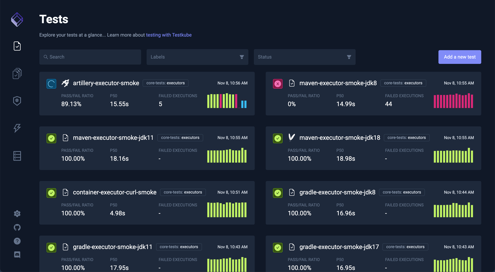
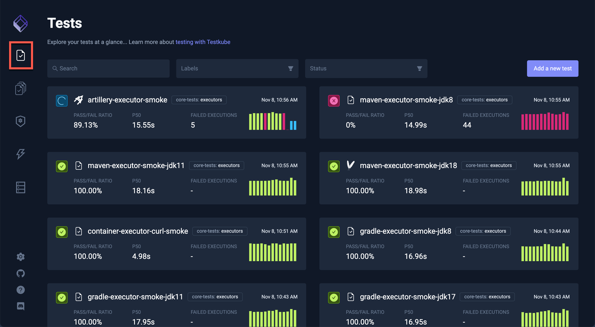
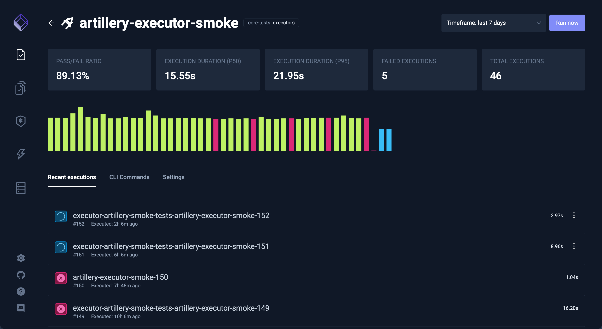
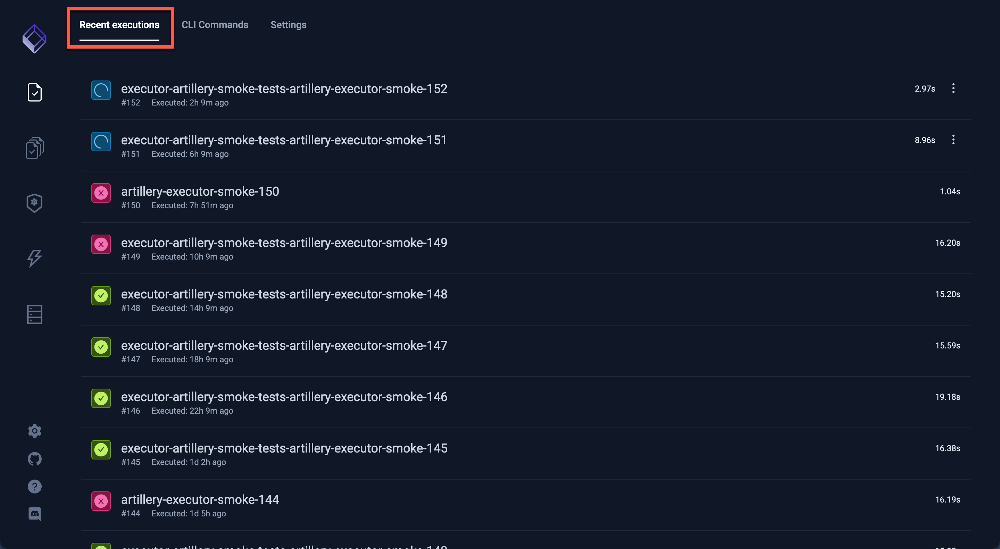
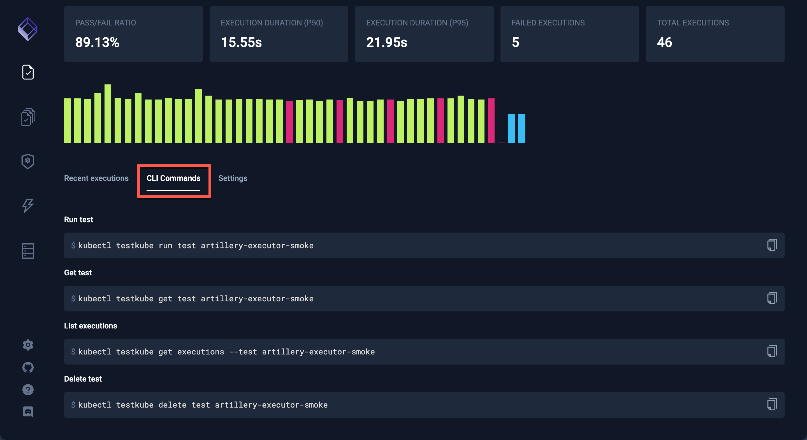
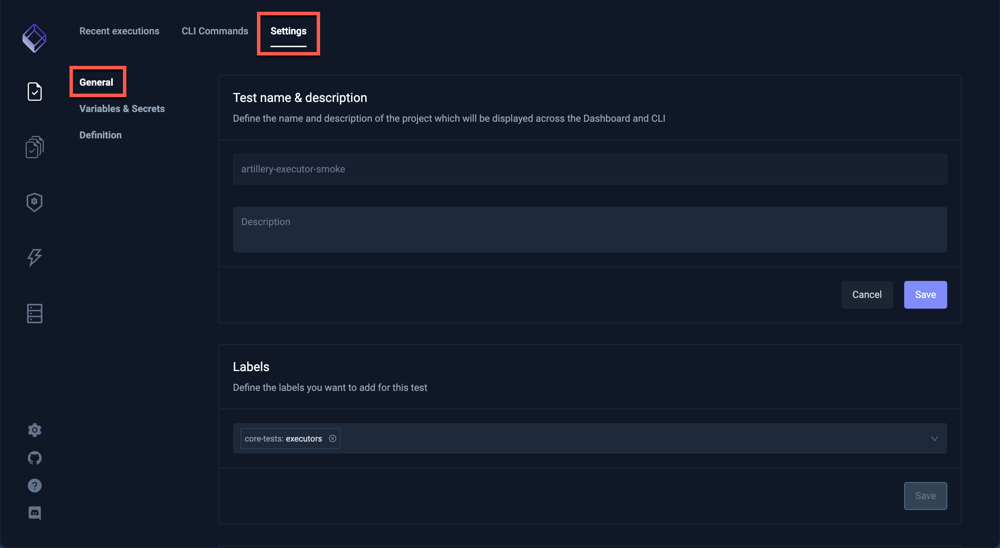

# Testkube Dashboard

The Testkube Dashboard provides a simple web-based user interface for monitoring Testkube test results via a web browser.

The URL to access the Testkube Dashboard is [https://demo.testkube.io](https://demo.testkube.io), which, when first loaded, will prompt for the results endpoint of your Testkube installation. Click the **Settings** icon at the bottom left of the screen to return to change the Testkube API endpoint.

See the [UI Results Endpoint section](#ui-results-endpoint) below to find the endpoint to open the dashboard. Once you have the results endpoint, you can append it to the above URL (as an apiEndpoint parameter) for a direct link to the dashboard with your results:

`https://demo.testkube.io/?apiEndpoint=...`

Alternatively, the Testkube Dashboard can be opened on your local machine using command `sh kubectl testkube dashboard` which uses port forwarding for accessing your local results endpoint (see more [here](../reference/cli/testkube_dashboard.md)).

## Explore the Testkube Dashboard

The Testkube Dashboard displays the current status of Tests and Test Suites executed in your environment.

After selecting Tests or Test Suites in the left bar, the list of recent runs is displayed. At the top of the list, a Search field and filters for Labels and Status make finding tests in a large list easier:

Select any Test or Test Suite to see the recent executions and their statuses.

The execution statistics of the chosen Test or Test Suite are at the top of the screen, along with a graph of success or failure for the executions.

The **Recent executions** tab has the list of executions. A green checkmark denotes a successful execution, a red 'x' denotes a failed execution and circling dots denotes a current run of a Test or Test Suite.

The **CLI Commands** tab shows the commands used to perform the selected test:

The **Settings** tab contains 3 types of information about the Test or Test Suite.

### General Settings

Clicking the **General** box under the **Settings** tab displays the **Test name & description** and **Labels** for the Test or Test Suite:

It is also the place to delete a Test or Test Suite:

### Variables & Secrets

Visit [Using Tests Variables](./tests/tests-variables.md) for a description of adding Variables and Secrets.

### Definition

Clicking the **Definition** box under the **Settings** tab allows the validation and export the configuration for the Test or Test Suite:

