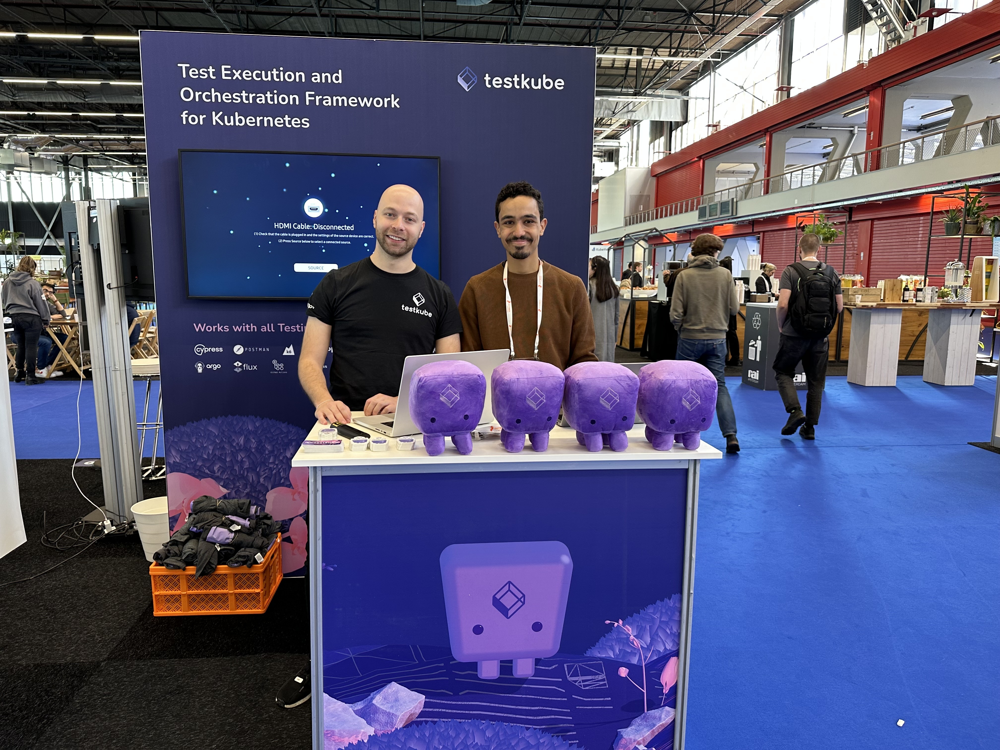
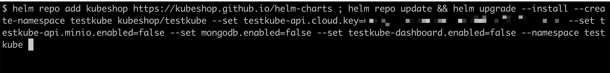

# Win a Testkube Plushie!



Read on to learn how you can win a Testkube plushy!

[Testkube](https://testkube.io) is a test execution and orchestration framework for Kubernetes that works with any CI/CD system and testing tool you need. It leverages K8s to eliminate CI/CD bottlenecks, helping you with:
- packaging your testing tools 
- aggregating test results
- storing test artifacts like screenshots and videos
- enabling running tests from Kubernetes events

## Instructions

Create a simple test using Testkube Pro to win a Testkube plushy. 

You can follow these instructions or get help from our booth staff to create your first test with Testkube!

### 1. Create a K8s cluster

If you have a cluster, go to the next section - if not, you can use any of these tools to create one right in your laptop: 
- [Minikube](https://minikube.sigs.k8s.io/)
- [Kind](https://kind.sigs.k8s.io/)
- [Docker Desktop](https://docs.docker.com/desktop/kubernetes/)

### 2. Install an app on your K8s cluster

Install a sample K8s application by running this command in your terminal: 

```sh 
kubectl create deployment hello-world --image=kubeshop/kusk-hello-world:v1.0.0
kubectl expose deployment hello-world --name hello-world-svc --port=8080
```

### 3. Sign in to Testkube Pro

Go to https://app.testkube.io/ and create an account on Testkube Pro using your Github credentials.

### 4. Install Testkube on your cluster

Create an environment (e.g: dev, staging, prod...): 


Install Testkube in your K8s cluster: 




### 5. Create a test

Let's create a quick `curl` test, but this can be any testing tool you're using like Postman, Cypress, K6, etc. 


Use the following `curl` test that checks if the hello-world app returns a status `200`: 

```json
{
  "command": [
    "curl",
    "hello-world-svc.default:8080/hello",
    "-H",
    "'Accept: application/json'"
  ],
  "expected_status": "200"
}
```


### 6. Run your test!

Run your test and show it to us in the booth. 

Congrats!!!

