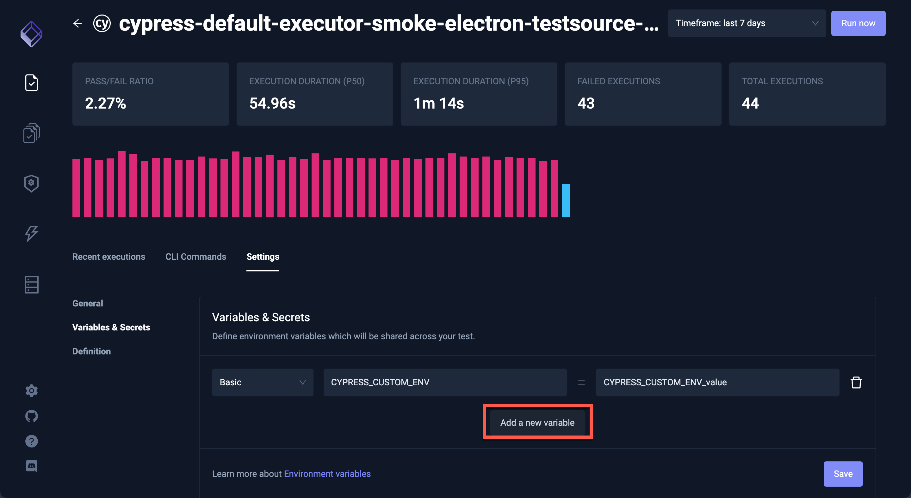
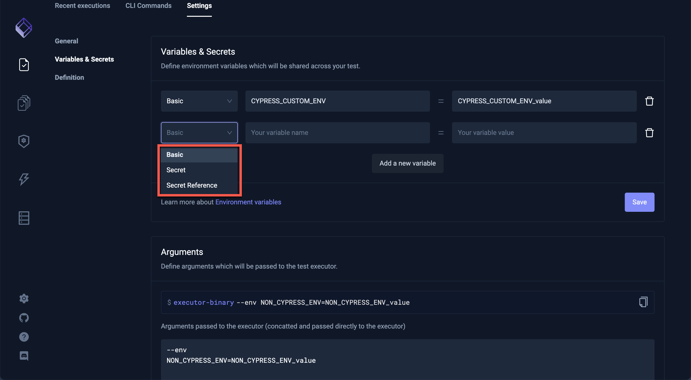

# Using Test Variables

To synchronize Testkube's feature set between the Testkube CLI and the Testkube Dashboard, Test Variables can be defined in the Testkube Dashboard. On the Tests screen, select a Test and click on the **Settings** tab and select **Variables & Secrets**:

Any variables already existing for that Test will be shown. To create a Test variable, click **Add Variable** and provide desired values.

The types available for Test variables are Basic, Secret and Secret Reference. 
