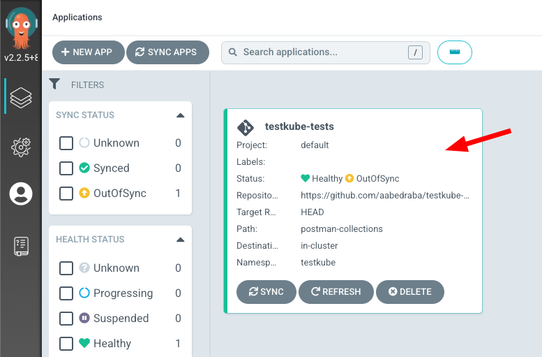
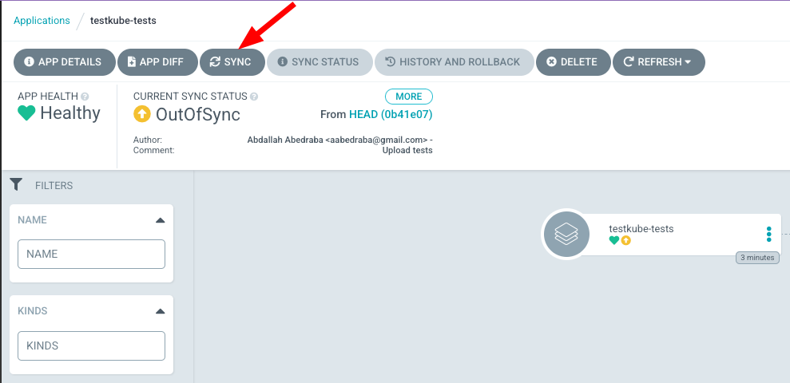
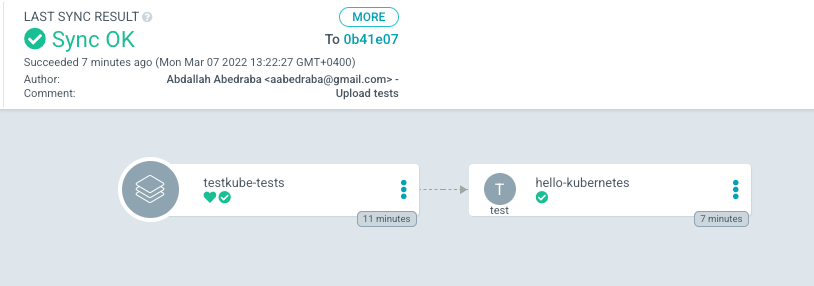
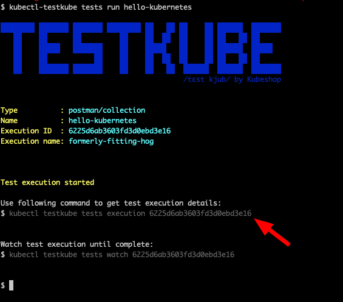
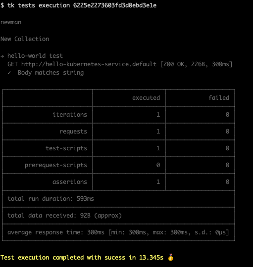
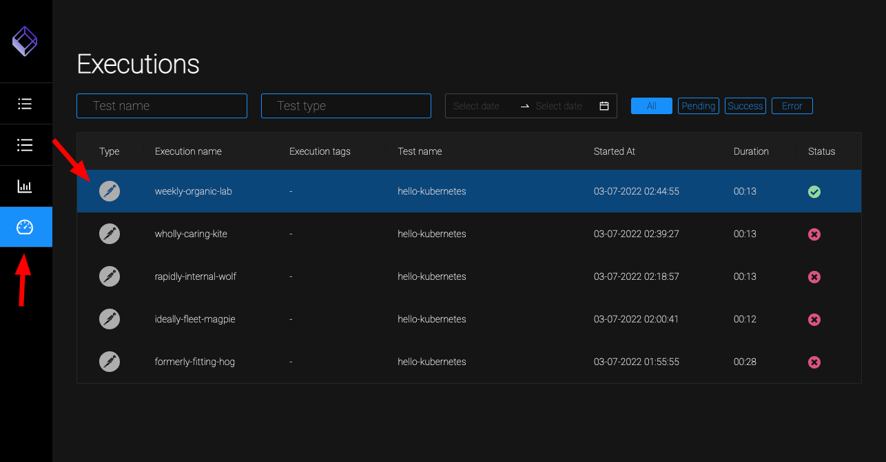
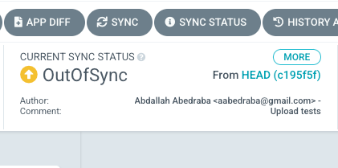
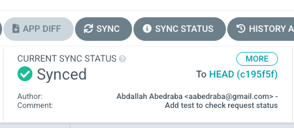

# GitOps Cloud Native Testing with ArgoCD

One of the major trends in contemporary cloud native application development is the adoption of GitOps; managing the state of your Kubernetes cluster(s) in Git - with all the bells and whistles provided by modern Git platforms like GitHub and GitLab in regard to workflows, auditing, security, tooling, etc. Tools like ArgoCD or Flux are used to do the heavy lifting of keeping your Kubernetes cluster in sync with your Git repository; as soon as difference is detected between Git and your cluster it is deployed to ensure that your repository is the source-of-truth for your runtime environment.

Testkube is the first GitOps-friendly Cloud-native test orchestration/execution framework to ensure that your QA efforts align with this new approach to application configuration and cluster configuration management. Combined with the GitOps approach described above, Testkube will include your test artifacts and application configuration in the state of your cluster and make git the source of truth for these test artifacts. And it’s Open-Source too. For more on Testkube, check out the introduction blog, [Hello Testkube](https://testkube.io/blog/hello-testkube-power-to-testers-on-k8s).

## Benefits of the GitOps Approach

- Since your tests are included in the state of your cluster you are always able to validate that your application components/services work as required.
- Since tests are executed from inside your cluster there is no need to expose services under test externally purely for the purpose of being able to test them.
- Tests in your cluster are always in sync with the external tooling used for authoring
- Test execution is not strictly tied to CI but can also be triggered manually for ad-hoc validations or via internal triggers (Kubernetes events)
- You can leverage all your existing test automation assets from Postman, or Cypress (even for end-to-end testing), or … through executor plugins.

Conceptually, this can be illustrated as follows:


## Using Testkube for git Version Control

### GitOps Tutorial

The following is a step-by-step walkthrough to get this in place for the automated application deployment and execution of Postman collections in a local Minikube cluster to test.

Let’s start with setting things up for our GitOps-powered testing machine!

#### **Installations for GitOps Testing**

**1.** Install Minikube

You can follow the minikube installation for your operating system [here](https://minikube.sigs.k8s.io/docs/start/).

**2.** Install ArgoCD

Follow the [ArgoCD Installation Guide](https://argo-cd.readthedocs.io/en/stable/getting_started/).

Note: For step 3 in the guide, “Access The Argo CD API Server”, choose the “Port Forwarding” method, as that is the easiest way to connect to it with a Minikube cluster.

**3.** Install Testkube
Follow the installation guide for Testkube [here](https://docs.testkube.io/getting-started/installation). Make sure to install the CLI client and the components in your cluster.

#### **Set up "Hello Kubernetes" Application and Tests**

**4.** Install a “Hello Kubernetes!” application in your cluster.

We will create a YAML file for a simple “Hello Kubernetes” application that we will then create our integration tests against.

Create the file **hello-kubernetes.yaml**:

```bash
apiVersion: v1
kind: Service
metadata:
 name: hello-kubernetes-service
spec:
 ports:
   - name: http
     port: 80
     targetPort: 8080
 selector:
   app: hello-kubernetes
---
apiVersion: apps/v1
kind: Deployment
metadata:
 name: hello-kubernetes-deployment
spec:
 replicas: 1
 selector:
   matchLabels:
     app: hello-kubernetes
 template:
   metadata:
     labels:
       app: hello-kubernetes
   spec:
     containers:
       - name: hello-kubernetes
         image: gcr.io/google-samples/kubernetes-bootcamp:v1
         ports:
           - containerPort: 8080
```
And deploy the **Hello Kubernetes** deployment with:
```bash
kubectl apply -f hello-kubernetes.yaml
```


You can test that your application has been correctly installed by running:

```bash
minikube service hello-kubernetes-service
```
‍
**5.** Set up a Git Repository containing some Postman collections.

We are going to use tests created by Postman and exported in a [Postman collections file](https://www.postman.com/collection/).

We can upload this to the same Git Repository as our application, but in practice the repository could be the same repository hosting the application or it could also be in a separate repository where you manage all your test artifacts.

So let’s create our **postman-collections.json** and push it to the repository.

```bash
{
  "info": {
    "_postman_id": "02c90123-318f-4680-8bc2-640adabb45e8",
    "name": "New Collection",
    "schema": "https://schema.getpostman.com/json/collection/v2.1.0/collection.json"
  },
  "item": [
    {
      "name": "hello-world test",
      "event": [
        {
          "listen": "test",
          "script": {
            "exec": [
              "pm.test(\"Body matches string\", () => {",
              "    pm.expect(pm.response.text()).to.contain(\"Hello Kubernetes\")",
              "})",
              "",
              "pm.test(\"Body matches string\", () => {",
              "    pm.expect(pm.response.status).to.equal(\"OK\")",
              "})"
            ],
            "type": "text/javascript"
          }
        }
      ],
      "request": {
        "method": "GET",
        "header": [],
        "url": {
          "raw": "http://hello-kubernetes-service.default",
          "protocol": "http",
          "host": [
            "hello-kubernetes-service",
            "default"
          ]
        }
      },
      "response": []
    }
  ]
}
```

You can see an example of how the repository should look [here](https://github.com/aabedraba/testkube-argocd-tests).

#### **Configure ArgoCD to work with Testkube**
**6.** Configure ArgoCD to use the Testkube plugin.

To get ArgoCD to use Testkube, we need to add Testkube as a [plugin](https://argo-cd.readthedocs.io/en/stable/operator-manual/config-management-plugins/). For that we have built a customized **argocd-repo-server** container image that will include Testkube as a binary.

Patch the ArgoCD repo-server pod image:

```bash
- op: replace
  path: /spec/template/spec/containers/0/image
  value: kubeshop/argocd-testkube:v1.0.1
- op: replace
  path: /spec/template/spec/initContainers/0/image
  value: kubeshop/argocd-testkube:v1.0.1
  ```

And apply it with the following command:
```bash
kubectl patch deployments.apps -n argocd argocd-repo-server --type json --patch-file patch.yaml
```

**7.** Define Testkube as a plugin in ArgoCD’s Configuration Management Plugin
Create the file argocd-plugins.yaml
‍

Create the file **argocd-plugins.yaml**:

```bash
data:
 configManagementPlugins: |
   - name: testkube
     generate:
       command: ["bash", "-c"]
       args: ["testkube generate tests-crds ."]
     lockRepo: true
```

As you can see here, we’re using the command **testkube generate tests-crds** which creates the Custom Resources (manifests) that ArgoCD will then add to our cluster. Apply the patch with the command:
```bash
kubectl patch -n argocd configmaps argocd-cm --patch-file argocd-plugin.yaml
```
‍

**8.** Configure an ArgoCD application to manage test collections in your cluster.

Create the file **testkube-application.yaml**.
```bash
apiVersion: argoproj.io/v1alpha1
kind: Application
metadata:
 name: testkube-tests
 namespace: argocd
spec:
 project: default
 source:
   repoURL: https://github.com/USERNAME/testkube-argocd.git
   targetRevision: HEAD
   path: postman-collections
   plugin:
     name: testkube
 destination:
   server: https://kubernetes.default.svc
   namespace: testkube
```   

Notice that we have defined path **postman-collections** which is the test folder with our Postman collections from the steps earlier. With Testkube you can use multiple test executors like **curl**, for example, so it is convenient to have a folder for each. We have also defined the **.destination.namespace** to be **testkube**, which is where the tests should be deployed in our cluster.
‍

Now let’s create the application with:
```bash
kubectl apply -f testkube-application.yaml
```
‍

**9.** Run the initial ArgoCD sync and check your cluster.

On ArgoCD’s dashboard, we will now see the newly created application. Let’s click to get into it and sync our tests.



And now click on Sync to see your tests created.



Voilà! there’s our test collection created and managed by ArgoCD with every new test created and updated in the Github repository containing the tests!



#### Run your ArgoCD tests!

**10.** Run ad-hoc tests from the CLI.

List the tests in your cluster with:

<!-- need command here -->

You should see your deployed test artifacts:


To run those tests execute the following command:

```bash
$ kubectl-testkube tests run hello-kubernetes
```
‍
The test execution will start in the background. Copy the command from the image below to check the result of the execution of the test:



```bash
$ kubectl testkube tests execution EXECUTION_ID
```

‍You should see that the tests have run successfully, just like in the image below.




**11.** See test results in the Testkube dashboard.

You can also see the results of your tests in a nice dashboard. Open the Testkube dashboard with the following command:

```bash
kubectl-testkube dashboard
```

And you will be able to see the results of the execution in the Executions tab as seen in the image below:



test execution we based dashboard for k8s

**12.** Test the flow: update the test and deploy the updated test with ArgoCD.

Let’s add an additional test to our collection. Replace the content our existing test in **hello-kubernetes.json** with the following:
```bash
{
  "info": {
    "_postman_id": "02c90123-318f-4680-8bc2-640adabb45e8",
    "name": "New Collection",
    "schema": "https://schema.getpostman.com/json/collection/v2.1.0/collection.json"
  },
  "item": [
    {
      "name": "hello-world test",
      "event": [
        {
          "listen": "test",
          "script": {
            "exec": [
              "pm.test(\"Body matches string\", () => {",
              "    pm.expect(pm.response.text()).to.contain(\"Hello Kubernetes\")",
              "})",
              "",
              "pm.test(\"Body matches string\", () => {",
              "    pm.expect(pm.response.status).to.equal(\"OK\")",
              "})"
            ],
            "type": "text/javascript"
          }
        }
      ],
      "request": {
        "method": "GET",
        "header": [],
        "url": {
          "raw": "http://hello-kubernetes-service.default",
          "protocol": "http",
          "host": [
            "hello-kubernetes-service",
            "default"
          ]
        }
      },
      "response": []
    }
  ]
}
```

As you can see, we have added a request status check. Now commit this change to the Github repository.

If you now go to ArgoCD’s dashboard you’ll see that your tests are out of sync with the deployed artifacts.



Click on **Sync** again and apply the changes. With that, your test artifacts are back in sync!



We now have an automated test deployment and execution pipeline based on GitOps principles!

## GitOps Takeaways

Once fully realized - using GitOps for testing of Kubernetes applications as described above provides a powerful alternative to a more traditional approach where orchestration is tied to your current CI/CD tooling and not closely aligned with the lifecycle of Kubernetes applications.

We would love to get your thoughts on the above approach - over-engineering done right? Waste of time? Let us know!

Check Testkube on GitHub — and let us know if you’re missing something we should be adding to make your k8s resource testing easier.

[Download the latest release](https://github.com/kubeshop/testkube/releases) on GitHub.

Check out the [documentation](https://docs.testkube.io/).

Get in touch with us on our [Discord server](https://discord.com/channels/884464549347074049/885185660808474664).