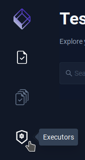
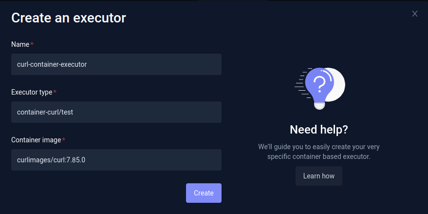
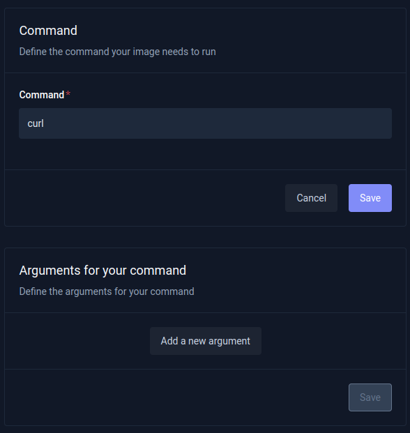
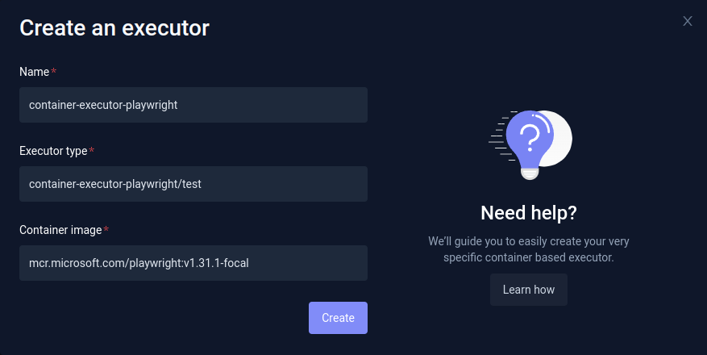
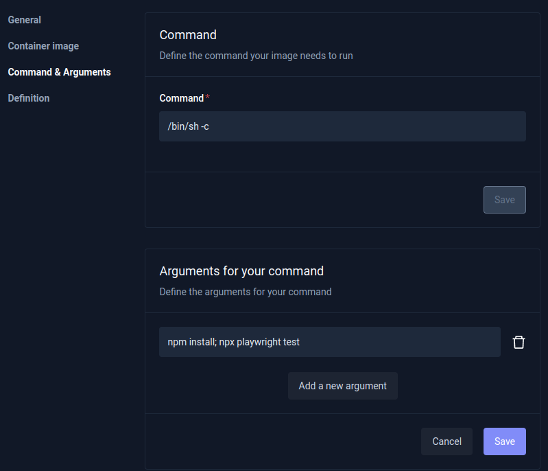

import Tabs from "@theme/Tabs";
import TabItem from "@theme/TabItem";

# Container Executor

The Testkube Container Executor allows you to run your own container images for executing tests. Testkube orchestrates the Tests using the container image as Kubernetes Jobs.

The Test execution fails if the container exits with an error and succeeds when the container command successfully executes.

That's the new and recommended way of running custom images. Docs about the prebuilt custom executors can be found [here](prebuilt-executor.md).

## Creating and configuring Container Executor: Curl

In the following example, the custom Curl executor will be creating using `curlimages/curl:7.85.0` image. Testkube supports interacting with custom executors using any of available methods - Testkube Dashboard, CLI, and CRD.

<Tabs groupId="dashboard-cli">
<TabItem value="dash" label="Dashboard">

Let's start with Dashboard first. You can view existing executors by going to the Executors tab.



That's also a place where you can create a new custom Container Executor. In order to do it just click the `Create a new executor` button.
The executor creation dialog will be displayed. That's where you can name you executor, and set image that will be used for execution. That's where you also need to set `Executor type` - that's the name you will later use in your Tests as the test type. In this example we created a custom Curl executor:



After the executor is created, you will be redirected to executor settings view. That's where you can set additional seetings.

#### Additional settings

Command & Arguments tab is a place, where you can define the Command your custom executor will run, and default arguments. Let's set the Command to `curl`:



Container image tab allow you to change the container image which is used, or set `Secret ref name` if the image is in the private registry.
Additionally, the Definition tab allows you to check the Executor CRD:


Now, the container executor is created, and configured - it can be used for running tests.

</TabItem>

<TabItem value="cli" label="CLI">
  
Custom Container Executor can also be created with Testkube CLI using `testkube create executor` command:

Let's check available configuration options first:

```sh
$ testkube create executor --help
Create new Executor Custom Resource

Usage:
  testkube create executor [flags]

Aliases:
  executor, exec, ex

Flags:
      --args stringArray                 args passed to image in container executor
      --command stringArray              command passed to image in container executor
      --content-type stringArray         list of supported content types for executor
      --docs-uri string                  URI to executor docs
      --executor-type string             executor type, container or job (defaults to job) (default "job")
      --feature stringArray              feature provided by executor
  -h, --help                             help for executor
      --icon-uri string                  URI to executor icon
      --image string                     image used for executor
      --image-pull-secrets stringArray   secret name used to pull the image in executor
  -j, --job-template string              if executor needs to be launched using custom job specification, then a path to template file should be provided
  -l, --label stringToString             label key value pair: --label key1=value1 (default [])
  -n, --name string                      unique executor name - mandatory
      --tooltip stringToString           tooltip key value pair: --tooltip key1=value1 (default [])
  -t, --types stringArray                test types handled by executor
  -u, --uri string                       if resource need to be loaded from URI

Global Flags:
  -a, --api-uri string     api uri, default value read from config if set (default "http://localhost:8088")
  -c, --client string      client used for connecting to Testkube API one of proxy|direct (default "proxy")
      --crd-only           generate only crd
      --namespace string   Kubernetes namespace, default value read from config if set (default "testkube")
      --oauth-enabled      enable oauth
      --verbose            show additional debug messages
```

- `--name` is mandatory - that's custom executor's name.
- `--executor-type` need to be set to `container`
- `--image` is the executor image (for example, `curlimages/curl:7.85.0`)
- `--types` that's the name you will later use in your Tests as the test type (for example, `executor-curl/test`)
- `--command` (for example, `curl`)

Which result in:

```sh
testkube create executor --name curl-container-executor --executor-type container --image curlimages/curl:7.85.0 --types curl-container/test --command curl
```

</TabItem>

<TabItem value="crd" label="Custom Resource">

In order to use the Container Executor, create a new executor with `executor_type: container` and your custom type. For example:

```yaml
apiVersion: executor.testkube.io/v1
kind: Executor
metadata:
  name: curl-container-executor
  namespace: testkube
spec:
  image: curlimages/curl:7.85.0
  command: ["curl"]
  executor_type: container
  imagePullSecrets:
    - name: secret-name
  types:
    - curl-container/test
```

In the above example, all Tests of `curl-container/test` will be executed by this Executor. Then you can create a new test that uses this Executor:

```yaml
apiVersion: tests.testkube.io/v3
kind: Test
metadata:
  name: test-website
  namespace: testkube
spec:
  type: curl-container/test
  executionRequest:
    args:
      - https://testkube.kubeshop.io/
    variables:
      TESTKUBE_ENV:
        name: TESTKUBE_ENV
        value: example
```

Executing this test will run a Kubernetes Job with:

- `curlimages/curl:7.85.0` image
- `secret-name` image pull secret
- `curl` command
- `https://testkube.kubeshop.io/` argument

You can provide image, args, command, and image pull secrets in the HTTP Request, Test Spec, and Executor spec. The container executor merges all the data using the following order:

1. HTTP Request.
2. Test.Spec.ExecutionRequest fields are used if they are not filled before.
3. Executor.Spec fields are used if they are not filled before.

</TabItem>
</Tabs>

## Creating and configuring Container Executor: Playwright
Despite having the dedicated [Playwright executor](executor-playwright.md), you may want to use, for example, a version that isn't supported. That's where you can use the Container executor - it allow you to use any Playwright image you may need.

The example Playwright project uses Playwright `1.31.1`: https://github.com/kubeshop/testkube/tree/main/test/playwright/executor-tests/playwright-project
That's the specific version that's needed to run the tests. So, in this example the container executor will be created with `mcr.microsoft.com/playwright:v1.31.1-focal` Playwright official image. If you need another image you can find specific image tags in the Playwright Docs: https://playwright.dev/docs/docker#image-tags

<Tabs groupId="dashboard-cli">
<TabItem value="dash" label="Dashboard">

Again, let's start with Dashboard first. In order to create a new custom Container Executor you need to go to the Executors tab, and then click the `Create a new executor` button.


The executor creation dialog will be displayed. That's where you can name you executor, and set image that will be used for execution. That's where you also need to set `Executor type` - that's the name you will later use in your Tests as the test type. In this example we created a custom Playwright executor:



After the executor is created, you will be redirected to executor settings view. That's where you can set additional seetings.

In this case you will need to set Command that will be executed.



Command: `/bin/sh -c`
Arguments: `npm install; npx playwright test`


</TabItem>

<TabItem value="cli" label="CLI">
Custom Container Executor can also be created with Testkube CLI using `testkube create executor` command.

- `--name` is mandatory - that's custom executor's name.
- `--executor-type` need to be set to `container`
- `--image` is the executor image (`mcr.microsoft.com/playwright:v1.31.1-focal`)
- `--types` that's the name you will later use in your Tests as the test type (for example, `executor-playwright/test`)
- `--command` (in this case `/bin/sh -c`)
- `--args` (arguments - in this case `npm install; npx playwright test`)

So, the final command may look like this:
```sh
testkube create executor --name container-executor-playwright --executor-type container --image mcr.microsoft.com/playwright:v1.31.1-focal --types executor-playwright/test  --command "/bin/sh -c" --args "npm install; npx playwright test"
```

</TabItem>
<TabItem value="crd" label="Custom Resource">

Executor CRD:

```yaml
apiVersion: executor.testkube.io/v1
kind: Executor
metadata:
  name: container-executor-playwright-v1.31.1
  namespace: testkube
spec:
  image: mcr.microsoft.com/playwright:v1.31.1-focal
  command: ["/bin/sh", "-c"]
  args:
  - "npm install; npx playwright test"
  executor_type: container
  types:
  - container-executor-playwright-v1.31.1/test
```

Test CRD:

```yaml
apiVersion: tests.testkube.io/v3
kind: Test
metadata:
  name: container-executor-playwright-smoke
  namespace: testkube
  labels:
    core-tests: executors
spec:
  type: container-executor-playwright-v1.31.1/test
  content:
    type: git-dir
    repository:
      type: git
      uri: https://github.com/kubeshop/testkube
      branch: main
      path: test/playwright/executor-tests/playwright-project
      workingDir: test/playwright/executor-tests/playwright-project
```

</TabItem>
</Tabs>

## Input Data

You can provide input data via string, files, and Git repositories via Testkube Dashboard. The data is downloaded into `/data` before the test is run using Kubernetes Init container. When using `string` type, the content is put into `/data/test-content` file. For example:

```yaml
apiVersion: tests.testkube.io/v3
kind: Test
metadata:
  name: custom-container
  namespace: testkube
spec:
  content:
    data: |-
      {
        "project": "testkube",
        "is": "awesome"
      }
    type: string
  type: custom-container/test
```

Puts data into `/data/test-content` file:

```sh
cat /data/test-content
```

```json title="Expected output:"
{
  "project": "testkube",
  "is": "awesome"
}
```

When using Git or Git directory sources, the content is placed inside `/data/repo` directory. For example:

```yaml
apiVersion: tests.testkube.io/v3
kind: Test
metadata:
  name: custom-container
  namespace: testkube
spec:
  content:
    repository:
      branch: main
      type: git
      uri: https://github.com/kubeshop/testkube-executor-init
    type: git
```

Downloads into `/data/repo` directory

```sh
$ ls /data/repO
CODE_OF_CONDUCT.md  CONTRIBUTING.md  LICENSE  Makefile  README.md  build  cmd  go.mod  go.sum  pkg
```

## Collecting test artifacts

For container executors that produce files during test execution we support collecting (scraping) these artifacts and storing them in our S3 compatible file storage. You need to save test related files into specified directories on the dynamically created volume, they will be uploaded from there to Testkube file storage and available later for downloading using standard Testkube CLI or Testkube Dashboard commands. For example:

```yaml
apiVersion: tests.testkube.io/v3
kind: Test
metadata:
  name: cli-container
  namespace: testkube
spec:
  type: cli/container
  executionRequest:
    artifactRequest:
      storageClassName: standard
      volumeMountPath: /share
      dirs:
        - test/reports
```

You have to define the storage class name, volume mount path and directories in this volume with test artifacts.
Make sure your container executor definition has `artifacts` feature. For example:

```yaml
apiVersion: executor.testkube.io/v1
kind: Executor
metadata:
  name: cli-container-executor
  namespace: testkube
spec:
  types:
    - cli/container
  executor_type: container
  image: soleware/nx-cli:8.5.2
  command:
    - /bin/bash
    - -c
    - pwd; echo 'Change dir to /share'; cd /share; echo 'create test/reports'; mkdir -p test/reports; echo 'test data' > test/reports/result.txt
  features:
    - artifacts
```

Run your test using CLI command:

```sh
testkube run test cli-container
```

Then get available artifacts for your test execution id:

```sh
testkube get artifact 638a08b94ff1d2c694aeebf2
```

```sh title="Expected output:"
  NAME       | SIZE (KB)
-------------+------------
  result.txt |        10
```
