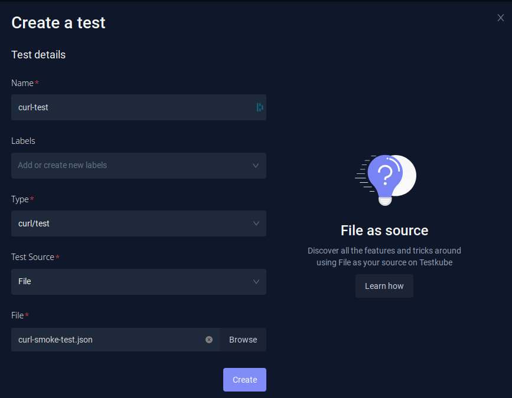
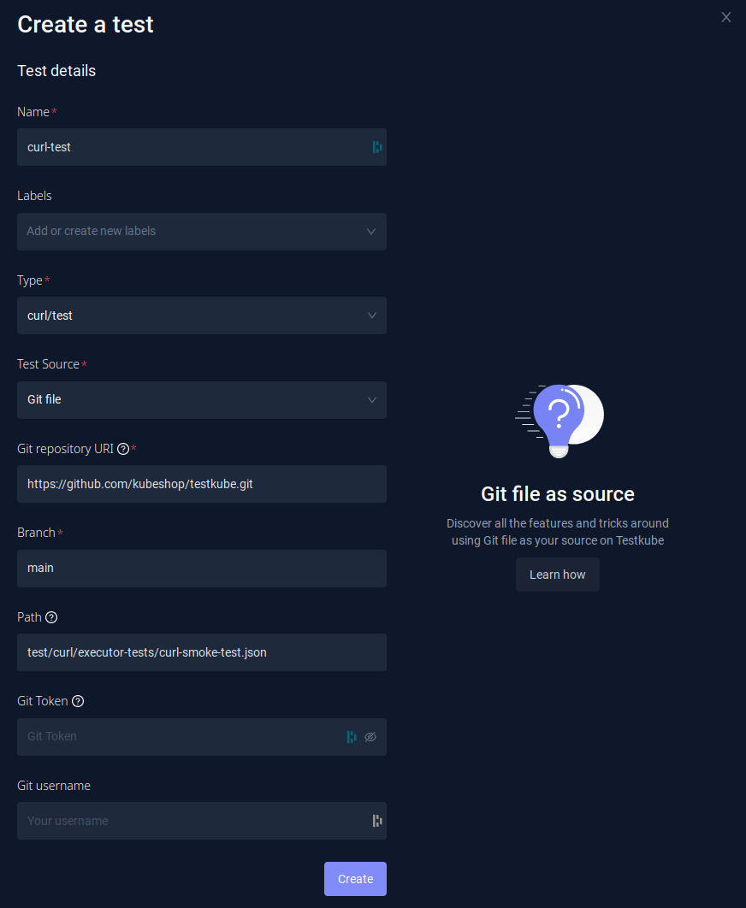

import Tabs from "@theme/Tabs";
import TabItem from "@theme/TabItem";

# cURL

Testkube is able to run cURL commands as tests.

Default command for this executor: `curl`
Default arguments for this executor command: `-is`

[See more at "Redefining the Prebuilt Executor Command and Arguments" on the Creating Test page.](../articles/creating-tests.md#redefining-the-prebuilt-executor-command-and-arguments)

## Abstraction over cURL

Testkube executor provides an abstraction over cURL that allow you to create JSON-based cURL test files. They allow you to combine a cURL command with expected results:

- `expected_status` allows you to assert that a specific status code is returned.
- `expected_body` allows you to validate the body of the response.

Below is an example of how to format the test:

```json
{
  "command": [
    "curl",
    "https://jsonplaceholder.typicode.com/todos/1",
    "-H",
    "'Accept: application/json'"
  ],
  "expected_status": "200"
}
```

You can also find this test in the Testkube repository: https://github.com/kubeshop/testkube/blob/main/test/curl/curl.json.

## Example Test

In this example we will use the following cURL test: https://github.com/kubeshop/testkube/blob/main/test/curl/executor-tests/curl-smoke-test.json.

```json
{
  "command": ["curl", "https://jsonplaceholder.typicode.com/todos/1"],
  "expected_status": "200"
}
```

## Creating and Running a Test

<Tabs groupId="dashboard-cli">
<TabItem value="dash" label="Dashboard">

If you prefer to use the Dashboard, just go to Tests, and click the `Add a new test` button. Fill in the Test Name, choose the Test Type (`curl/test`), and then choose Test Source.

### File

For a File source, the test file is uploaded directly.



### Git File

For a Git file, you need to fill in the repository details - Git repository URI (in this case `https://github.com/kubeshop/testkube.git`), branch (`main`), and the path to the cURL test in your repository (`test/curl/executor-tests/curl-smoke-test.json`). In this example, the repository is public, but in the case of private ones, you would need to additionally fill in the Git credentials.



</TabItem>
<TabItem value="cli" label="CLI">

If you prefer using the CLI, you can create the test with `testkube create test`.

You need to set:

- `--name` (for example, `curl-test`)
- `--type` (in this case `curl/test`)

And, then choose the Test Content type based on the Test Source you want to use:

### File

For a File test source:

- `--test-content-type` (`file-uri`)
- `--file` (path to your curl test - in this case `test/curl/executor-tests/curl-smoke-test.json`)

```sh
testkube create test --name curl-test --type curl/test --file test/curl/executor-tests/curl-smoke-test.json
```

```sh title="Expected output:"
Test created testkube / curl-test 🥇
```

You can then run the test with `testkube run test curl-test`.

### Git File

- `--test-content-type` (`git-file`, so specific file will be checked out from the Git repository)
- `--git-uri` - Repository URI (in case of this example, `https://github.com/kubeshop/testkube.git`).
- `--git-branch`
- `--git-path` - Path to the k6 script in the repository (in this case `test/curl/executor-tests/curl-smoke-test.json`).

```sh
testkube create test --name curl-test --type curl/test --test-content-type git-file --git-uri https://github.com/kubeshop/testkube.git --git-branch main --git-path test/curl/executor-tests/curl-smoke-test.json
```

```sh title="Expected output:"
Test created testkube / curl-test 🥇
```

You can then run the test with `testkube run test curl-test`.

```sh
$ testkube run test curl-test
Type:              curl/test
Name:              curl-test
Execution ID:      6400870d237c189271627cfa
Execution name:    curl-test-1
Execution number:  1
Status:            running
Start time:        2023-03-02 11:22:53.0107448 +0000 UTC
End time:          0001-01-01 00:00:00 +0000 UTC
Duration:


Test execution started
Watch test execution until complete:
$ kubectl testkube watch execution curl-test-1


Use following command to get test execution details:
$ kubectl testkube get execution curl-test-1
```

You can then watch the execution, or get the results after the execution is finished.

```sh
ID:         6400870d237c189271627cfa
Name:       curl-test-1
Number:            1
Test name:         curl-test
Type:              curl/test
Status:            passed
Start time:        2023-03-02 11:22:53.01 +0000 UTC
End time:          2023-03-02 11:23:02.472 +0000 UTC
Duration:          00:00:09
Repository parameters:
  Branch:          main
  Commit:
  Path:            test/curl/executor-tests/curl-smoke-test.json
  Working dir:
  Certificate:

running test [6400870d237c189271627cfa]
🚚 Initializing...
🌍 Reading environment variables...
✅ Environment variables read successfully
RUNNER_ENDPOINT="testkube-minio-service-testkube:9000"
RUNNER_ACCESSKEYID="********"
RUNNER_SECRETACCESSKEY="********"
RUNNER_REGION=""
RUNNER_TOKEN=""
RUNNER_BUCKET="testkube-artifacts"
RUNNER_SSL=false
RUNNER_SCRAPPERENABLED="true"
RUNNER_GITUSERNAME=""
RUNNER_GITTOKEN=""
RUNNER_DATADIR="/data"
📦 Fetching test content from git-file...
✅ Test content fetched to path /data/repo/test/curl/executor-tests/curl-smoke-test.json
📂 Fetching uploads from object store testkube-minio-service-testkube:9000...
📂 Placing files from buckets into /data/uploads/ []
📂 Getting the contents of bucket folders [test-curl-test]

📂 Setting up access to files in /data
🔬 Executing in directory /data:
 $ chmod
✅ Execution succeeded
✅ Access to files enabled
✅ Initialization successful
0xc000f641f0
🚚 Preparing test runner
🌍 Reading environment variables...
✅ Environment variables read successfully
RUNNER_ENDPOINT="testkube-minio-service-testkube:9000"
RUNNER_ACCESSKEYID="********"
RUNNER_SECRETACCESSKEY="********"
RUNNER_REGION=""
RUNNER_TOKEN=""
RUNNER_BUCKET="testkube-artifacts"
RUNNER_SSL=false
RUNNER_SCRAPPERENABLED="true"
RUNNER_GITUSERNAME=""
RUNNER_GITTOKEN=""
RUNNER_DATADIR="/data"
running test [6400870d237c189271627cfa]
🚚 Preparing for test run
📦 Fetching test content from git-file...
✅ Test content fetched to path /tmp/git-checkout2214379061/repo/test/curl/executor-tests/curl-smoke-test.json
🔑 Filling in the input templates
✅ Successfully filled the input templates
🔬 Executing in directory :
 $ curl -is https://testkube.io/
HTTP/2 200
date: Thu, 02 Mar 2023 11:22:59 GMT
content-type: text/html
// ... output skipped

Test execution completed with success in 9.462s 🥇
```

</TabItem>
<TabItem value="crd" label="Custom Resource">

The third option for creating the Test is to use a Test CRD. If you already have the test created, you can check the definition in the Dashboard (`Definition` tab in Test Settings).

You can also get a definition while using the `testkube create test` command by adding `--crd-only`.
In that case, the test won't be created but the definition will be displayed.

```sh title="Expected output:"
testkube create test --name curl-test --type curl/test --test-content-type git-file --git-uri https://github.com/kubeshop/testkube.git --git-branch main --git-path test/curl/executor-tests/curl-smoke-test.json --crd-only
```

```yaml
apiVersion: tests.testkube.io/v3
kind: Test
metadata:
  name: curl-executor-smoke
  namespace: testkube
  labels:
    core-tests: executors
spec:
  type: curl/test
  content:
    type: git-file
    repository:
      type: git-file
      uri: https://github.com/kubeshop/testkube.git
      branch: main
      path: test/curl/executor-tests/curl-smoke-test.json
```

</TabItem>
</Tabs>

When the Test CRD is saved to the yaml file, it can then be applied directly with `kubectl apply -f SOME_FILE_NAME.yaml`.
