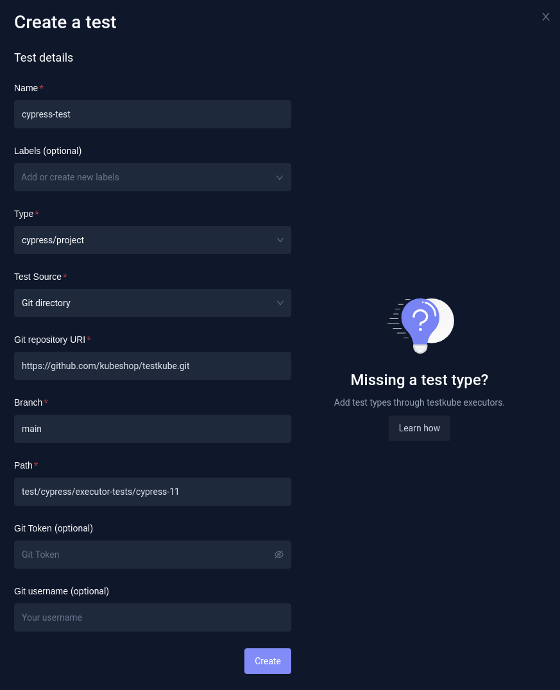
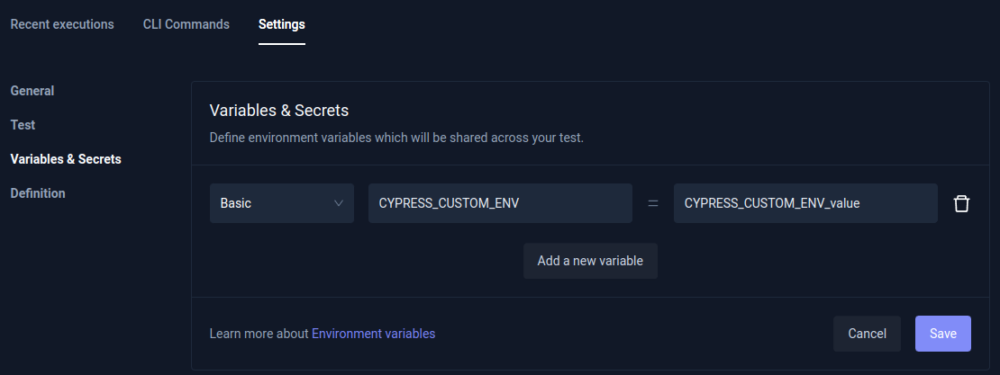

import Tabs from "@theme/Tabs";
import TabItem from "@theme/TabItem";
import Admonition from "@theme/Admonition";

# Cypress

Our dedicated Cypress executor allows running Cypress tests with Testkube - directly from your Git repository.

- Default command for this executor: `./node_modules/cypress/bin/cypress`
- Default arguments for this executor command: `run` `--reporter` `junit` `--reporter-options` `mochaFile=<reportFile>,toConsole=false` `--project` `<projectPath>` `--env` `<envVars>`

Parameters in &lt;&gt; are calculated at test execution:

- `<reportFile>` - path to the generated JUnit report xml file
- `<projectPath>` - path to where the project was placed
- `<envVars>` - list of environment variable keys and values, separated by comma

[See more at "Redefining the Prebuilt Executor Command and Arguments" on the Creating Test page.](../articles/creating-tests.md#redefining-the-prebuilt-executor-command-and-arguments)

export const ExecutorInfo = () => {
  return (
    <div>
      <Admonition type="info" icon="🎓" title="What is Cypress?">
        <ul>
          <li>
            Cypress is a framework for making end-to-end tests of your
            applications, mostly used for front-end testing.
          </li>
          <li>
            When you run your Cypress tests, a browser is spun up so you can
            assert against it in an automatic way.
          </li>
          <li>
            With Cypress you can, for example, check that you get the expected
            behaviour when a button in your UI is clicked. Cypress can then
            record the test execution and provide you with a video of what
            happened with the actual test.
          </li>
        </ul>
      </Admonition>
    </div>
  );
};

<ExecutorInfo />

**Check out our [blog post](https://kubeshop.io/blog/end-to-end-tests-of-your-kubernetes-applications-with-cypress) to follow tutorial steps for end-to-end testing of your Kubernetes applications with Cypress.**

<span class="embed-container">
  <iframe
    width="100%"
    height="315px"
    src="https://www.youtube.com/embed/lGCkfIqzGfw"
    title="YouTube Tutorial: End-to-End Testing in Kubernetes with Cypress and Testkube"
    frameborder="0"
    allow="accelerometer; autoplay; clipboard-write; encrypted-media; gyroscope; picture-in-picture; web-share"
    allowfullscreen
  ></iframe>
</span>

## Example Cypress Project

If you haven't created the Cypress project yet, please follow the Cypress documentation for details: https://docs.cypress.io/guides/dashboard/projects.

In this example we will use the following Cypress project: https://github.com/kubeshop/testkube/tree/main/test/cypress/executor-tests/cypress-11
`smoke.cy.js` contains three `it` steps:

```js
describe("Testkube website", () => {
  it("Open Testkube website", () => {
    cy.visit("/");
  });
  it(`Validate CYPRESS_CUSTOM_ENV ENV (${Cypress.env("CUSTOM_ENV")})`, () => {
    expect("CYPRESS_CUSTOM_ENV_value").to.equal(Cypress.env("CUSTOM_ENV")); //CYPRESS_CUSTOM_ENV - "cypress" prefix - auto-loaded from global ENVs
  });
  it(`Validate NON_CYPRESS_ENV ENV (${Cypress.env("NON_CYPRESS_ENV")})`, () => {
    expect("NON_CYPRESS_ENV_value").to.equal(Cypress.env("NON_CYPRESS_ENV")); //NON_CYPRESS_ENV - need to be loaded with --env parameter
  });
});
```

The test opens the Testkube website and validates 2 methods of loading ENV variables.

## Creating and Running Tests

Cypress projects consist of multiple files, so the Test can only be created using a Git Directory as the test source. The Git Directory checkouts the whole Cypress project directory from your repository.

<Tabs groupId="dashboard-cli">
<TabItem value="dash" label="Dashboard">

If you prefer to use the Dashboard, just go to Tests and click the `Add a new test` button. Then you need to fill in the Test Name, choose the Test Type (`cypress/project`), and choose the Test Source (`Git Directory`). Then, you need to fill in the repository details - Git repository URI (in this case `https://github.com/kubeshop/testkube.git`), branch (`main`), and path to the Cypress project directory in your repository (`test/cypress/executor-tests/cypress-11`). In this example, the repository is public, but in the case of private ones, you would need to additionally fill in the Git credentials.



When the test is created, you can run it. But, in this example, the test checks ENV variables, which aren't set yet.
In order for this test to pass:

- `CYPRESS_CUSTOM_ENV` ENV needs to be set to `CYPRESS_CUSTOM_ENV_value`.
- `NON_CYPRESS_ENV` ENV needs to be set to `NON_CYPRESS_ENV_value`.

#### Setting ENV variables

In order to set ENV variables, or arguments, you need to open the test you created, and then go to `Settings`, and `Variables & Secrets`.

Cypress auto-loads ENV variables with `CYPRESS_` prefix, which are available in the tests without this prefix. So, if you set `CYPRESS_CUSTOM_ENV` ENV, it will be available as `CUSTOM_ENV`. Choose `Add a new variable`, leave the default type (`Basic`), and fill in the variable name `CYPRESS_CUSTOM_ENV`, and its value `CYPRESS_CUSTOM_ENV_value`. Then, click Save.



Another way of setting ENVs in Cypress is by the `--env` argument. That's something you can also do at the `Variables & Secrets` settings - just go to the `Arguments` section.


</TabItem>
<TabItem value="cli" label="CLI">

#### Creating a Test

If you prefer using the CLI instead, you can create the test with `testkube create test`.

You need to set test:

- `--name` (for example, `cypress-test-2`)
- `--type` (in this case `cypress/project`)
- `--test-content-type` (`git-dir`, so the whole test directory will be checked out from the Git repository)
- `--git-uri` - Repository URI (in case of this example, `https://github.com/kubeshop/testkube.git`).
- `--git-branch`
- `--git-path` - Path to the Cypress project directory in the repository (in this case `test/cypress/executor-tests/cypress-11`). If it's in the root path in the repository, you can omit it.

Additionally, because the test from this example require 2 ENVs to be set, we need to set them.

- `--variable CYPRESS_CUSTOM_ENV=CYPRESS_CUSTOM_ENV_value` (global ENV variable that will be set in the execution container)
- `--executor-args "--env NON_CYPRESS_ENV=NON_CYPRESS_ENV_value"` (`--execution-args` pass arguments to the executor binary - in this case `--env`)

So, the final command will be:

```sh
testkube create test --name cypress-test-2 --type cypress/project --test-content-type git-dir --git-uri https://github.com/kubeshop/testkube.git --git-branch main --git-path test/cypress/executor-tests/cypress-11 --variable CYPRESS_CUSTOM_ENV=CYPRESS_CUSTOM_ENV_value --executor-args "--env NON_CYPRESS_ENV=NON_CYPRESS_ENV_value"
```

You will get the confirmation the test has been created:

```sh
Test created testkube / cypress-test-2 🥇
```

#### Running the Test

The test can be started using `testkube run test` command.

```sh
testkube run test cypress-test-2
```

Output:

```sh
Type:              cypress/project
Name:              cypress-test-2
Execution ID:      63f625d01e00af08138c4ea6
Execution name:    cypress-test-2-1
Execution number:  1
Status:            running
Start time:        2023-02-22 14:25:20.821507561 +0000 UTC
End time:          0001-01-01 00:00:00 +0000 UTC
Duration:

  Variables:    1
  - CYPRESS_CUSTOM_ENV = CYPRESS_CUSTOM_ENV_value


Test execution started
Watch test execution until complete:
$ kubectl testkube watch execution cypress-test-2-1


Use following command to get test execution details:
$ kubectl testkube get execution cypress-test-2-1
```

#### Getting Execution Results

You can then get test result with the `testkube get execution` command using the execution name or execution ID.

```sh
testkube get execution cypress-test-2-1
```

```sh title="Expected output:"
ID:         63f625d01e00af08138c4ea6
Name:       cypress-test-2-1
Number:            1
Test name:         cypress-test-2
Type:              cypress/project
Status:            passed
Start time:        2023-02-22 14:25:20.821 +0000 UTC
End time:          2023-02-22 14:25:43.025 +0000 UTC
Duration:          00:00:22

  Variables:    1
  - CYPRESS_CUSTOM_ENV = CYPRESS_CUSTOM_ENV_value
Args:     --env NON_CYPRESS_ENV=NON_CYPRESS_ENV_value
Repository parameters:
  Branch:          main
  Commit:
  Path:            test/cypress/executor-tests/cypress-11
  Working dir:
  Certificate:

running test [63f625d01e00af08138c4ea6]
🚚 Initializing...
🌍 Reading environment variables...
✅ Environment variables read successfully
RUNNER_ENDPOINT="testkube-minio-service-testkube:9000"
RUNNER_ACCESSKEYID="********"
RUNNER_SECRETACCESSKEY="********"
RUNNER_REGION=""
RUNNER_TOKEN=""
RUNNER_BUCKET="testkube-artifacts"
RUNNER_SSL=false
RUNNER_SCRAPPERENABLED="true"
RUNNER_GITUSERNAME=""
RUNNER_GITTOKEN=""
RUNNER_DATADIR="/data"
📦 Fetching test content from git-dir...
✅ Test content fetched to path /data/repo/test/cypress/executor-tests/cypress-11
📂 Fetching uploads from object store testkube-minio-service-testkube:9000...
📂 Placing files from buckets into /data/uploads/ []
📂 Getting the contents of bucket folders [test-cypress-test-2]

📂 Setting up access to files in /data
🔬 Executing in directory /data:
 $ chmod
✅ Execution succeeded
✅ Access to files enabled
✅ Initialization successful
0xc0020faad0
🚚 Preparing test runner
🌍 Reading environment variables...
✅ Environment variables read successfully
RUNNER_ENDPOINT="testkube-minio-service-testkube:9000"
RUNNER_ACCESSKEYID="********"
RUNNER_SECRETACCESSKEY="********"
RUNNER_REGION=""
RUNNER_TOKEN=""
RUNNER_BUCKET="testkube-artifacts"
RUNNER_SSL=false
RUNNER_SCRAPPERENABLED="true"
RUNNER_GITUSERNAME=""
RUNNER_GITTOKEN=""
RUNNER_DATADIR="/data"
running test [63f625d01e00af08138c4ea6]
🚚 Preparing for test run
📦 Checking test content from git-dir...
✅ Test content checked
🔬 Executing in directory /data/repo/test/cypress/executor-tests/cypress-11:
 $ npm

added 165 packages, and audited 166 packages in 4s


28 packages are looking for funding

  run `npm fund` for details


found 0 vulnerabilities

✅ Execution succeeded
🔬 Executing in directory /data/repo/test/cypress/executor-tests/cypress-11:
 $ ./node_modules/cypress/bin/cypress
✅ Execution succeeded
CYPRESS_CUSTOM_ENV=CYPRESS_CUSTOM_ENV_value
🔬 Executing in directory /data/repo/test/cypress/executor-tests/cypress-11:
 $ ./node_modules/cypress/bin/cypress run --reporter junit --reporter-options mochaFile=/data/repo/test/cypress/executor-tests/cypress-11/results/junit.xml,toConsole=false --env CYPRESS_CUSTOM_ENV=CYPRESS_CUSTOM_ENV_value --env NON_CYPRESS_ENV=NON_CYPRESS_ENV_value

... # Long output skipped
====================================================================================================

  (Run Starting)

  ┌────────────────────────────────────────────────────────────────────────────────────────────────┐
  │ Cypress:        11.2.0                                                                         │
  │ Browser:        Electron 106 (headless)                                                        │
  │ Node Version:   v16.16.0 (/usr/local/bin/node)                                                 │
  │ Specs:          1 found (smoke.cy.js)                                                          │
  │ Searched:       cypress/e2e/**/*.cy.{js,jsx,ts,tsx}                                            │
  └────────────────────────────────────────────────────────────────────────────────────────────────┘


────────────────────────────────────────────────────────────────────────────────────────────────────

  Running:  smoke.cy.js                                                                     (1 of 1)
[62:0222/142530.135873:ERROR:zygote_host_impl_linux.cc(263)] Failed to adjust OOM score of renderer with pid 424: Permission denied (13)

  (Results)

  ┌────────────────────────────────────────────────────────────────────────────────────────────────┐
  │ Tests:        3                                                                                │
  │ Passing:      3                                                                                │
  │ Failing:      0                                                                                │
  │ Pending:      0                                                                                │
  │ Skipped:      0                                                                                │
  │ Screenshots:  0                                                                                │
  │ Video:        false                                                                            │
  │ Duration:     7 seconds                                                                        │
  │ Spec Ran:     smoke.cy.js                                                                      │
  └────────────────────────────────────────────────────────────────────────────────────────────────┘


====================================================================================================

  (Run Finished)


       Spec                                              Tests  Passing  Failing  Pending  Skipped
  ┌────────────────────────────────────────────────────────────────────────────────────────────────┐
  │ ✔  smoke.cy.js                              00:07        3        3        -        -        - │
  └────────────────────────────────────────────────────────────────────────────────────────────────┘
    ✔  All specs passed!                        00:07        3        3        -        -        -


Test execution completed with success in 22.204s 🥇

```

</TabItem>

<TabItem value="crd" label="Custom Resource">
The third option for creating the Test is to use a Test CRD. If you already have the test created you can check the definition in the Dashboard (`Definition` tab in Test Settings).

You can also get a definition while using the `testkube create test` command by adding `--crd-only`.
In that case, the test won't be created, but the definition will be displayed.

```sh
testkube create test --name cypress-test-3 --type cypress/project --test-content-type git-dir --git-uri https://github.com/kubeshop/testkube.git --git-branch main --git-path test/cypress/executor-tests/cypress-11 --variable CYPRESS_CUSTOM_ENV=CYPRESS_CUSTOM_ENV_value --executor-args "--env NON_CYPRESS_ENV=NON_CYPRESS_ENV_value" --crd-only
```

Output:

```yaml
apiVersion: tests.testkube.io/v3
kind: Test
metadata:
  name: cypress-test-3
  namespace: testkube
spec:
  type: cypress/project
  content:
    type: git-dir
    repository:
      type: git
      uri: https://github.com/kubeshop/testkube.git
      branch: main
      path: test/cypress/executor-tests/cypress-11
  executionRequest:
    variables:
      CYPRESS_CUSTOM_ENV:
        name: CYPRESS_CUSTOM_ENV
        value: "CYPRESS_CUSTOM_ENV_value"
        type: basic
    args:
      - "--env"
      - "NON_CYPRESS_ENV=NON_CYPRESS_ENV_value"
```

When the Test CRD is saved to the yaml file, it can then be applied directly with `kubectl apply -f SOME_FILE_NAME.yaml`.

</TabItem>
</Tabs>

## Using Non-default Cypress Images

In the Cypress world, there are instances when you want to have control over your Runtime environment. Testkube can easily handle that for you!
We're building several Cypress images to handle features that different versions of Cypress can support.

To use a different executor you can use one of our pre-built ones (for Cypress 8, 9, 10 and Custom Testkube images) or build your own Docker image based on a Cypress executor.

Let's assume we need official Cypress 10 version for our test runs. To handle that issue, create a new Cypress executor:

content of `cypress-v10-executor.yaml`

```yaml
apiVersion: executor.testkube.io/v1
kind: Executor
metadata:
  name: cypress-v10-executor
  namespace: testkube
spec:
  image: kubeshop/testkube-cypress-executor:1.1.7-cypress10 # <-- we're buidling cypress versions
  types:
    - cypress:v10/test # <-- just create different test type with naming convention "framework:version/type"
```

> Tip: Look for recent executor versions here: https://hub.docker.com/r/kubeshop/testkube-cypress-executor/tags.

And add it to your cluster:

```sh
kubectl apply -f cypress-v10-executor.yaml
```

Now, create a new test with a type which our new executor can handle e.g.: `cypress:v10/test`

```sh
# create test
testkube create test --git-uri https://github.com/kubeshop/testkube-executor-cypress.git --git-path examples --type cypress:v10/test --name cypress-v10-example-test --git-branch main

# and run it
testkube run test cypress-v10-example-test -f
```
