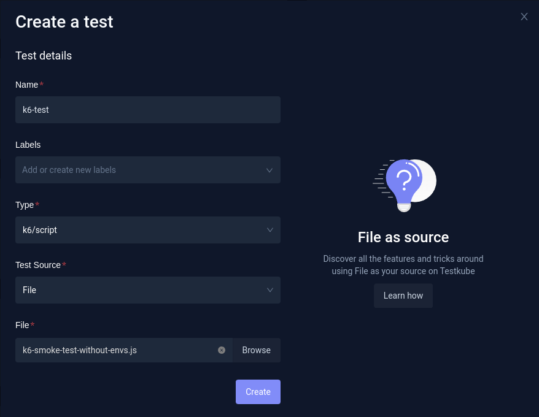
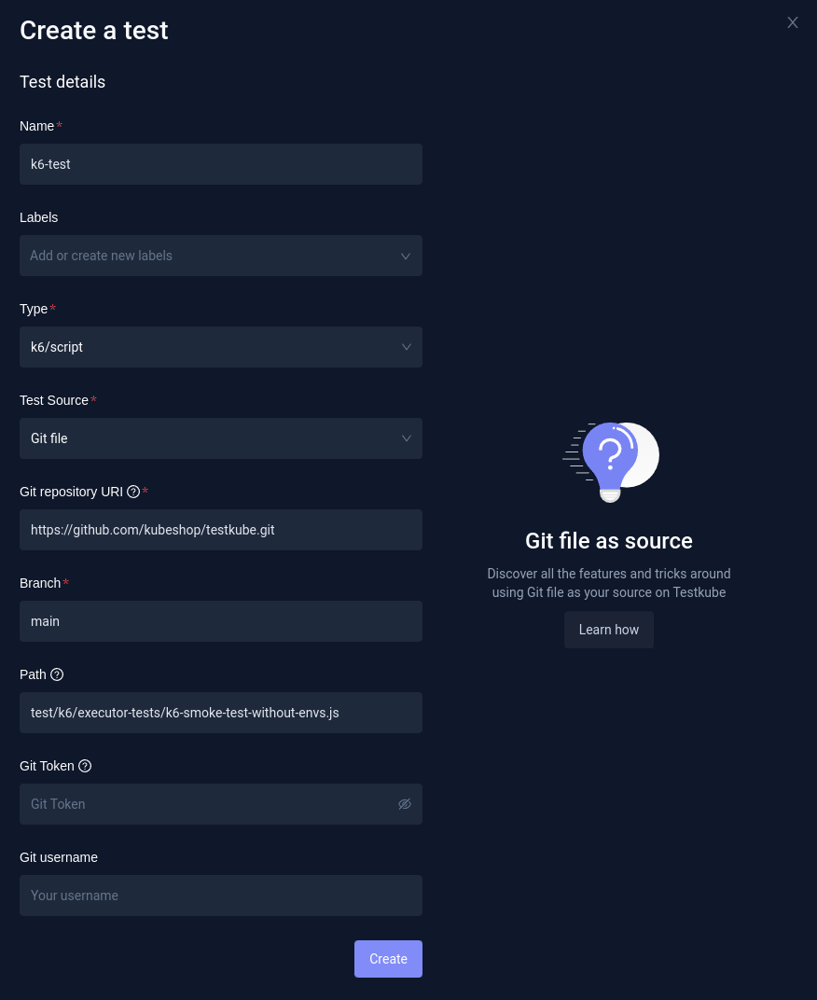
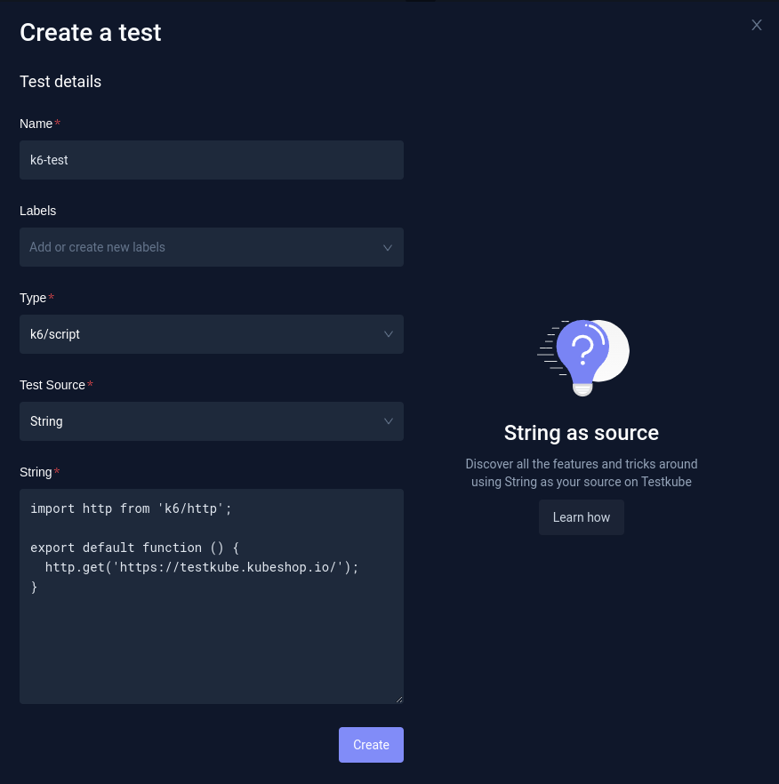

import Tabs from "@theme/Tabs";
import TabItem from "@theme/TabItem";

# K6

**Check out our [blog post](https://kubeshop.io/blog/load-testing-in-kubernetes-with-k6-and-testkube) to follow tutorial steps to harness the power of k6 load testing in Kubernetes with Testkube's CLI and API.**

[K6](https://k6.io/docs/) is an open-source load testing tool that makes performance testing easy and productive for engineering teams. K6 is free, developer-centric and extensible.

Using k6, you can test the reliability and performance of your systems and catch performance regressions and problems earlier. K6 will help you to build resilient and performant applications that scale.

K6 is developed by Grafana Labs and the community.

Testkube's k6 executor provides a convenient way of running k6 tests.

## Example k6 test

In this example we will use the following k6 test:
https://github.com/kubeshop/testkube/blob/main/test/k6/executor-tests/k6-smoke-test-without-envs.js

```js
import http from "k6/http";

export default function () {
  http.get("https://testkube.kubeshop.io/");
}
```

### Test Source

K6 tests may vary significantly. The test may be just a single file, but may also consist of multiple files (modules, dependencies, or test data files). That's why all of the available Test Sources may be used with K6:

- Git file
- Git directory
- File
- String

## Creating and running Test

<Tabs groupId="dashboard-cli">
<TabItem value="dash" label="Dashboard">

If you prefer to use Dashboard, just go to Tests, and click `Add a new test` button. Then you need to fill in the test Name, choose the test Type (`k6 script`), and then choose Test Source.

#### File

In case of File source the test file is uploaded directly.



#### Git file

In case of Git file you need to fill in repository details - Git repository URI (in this case `https://github.com/kubeshop/testkube.git`), branch (`main`), and path to k6 script in your repository (`est/k6/executor-tests/k6-smoke-test-without-envs.js`). In this example, the repository is public, but in case of private ones you mwould need to additionally fill in Git credentials.



#### String

For String source the test script is added directly.



</TabItem>
<TabItem value="cli" label="CLI">
If you prefer using the CLI, you can create the test with `testkube create test`.

You need to set:

- `--name` (for example, `k6-test`)
- `--type` (in this case `k6/script`)

And, then choose Test Content type based on Test Source you want to use:

#### File

In case of File test source:

- `--test-content-type` (`file-uri`)
- `--file` (path to your k6 script - in this case `test/k6/executor-tests/k6-smoke-test-without-envs.js`)

```sh
testkube create test --name k6-test --type k6/script --test-content-type file-uri --file test/k6/executor-tests/k6-smoke-test-without-envs.js
```

```sh title="Expected output:"
Test created testkube / k6-test 🥇
```

#### Git file

- `--test-content-type` (`git-file`, so specific file will be checked out from the Git repository)
- `--git-uri` - repository URI (in case of this example, `https://github.com/kubeshop/testkube.git`)
- `--git-branch`
- `--git-path` - path to the k6 script in the repository (in this case `test/k6/executor-tests/k6-smoke-test-without-envs.js`)

```sh
testkube create test --name k6-test --type k6/script --test-content-type git-file --git-uri https://github.com/kubeshop/testkube.git --git-branch main --git-path test/k6/executor-tests/k6-smoke-test-without-envs.js
```

```sh title="Expected output:"
Test created testkube / k6-test 🥇
```

#### Git directory

- `--test-content-type` (`git-directory`, so the whole directory will be checked out from the Git repository)
- `--git-uri` - repository URI (in case of this example, `https://github.com/kubeshop/testkube.git`)
- `--git-branch`
- `--git-path` (path to the directory that should be checked out)
- `--executor-args` (whole directory will be checked out - specific test file must be set as k6 argument - in this example `test/k6/executor-tests/k6-smoke-test-without-envs.js`)

```sh
testkube create test --name k6-test --type k6/script --test-content-type git-dir --git-uri https://github.com/kubeshop/testkube.git --git-branch main --git-path test/k6/executor-tests --executor-args test/k6/executor-tests/k6-smoke-test-without-envs.js
```

```sh title="Expected output:"
Test created testkube / k6-test 🥇
```

## Using Additional K6 Arguments in Your Tests

Additional agruments can be passed to the `k6` binary both on test creation (`--executor-args`), and during test execution (`--args`).

```sh
testkube run test -k6-test --args '--vus 100 --no-connection-reuse'
```

</TabItem>
<TabItem value="crd" label="Custom Resource">

#### Git file
```yaml
apiVersion: tests.testkube.io/v3
kind: Test
metadata:
  name: k6-test
  namespace: testkube
spec:
  type: k6/script
  content:
    type: git-file
    repository:
      type: git
      uri: https://github.com/kubeshop/testkube.git
      branch: main
      path: test/k6/executor-tests/k6-smoke-test-without-envs.js
```

#### Git directory

Checking out whole git directory (in the following example `test/k6/executor-tests`), and running specific test file (`test/k6/executor-tests/k6-smoke-test-without-envs.js`):

```yaml
apiVersion: tests.testkube.io/v3
kind: Test
metadata:
  name: k6-test
  namespace: testkube
spec:
  type: k6/script
  content:
    type: git-dir
    repository:
      type: git
      uri: https://github.com/kubeshop/testkube.git
      branch: main
      path: test/k6/executor-tests
  executionRequest:
    args:
      - test/k6/executor-tests/k6-smoke-test-without-envs.js
```

##### String

```yaml
apiVersion: tests.testkube.io/v3
kind: Test
metadata:
  name: k6-test
  namespace: testkube
spec:
  type: k6/script
  content:
    type: string
    data: "import http from 'k6/http';\n\nexport default function () {\n  http.get('https://testkube.kubeshop.io/');\n}"
```

</TabItem>
</Tabs>

## K6 Test Results

A k6 test will be successful in Testkube when all checks and thresholds are successful. In the case of an error, the test will have `failed` status, even if there is no failure in the summary report in the test logs. For details check [this k6 issue](https://github.com/grafana/k6/issues/1680).
