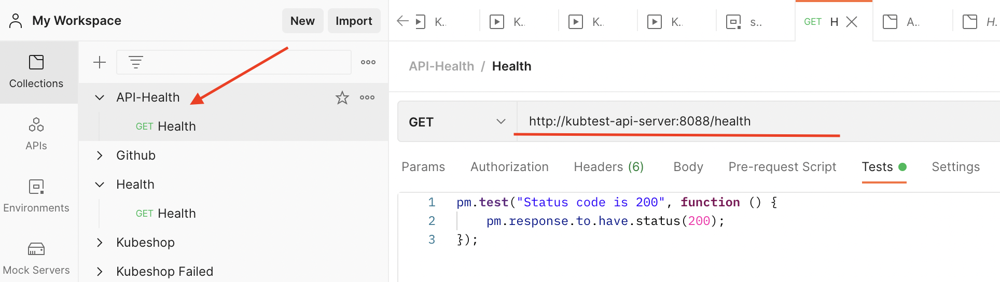
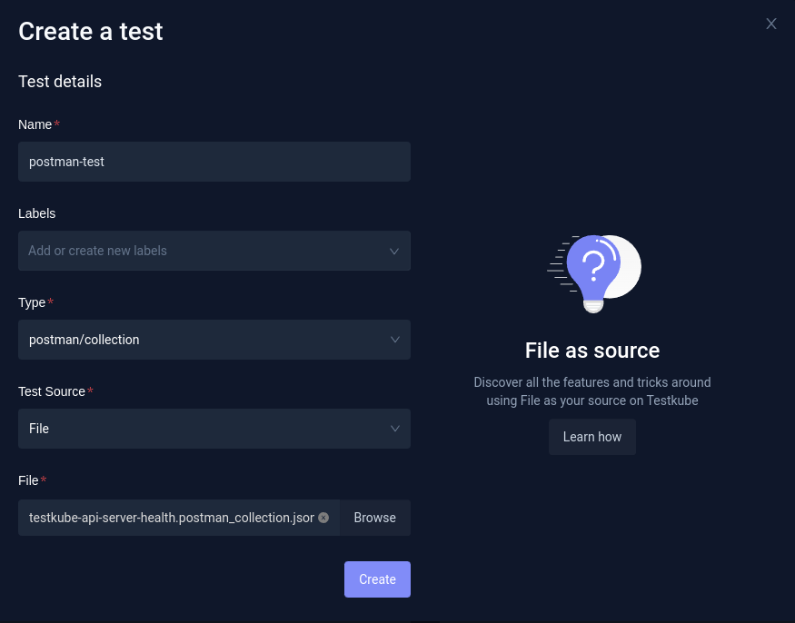
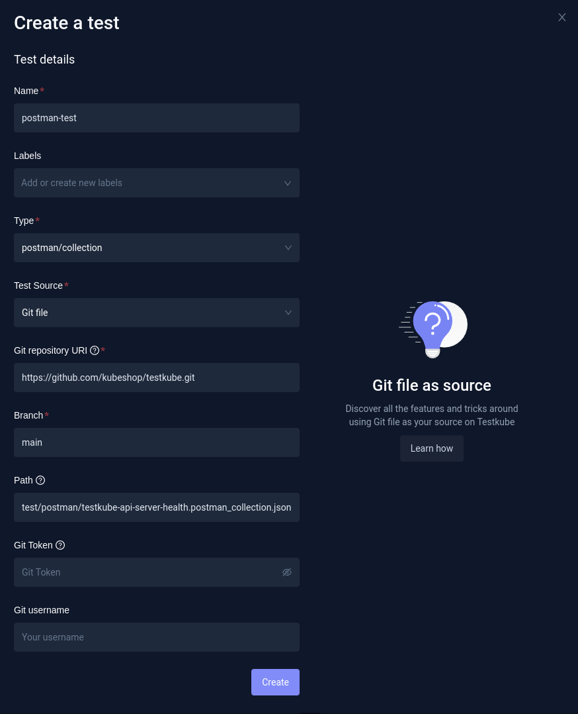

import Tabs from "@theme/Tabs";
import TabItem from "@theme/TabItem";
import Admonition from "@theme/Admonition";

# Postman

Testkube is able to run Postman collections inside your Kubernetes cluster so it can be used to test internal or external services.

- Default command for this executor: newman
- Default arguments for this executor command: run &lt;runPath&gt; -e &lt;envFile&gt; --reporters cli,json --reporter-json-export &lt;reportFile&gt;

Parameters in &lt;&gt; are calculated at test execution:

- `<runPath>` - path to the test files
- `<envFile>` - path to the environment file set by `--variables-file`
- `<reportFile>` - path to the generated report json file

[See more at "Redefining the Prebuilt Executor Command and Arguments" on the Creating Test page.](../articles/creating-tests.md#redefining-the-prebuilt-executor-command-and-arguments)

export const ExecutorInfo = () => {
  return (
    <div>
      <Admonition type="info" icon="🎓" title="What is Postman?">
        <ul>
          <li>
            Postman is a platform for designing, building, testing, and
            iterating APIs.
          </li>
        </ul>
        <b>What can I do with Postman?</b>
        <ul>
          <li>
            Postman simplifies every step of the API lifecycle, making it easy
            for you to iterate and test your APIs by sending and inspecting
            responses, writing assertions to validate endpoints, or setting up
            logic to mirror your workflows.
          </li>
        </ul>
      </Admonition>
    </div>
  );
};

<ExecutorInfo />

**Check out our [blog post](https://testkube.io/blog/api-testing-in-kubernetes-with-postman) to follow tutorial steps for end-to-end testing of your Kubernetes applications with Postman.**

## Prerequisite: Example Postman test

### Service Under Test

Let's assume that our SUT (Service Under Test) is an internal Kubernetes service which has
ClusterIP `Service` created and is exposed on port `8088`. The service name is `testkube-api-server`
and is exposing the `/health` endpoint that we want to test.

To call the SUT inside a cluster:

```bash
curl http://testkube-api-server:8088/health
```

Output:

```bash
200 OK
```

### Example Postman collection

In the following examples, we will use a simple Postman test that makes a GET request to `http://testkube-api-server:8088/health`, and validates if response code equals 200.



You can find it in the Testkube repository: https://github.com/kubeshop/testkube/blob/main/test/postman/testkube-api-server-health.postman_collection.json

#### Exporting Postman collection

If you'd like to use another collection you can create it in Postman, and export it to the `.postman_collection.json` file by right clicking it and selecting Export.

## Creating and Running a Test

A Postman collection consists of the single file, so the following test sources can be used to create a test:

- File
- Git file
- String

<Tabs groupId="dashboard-cli">
<TabItem value="dash" label="Dashboard">

If you prefer to use the Dashboard, go to Tests and click the `Add a new test` button. Then you need to fill in the test Name, choose the test Type (`postman/collection`), and choose Test Source of your choice.

### a) Creating a Test from File

If you have the collection you want to run saved locally, you can use `File` as the test source. You can then select and upload it directly.



### b) Creating a Test with Git file

If you have a collection in the Git repository, you can use the `Git file` source. Then, you need to fill in repository details:

- Git repository URI (in this case `https://github.com/kubeshop/testkube.git`)
- branch (`main`)
- path to Postman collection in your repository (in this case `test/postman/testkube-api-server-health.postman_collection.json`).



In this example, the repository is public; if the repository is private, you would need to additionally fill in Git credentials.

### Running a Test

If you created a Test using any of the previous methods, you will be redirected to Test details. In order to run it, all you need to do is to click the Run button.

</TabItem>

<TabItem value="cli" label="CLI">

If you prefer using the CLI instead, you can create the test with `testkube create test`.

### a) Creating a Test from File

```sh
testkube create test --name postman-test --type postman/collection --file test/postman/testkube-api-server-health.postman_collection.json
```

```sh
Test created testkube / postman-test 🥇
```

### b) Creating a Test with Git file

````sh
testkube create test --name postman-test --type postman/collection --test-content-type git-file --git-uri https://github.com/kubeshop/testkube.git --git-branch main --git-path test/postman/testkube-api-server-health.postman_collection.json```

```sh
Test created testkube / postman-test 🥇
````

### Running a Test

The test can be run using the `testkube run test` command.

```sh
$ testkube run test postman-test
Type:              postman/collection
Name:              postman-test
Execution ID:      63fde0b3a862384f8f959239
Execution name:    postman-test-6
Execution number:  6
Status:            running
Start time:        2023-02-28 11:08:35.081273721 +0000 UTC
End time:          0001-01-01 00:00:00 +0000 UTC
Duration:


Test execution started
Watch test execution until complete:
$ kubectl testkube watch execution postman-test-6


Use following command to get test execution details:
$ kubectl testkube get execution postman-test-6
```

You can then check the execution results:

```sh

ID:         63fde715a862384f8f95923d
Name:       postman-test-8
Number:            8
Test name:         postman-test
Type:              postman/collection
Status:            passed
Start time:        2023-02-28 11:35:49.177 +0000 UTC
End time:          2023-02-28 11:35:57.203 +0000 UTC
Duration:          00:00:08
Repository parameters:
  Branch:          docs-postman
  Commit:
  Path:            test/postman/testkube-api-server-health.postman_collection.json
  Working dir:
  Certificate:

running test [63fde715a862384f8f95923d]
🚚 Initializing...
🌍 Reading environment variables...
✅ Environment variables read successfully
RUNNER_ENDPOINT="testkube-minio-service-testkube:9000"
RUNNER_ACCESSKEYID="********"
RUNNER_SECRETACCESSKEY="********"
RUNNER_REGION=""
RUNNER_TOKEN=""
RUNNER_BUCKET="testkube-artifacts"
RUNNER_SSL=false
RUNNER_SCRAPPERENABLED="true"
RUNNER_GITUSERNAME=""
RUNNER_GITTOKEN=""
RUNNER_DATADIR="/data"
📦 Fetching test content from git-file...
✅ Test content fetched to path /data/repo/test/postman/testkube-api-server-health.postman_collection.json
📂 Fetching uploads from object store testkube-minio-service-testkube:9000...
📂 Placing files from buckets into /data/uploads/ []
📂 Getting the contents of bucket folders [test-postman-test]

📂 Setting up access to files in /data
🔬 Executing in directory /data:
 $ chmod
✅ Execution succeeded
✅ Access to files enabled
✅ Initialization successful
0xc0058e69c0
🚚 Preparing test runner
🌍 Reading environment variables...
✅ Environment variables read successfully
RUNNER_ENDPOINT="testkube-minio-service-testkube:9000"
RUNNER_ACCESSKEYID="********"
RUNNER_SECRETACCESSKEY="********"
RUNNER_REGION=""
RUNNER_TOKEN=""
RUNNER_BUCKET="testkube-artifacts"
RUNNER_SSL=false
RUNNER_SCRAPPERENABLED="true"
RUNNER_GITUSERNAME=""
RUNNER_GITTOKEN=""
RUNNER_DATADIR="/data"
running test [63fde715a862384f8f95923d]
🚚 Preparing for test run
📦 Fetching test content from git-file...
✅ Test content fetched to path /tmp/git-checkout4073207673/repo/test/postman/testkube-api-server-health.postman_collection.json
🔬 Executing in directory:
 $ newman run /tmp/git-checkout4073207673/repo/test/postman/testkube-api-server-health.postman_collection.json -e /tmp/testkube-tmp3625780620 --reporters cli,json --reporter-json-export /tmp/testkube-tmp1329378482.json
newman


testkube-api-server


→ testkube-api-server

  GET http://testkube-api-server:8088/health
[200 OK, 124B, 50ms]

  ✓  Status code is 200


┌─────────────────────────┬──────────────────┬──────────────────┐
│                         │         executed │           failed │
├─────────────────────────┼──────────────────┼──────────────────┤
│              iterations │                1 │                0 │
├─────────────────────────┼──────────────────┼──────────────────┤
│                requests │                1 │                0 │
├─────────────────────────┼──────────────────┼──────────────────┤
│            test-scripts │                1 │                0 │
├─────────────────────────┼──────────────────┼──────────────────┤
│      prerequest-scripts │                0 │                0 │
├─────────────────────────┼──────────────────┼──────────────────┤
│              assertions │                1 │                0 │
├─────────────────────────┴──────────────────┴──────────────────┤
│ total run duration: 85ms                                      │
├───────────────────────────────────────────────────────────────┤
│ total data received: 8B (approx)                              │
├───────────────────────────────────────────────────────────────┤
│ average response time: 50ms [min: 50ms, max: 50ms, s.d.: 0µs] │
└───────────────────────────────────────────────────────────────┘

✅ Execution succeeded
✅ Got Newman result successfully
✅ Mapped Newman result successfully
newman

testkube-api-server

→ testkube-api-server
  GET http://testkube-api-server:8088/health [200 OK, 124B, 50ms]
  ✓  Status code is 200

┌─────────────────────────┬──────────────────┬──────────────────┐
│                         │         executed │           failed │
├─────────────────────────┼──────────────────┼──────────────────┤
│              iterations │                1 │                0 │
├─────────────────────────┼──────────────────┼──────────────────┤
│                requests │                1 │                0 │
├─────────────────────────┼──────────────────┼──────────────────┤
│            test-scripts │                1 │                0 │
├─────────────────────────┼──────────────────┼──────────────────┤
│      prerequest-scripts │                0 │                0 │
├─────────────────────────┼──────────────────┼──────────────────┤
│              assertions │                1 │                0 │
├─────────────────────────┴──────────────────┴──────────────────┤
│ total run duration: 85ms                                      │
├───────────────────────────────────────────────────────────────┤
│ total data received: 8B (approx)                              │
├───────────────────────────────────────────────────────────────┤
│ average response time: 50ms [min: 50ms, max: 50ms, s.d.: 0µs] │
└───────────────────────────────────────────────────────────────┘


Test execution completed with success in 8.026s 🥇
```

</TabItem>

<TabItem value="crd" label="Custom Resource">

The third option for creating the Test is to use a Test CRD. If you already have the test created, you can check the definition in Dashboard (`Definition` tab in Test Settings).

You can also get a definition while using `testkube create test` command by adding `--crd-only`.
In that case, the test won't be created, but the definition will be displayed.

### Creating a Test with Git file

```yaml
apiVersion: tests.testkube.io/v3
kind: Test
metadata:
  name: postman-test
  namespace: testkube
spec:
  type: postman/collection
  content:
    type: git-file
    repository:
      type: git
      uri: https://github.com/kubeshop/testkube.git
      branch: main
      path: test/postman/testkube-api-server-health.postman_collection.json
```

When the Test CRD is saved to the yaml file it can then be applied directly with `kubectl apply -f SOME_FILE_NAME.yaml`.

</TabItem>
</Tabs>
