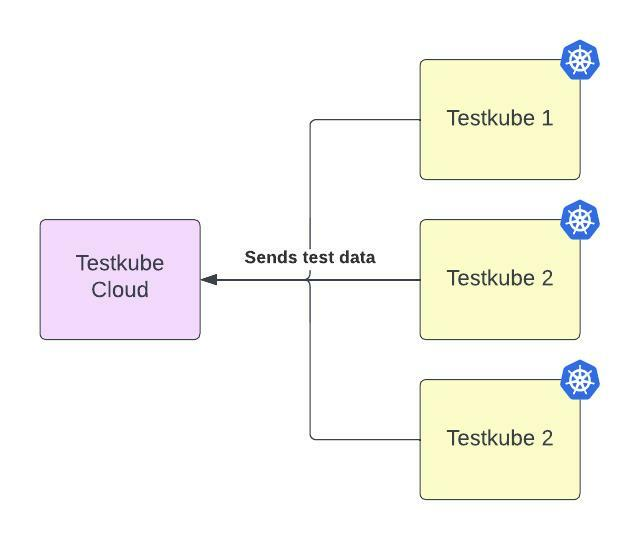

# Testkube Cloud Architecture

## Multiple Testkube Agents

The main Testkube Cloud feature is to have insights into multiple Testkube Cloud Agents. 
You can look at your Kubernetes clusters from a single dashboard and easily switch between different Testkube clusters. 

## Storing Results

In Testkube standalone, all results are stored in the users cluster, so you need to be aware of MinIO and MongoDB. 
Testkube Cloud makes it easy for you. All data is stored in the Testkube Cloud infrastructure so you don't need to worry about backups.

## Testkube Networking

To simplify networking connections, the Testkube Agent is able to create a connection to Testkube Cloud clusters. The Agent is registering itself into 
Testkube Cloud as a new environment. 
This allows Testkube Cloud to send commands which Testkube will manage in Agent mode. The connection is established from Testkube Agent to Testkube Cloud.

After installation, the Testkube Agent connects to Testkube Cloud and starts listening for commands. 
Additionally the Agent is connecting to the Testkube Cloud REST API.

Testkube Agent is connecting to `https://api.testkube.io` on port `8088` for HTTPS connection and on port `8089` for GRPC connection.  

