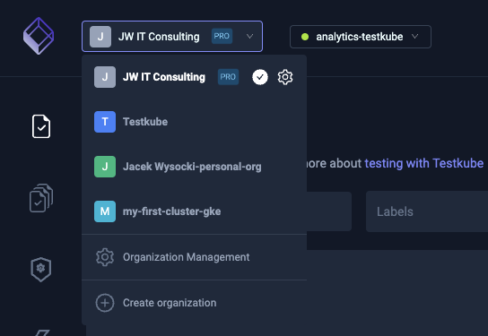
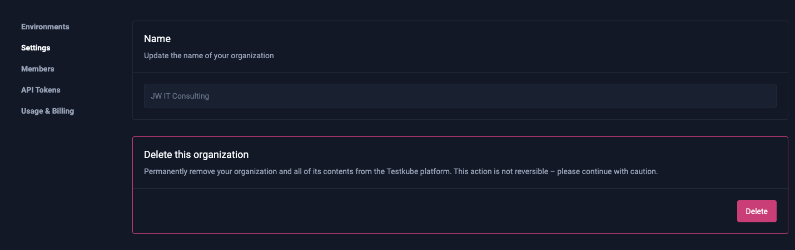
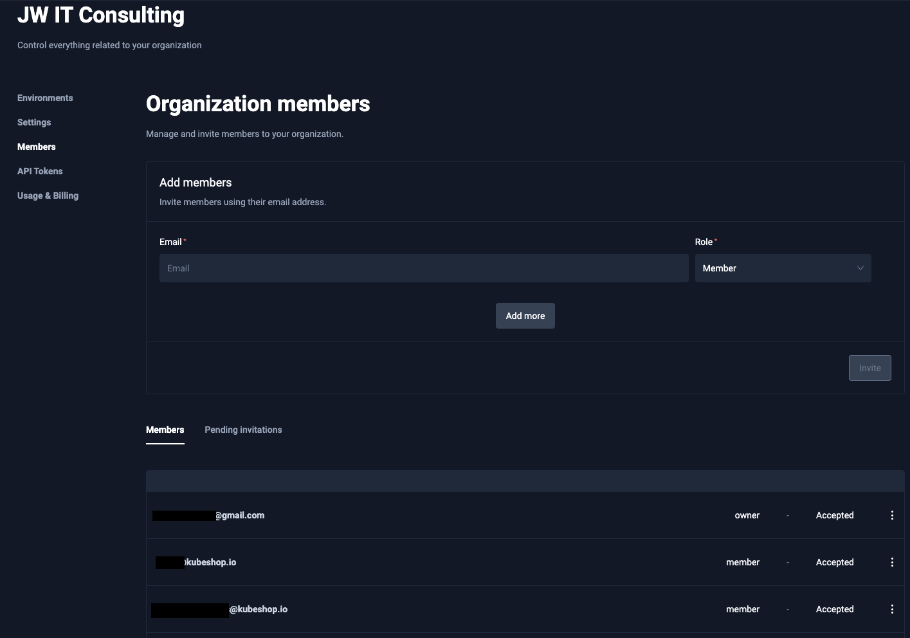
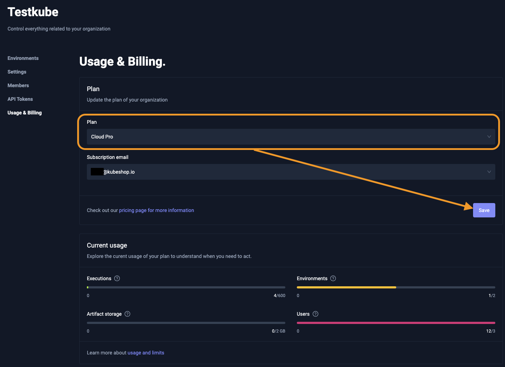
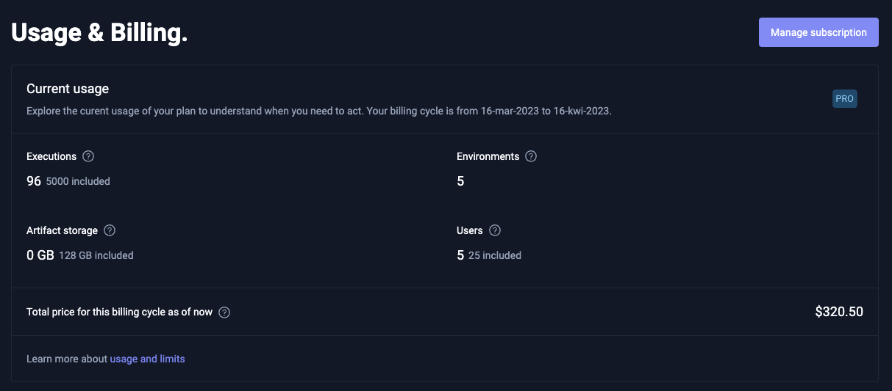

# Organization Management


To manage your organization settings click "Manage Organization" from organizations drop-down menu:



You can also create new organization. 


## Organization Settings

To edit your organization settings, click an organization from the available options from menu on the left.

### Environments

In the environments section you can see the list of your existing environments.


GREEN status means that your agent is connected successfully. 

In the case of a RED status, you can try to debug the issues with the command below:

```sh
testkube agent debug
```

Run this on your cluster where the given agent is installed.


### Settings

In settings you can remove your organization. Keep in mind that this operation can't be rolled back!




### Members

For each organization you can define who has access and what kind of actions each member can use. 




There are 4 types of organization members: 

* `owner` - Has access to all environments and organization settings, also can access billing details.
* `admin` - Has access to all environments and organization settings.
* `biller` - Has access to billing details only.
* `member` - Has limited access to environments, access is defined by the roles assigned to given member. Member by default doesn't have any access, you need to [explicitly set it in the given environment](environment-management.md). 


### API Tokens

Sometimes you need machine-to-machine authorization to run tests in CI pipelines or  call particular actions from your services. 
Testkube offers API Tokens to resolve this issue. API Tokens have very similar roles like members. 

Each token can have also expiration date, you can set it for given time period or as "No expiration" (not recommended for production environments).
If token is not needed anymore you can delete it from the tokens list. 

API Tokens can have 2 roles: 

#### "admin" - access to all environments


#### "member" - limited access to environments or limited access for environment actions 


For the member organization role, you should choose which environments you want to add to the created API Token, additionally, role should be chosen for each 
environment: 


We have 3 available roles for environment access: 
* `Read` - Read only, you can only call get and list endpoints which not mutate data in any way.
* `Run` - Access to Read and Run but no changes to the environment.
* `Write` - You can change environments and run tests. 

### Usage & Billing

#### Upgrading Testkube to the `PRO` Plan



#### `Free` Plan Usage 

All limits are calculated monthly. On the 'Free' plan, you have: 
- 600 executions 
- 2 environments
- 2GB artifacts storage
- 3 Users


#### `PRO` Plan Usage

Subscribing to the `PRO` plan provides: 
- 5000 test executions
- **Unlimited** environments
- **128GB** of artifacts storage
- **25** users

If you need more - just use Testkube - and you'll be charged for additional usage.
For pricing details, visit your subscription by clicking the "Manage subscription" button. 




