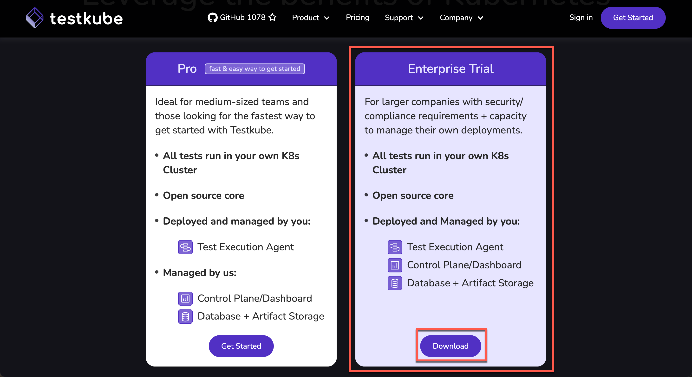
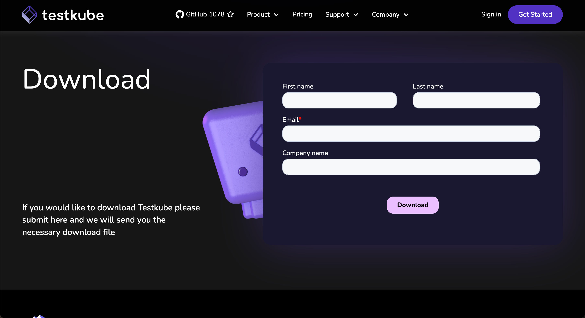

# Testkube Pro On-Prem

If your company has security and compliance requirements and the capacity to manage your own Kubernetes deployments, visit https://testkube.io/get-started and click **Download** to sign up for Testkube Pro On-Prem.

Enter your information in the form and click **Download**.

Once you submit the form you will receive an email with an Pro On-Prem license and installion instructions.

Visit our additional documentation to [install and use Helm Charts](https://docs.testkube.io/testkube-pro-on-prem/articles/usage-guide) and [configure Identity Providers](https://docs.testkube.io/testkube-pro-on-prem/articles/auth).
