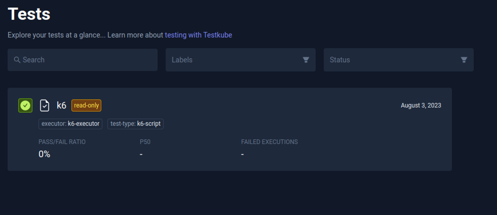
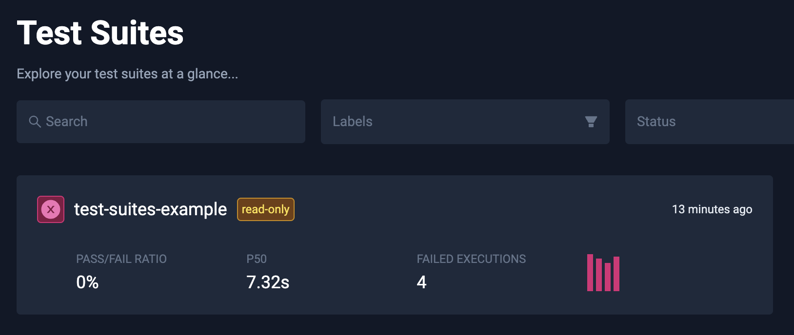

# Cached Test & Test Suite Results

export const ProBadge = () => {
  return (
    
      
PRO FEATURE

    
  );
}

<ProBadge />

Testkube cached test results allows you to see and inspect test execution results even when your Testkube agent is offline.

## Overview

Testkube Pro uses test execution data stored in Pro to allow you inspect past test executions. This feature also works when your agent is online, but the Testkube agent doesn't have the test definition available in Kubernetes.

Cached test results appear with a read-only tag. These tests cannot be updated. If you want to get rid of old tests, you can go to the Test Settings page and click "Delete Test".

Similar to tests, Testkube Pro supports also cached test suites, using the data stored in Pro. These can be identified by the read-only tag which suggests that either your agent is not connected, or that a particular test suite definition is no longer available in Kubernetes.
