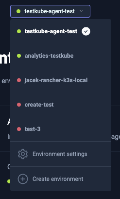
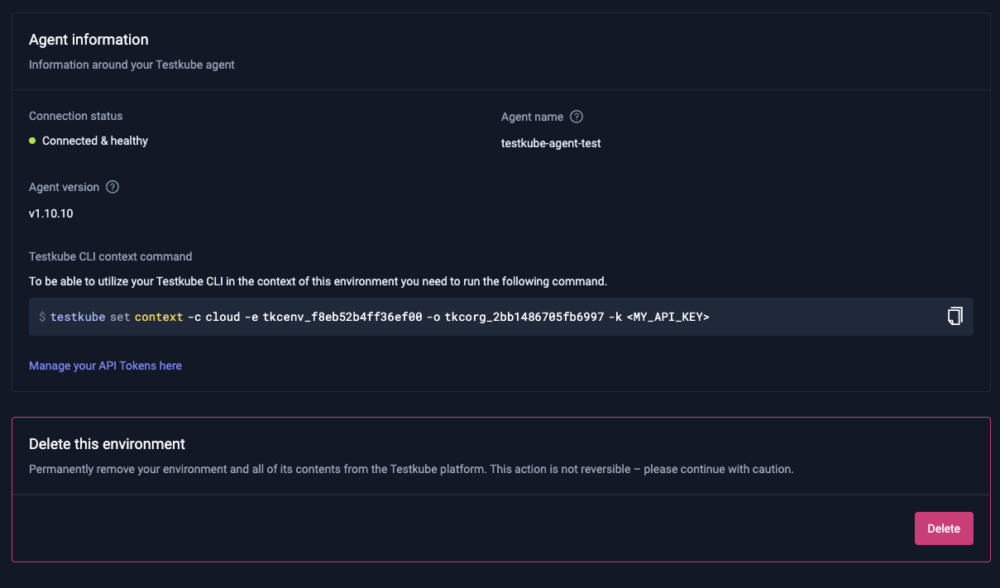

# Environment Management

Environment in Testkube is related to the Testkube agent, which is responsible for sending
test insights to Testkube Pro and for managing your Kubernetes related cluster resources.

## Creating a New Environment

You can create a new environment from the "Environments" drop down in the header section of the Testkube Pro UI. 

For installation instructions, follow [Testkube Agent Installation](installing-agent.md)

## Changing Environment Settings

On the "General" tab, you can see environment information:
* Connection state 
* Agent name
* Agent version - If a new Testkube Agent version is available, you'll be prompted to upgrade.
* Testkube CLI context command - To configure your Testkube CLI with pro context.

You can also delete a given environment (be careful, this action can't be rolled-back!)

## Managing Environment Member Roles

Keep in mind that all organization `admin` users can access all environments.

To add new organization users with member role use the "Members" tab.

You can choose from one of the following roles for a user: 

* `Read`: Has Read access only to all entities in an environment, test results, artifacts, logs, etc...
* `Run`: Has Read access and can trigger Test/ Test Suite executions.
* `Write`: Has Run access and can make changes to environment tests, triggers, webhooks, etc...
* `Admin`: Has Write access and is allowed to invite and change other collaborator roles.

