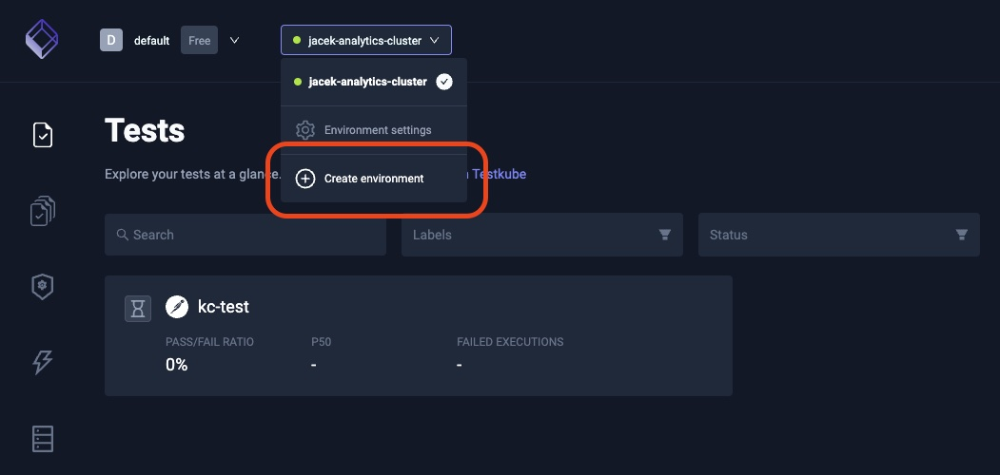
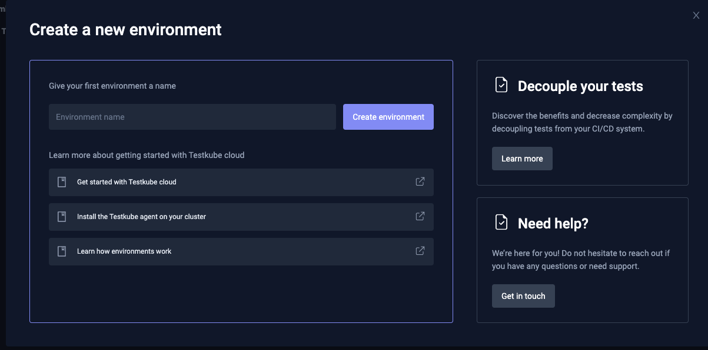
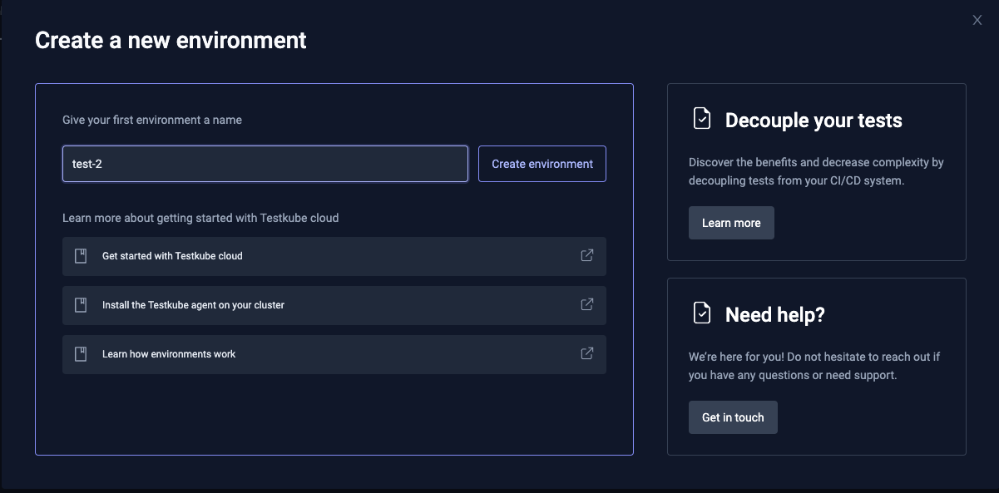
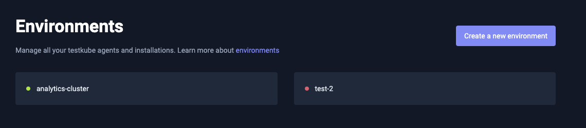

# Installing the Testkube Agent

Following steps, are under the assumption that you already have a TestKube Pro account, if that's not the case, you can find a detailed description about how to get started with TestKube [here](../../articles/getting-started.md).

## Installation Steps

1. To add a new agent, create a new environment: 






2. Fill in the environment name: 



3. Copy the Helm install command into your terminal to install the environment and deploy the Testkube agent in your cluster: 


4. Run the command in your terminal.

You will need *Helm* installed and `kubectl` configured with access to your Kubernetes cluster: 
- To install `helm` just follow the [install instructions on the Helm web site](https://helm.sh/docs/intro/install/).
- To install `kubectl` follow [Kubernetes docs](https://kubernetes.io/docs/tasks/tools/).


5. When the install is complete, you will see the Helm installation notice: 


## Validating the Installation 

Testkube Pro will notify if the installation is successful. 

* A green indicator means that your cluster was able to connect to the Testkube Pro.
* A red indicator indicates that the Testkube Agent can't connect to the Testkube Pro API (Testkube needs some time to establish a connection, max time is 2-3 minutes).



In the case of a RED status you can try to debug the issues with the command below:

```sh 
testkube agent debug
```

By default, Testkube is installed in the `testkube` namespace.