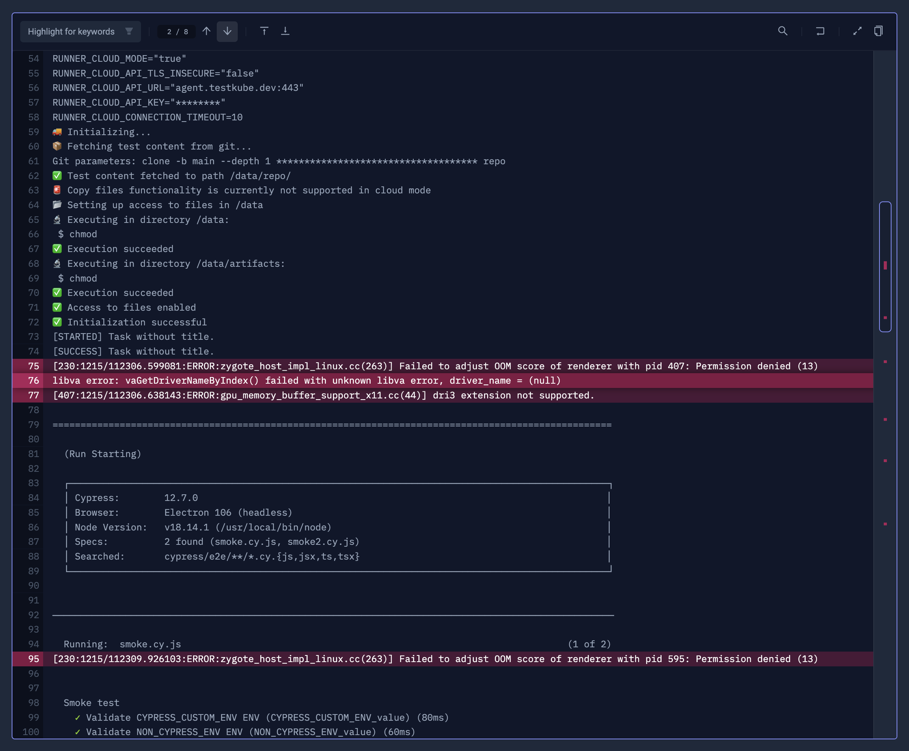
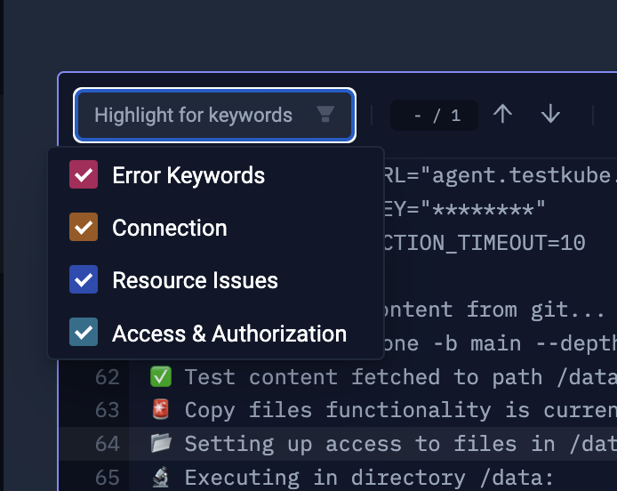
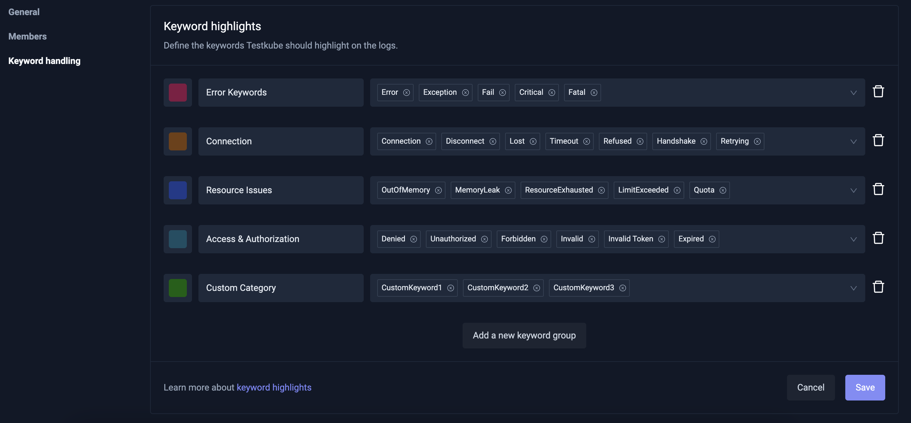

# Log Highlighting

export const ProBadge = () => {
  return (
    
      
PRO FEATURE

    
  );
}

<ProBadge />

## Overview

In Testkube Pro, we highlight relevant keywords in logs for faster debugging. To use this feature, open execution details.

On this screen, all the lines that may be relevant will be highlighted in the interface.

You may navigate through the highlighted lines with the arrows on top of the interface
or use the scrollbar where all relevant lines are marked.

## Filtering

To decide on the active highlight categories, you may click the "Highlight for keywords" button.
By default, all the categories are active.

## Configuring Keyword Categories

There are 4 default categories, represented with a few keywords each:

| Category                   | Keywords                                                            |
|----------------------------|---------------------------------------------------------------------|
| **Error Keywords**         | Error, Exception, Fail, Critical, Fatal                             |
| **Connection**             | Connection, Disconnect, Lost, Timeout, Refused, Handshake, Retrying |
| **Resource Issues**        | OutOfMemory, MemoryLeak, ResourceExhausted, LimitExceeded, Quota    |
| **Access & Authorization** | Denied, Unauthorized, Forbidden, Invalid, Invalid Token, Expired    |

To configure keyword categories for highlighting:

1. Navigate to the Environment settings -> Keyword handling.
2. Add a new category by providing a color, a group name, and an array of keywords.
3. Save the changes.

## Example Configuration

In the example above, there are default categories along with a new one:

- **Custom Category** (New):
  - **Color**: Green
  - **Group Name**: Custom Category
  - **Keywords**: [CustomKeyword1, CustomKeyword2, CustomKeyword3]

These keywords will be highlighted in logs when the custom category is active.