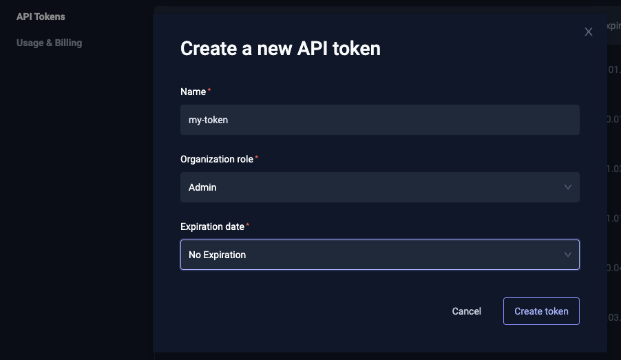
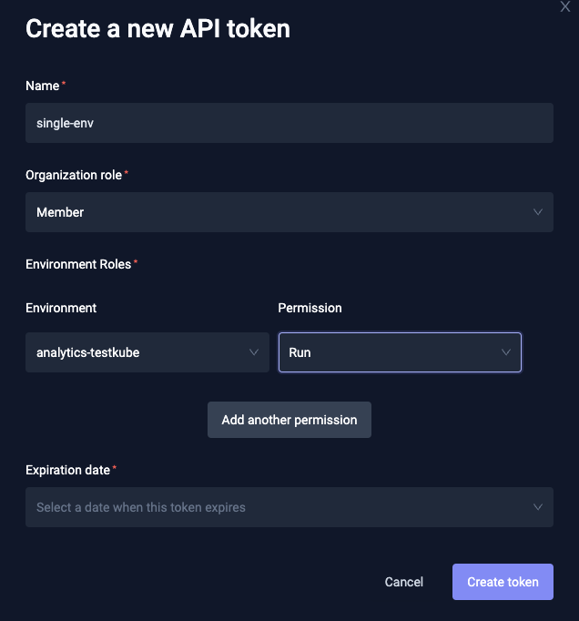

# Connecting from the CLI

To use Testkube CLI to connect to your Testkube Pro install you will need to set the CLI Context. For that you will need a Testkube Pro token.

The token you create can have different roles associated with it for fine-grained control:

* **Admin** access rights (access to all environments):



* Specific role for selected environments:




When the token is created, you're ready to change the Testkube CLI context: 


# Connecting Using `kubeconfig` Context

If you want to connect to your Testkube instance directly (like you would do with `kubectl`), set the CLI Context to be `kubeconfig`-based: 

```sh 
testkube set context --kubeconfig
```

