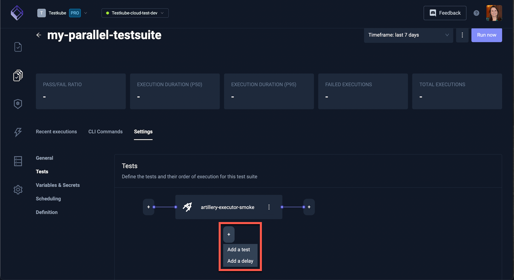

# Advanced Test Orchestration

Creating Test Suites with Testkube allows for the orchestration of tests. Individual tests that can be run at the same time, in parallel, helps to speed up overall testing.

## Running Parallel Tests in a Test Suite

### Create a Test Suite

In the Testkube Dashboard, on the Test Suite screen, select **Add a new test suite**:


### Add Tests

The new Test Suite will be empty. Click on **Add your first test**:


Continue to add tests to you test suite. You can also add a **delay** when necessary to specify he length of time between certain tests.



For this test suite, we have added 5 tests that all run in parallel:


Here is an example of a Test Suite sequence with 2 tests running in parallel and, when they complete, a single test runs, then 2 addtional parallel tests:


## Test Suite Steps

Test Suite Steps can be of two types:

1. Tests: tests to be run.
2. Delays: time delays to wait in between tests.

Similar to running a Test, running a Test Suite Step based on a test allows for specific execution request parameters to be overwritten. Step level parameters overwrite Test Suite level parameters, which in turn overwrite Test level parameters. The Step level parameters are configurable only via CRDs at the moment.

For details on which parameters are available in the CRDs, please consult the table below:

| Parameter                          | Test | Test Suite | Test Step |
| ---------------------------------- | ---- | ---------- | --------- |
| name                               | ✓    | ✓          |           |
| testSuiteName                      | ✓    |            |           |
| number                             | ✓    |            |           |
| executionLabels                    | ✓    | ✓          | ✓         |
| namespace                          | ✓    | ✓          |           |
| variablesFile                      | ✓    |            |           |
| isVariablesFileUploaded            | ✓    |            |           |
| variables                          | ✓    | ✓          |           |
| testSecretUUID                     | ✓    |            |           |
| testSuiteSecretUUID                | ✓    |            |           |
| args                               | ✓    |            | ✓         |
| argsMode                           | ✓    |            | ✓         |
| command                            | ✓    |            | ✓         |
| image                              | ✓    |            |           |
| imagePullSecrets                   | ✓    |            |           |
| sync                               | ✓    | ✓          | ✓         |
| httpProxy                          | ✓    | ✓          | ✓         |
| httpsProxy                         | ✓    | ✓          | ✓         |
| negativeTest                       | ✓    |            |           |
| activeDeadlineSeconds              | ✓    |            |           |
| artifactRequest                    | ✓    |            |           |
| jobTemplate                        | ✓    | ✓          | ✓         |
| jobTemplateReference               | ✓    | ✓          | ✓         |
| cronJobTemplate                    | ✓    | ✓          | ✓         |
| cronJobTemplateReference           | ✓    | ✓          | ✓         |
| preRunScript                       | ✓    |            |           |
| postRunScript                      | ✓    |            |           |
| executePostRunScriptBeforeScraping | ✓    |            |           |
| scraperTemplate                    | ✓    | ✓          | ✓         |
| scraperTemplateReference           | ✓    | ✓          | ✓         |
| pvcTemplate                        | ✓    | ✓          | ✓         |
| pvcTemplateReference               | ✓    | ✓          | ✓         |
| envConfigMaps                      | ✓    |            |           |
| envSecrets                         | ✓    |            |           |
| runningContext                     | ✓    | ✓          | ✓         |
| slavePodRequest                    | ✓    |            |           |
| secretUUID                         |      | ✓          |           |
| labels                             |      | ✓          |           |
| timeout                            |      | ✓          |           |

Similar to Tests and Test Suites, Test Suite Steps can also have a field of type `executionRequest` like in the example below:

```bash
apiVersion: tests.testkube.io/v3
kind: TestSuite
metadata:
  name: jmeter-special-cases
  namespace: testkube
  labels:
    core-tests: special-cases
spec:
  description: "jmeter and jmeterd executor - special-cases"
  steps:
  - stopOnFailure: false
    execute:
    - test: jmeterd-executor-smoke-custom-envs-replication
      executionRequest:
        args: ["-d", "-s"] // <- new field
      ...
  - stopOnFailure: false
    execute:
    - test: jmeterd-executor-smoke-env-value-in-args
```

The `Definition` section of each Test Suite in the Testkube UI offers the opportunity to directly edit the Test Suite CRDs. Besides that, consider also using `kubectl edit testsuite/jmeter-special-cases -n testkube`.
