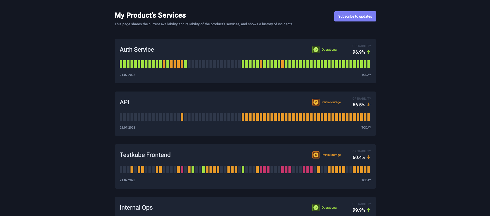
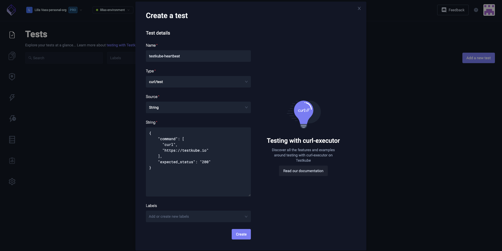
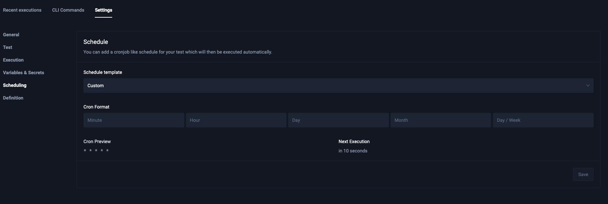
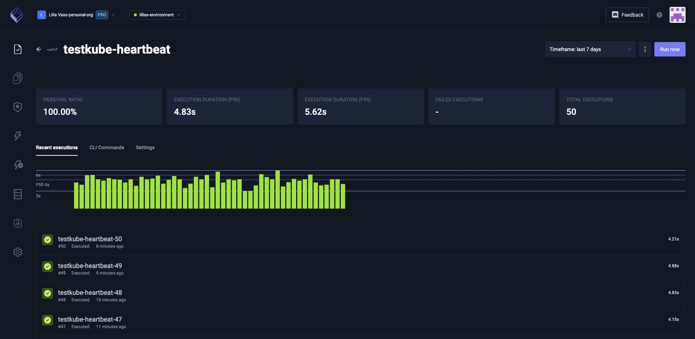
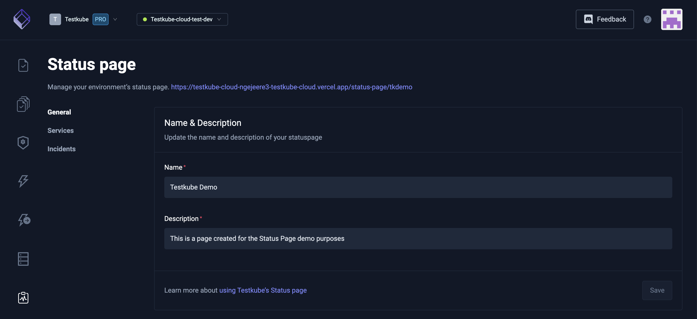
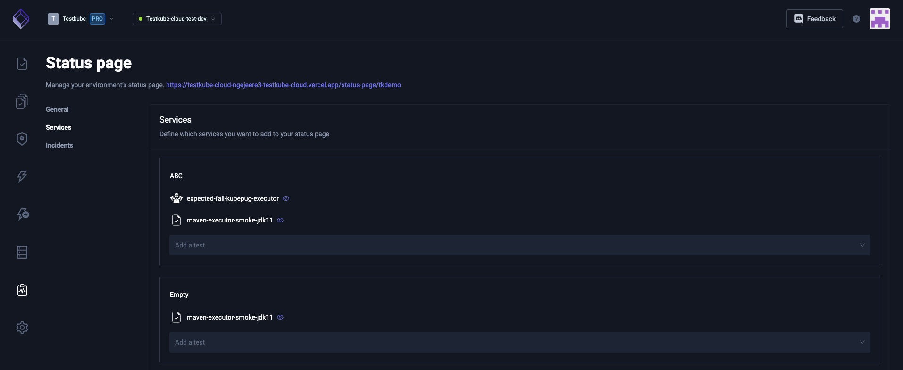
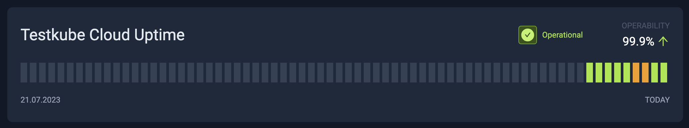
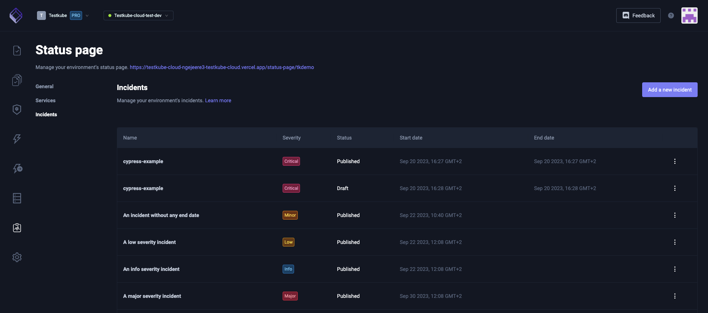

# Status Pages

export const ProBadge = () => {
  return (
    <span>
      <p class="pro-badge">PRO FEATURE</p>
    </span>
  );
}

<ProBadge />

The Testkube status pages are designed to help both technical and non-technical users understand and utilize the results of tests run on Testkube effectively. Whether you're a developer, project manager, or simply a stakeholder interested in monitoring software project status via running tests, Testkube has you covered.

You can see a live example of a Status Page [here](https://app.testkube.io/status/testkube).

## Overview



Testkube Status Pages is a feature within the Testkube software that allows you to create and manage dedicated status pages for your software projects. These pages provide real-time information about the health and availability of your project components, making it easier for both internal teams and external stakeholders to stay informed.

### Key Benefits

* Transparency: Keep all stakeholders informed about the status of your software.
* Efficiency: Quickly detect and respond to issues, minimizing downtime.
* Customization: Tailor your status page to match your brand and information needs.

## Getting Started

To access Testkube Status Pages:

1. Log in to your Testkube Pro account.
2. Go to the dashboard.
3. Click on "Status Pages" in the left navigation panel.

### Creating Your First Status Checker Test

The very first thing you have to consider, even before thinking about your status page, is the type of tests you are creating. You have to make sure that there are tests that are monitoring not just the behavior of a service, but also the availability. For this, Kubernetes is using liveness probes, which checks periodically if your service is still responsive on a user-configured endpoint. In case your application is already running in Kubernetes, consider reusing this endpoint in Testkube.

Let's create a scheduled cURL test. In order to do this, you should define a cURL command. For the sake of simplicity, we will be checking on the Testkube website `https://testkube.io`.



The cURL Test input we want to use is the following:

```bash
{
    "command": [
      "curl",
      "https://testkube.io"
    ],
    "expected_status": "200"
}
```

Make sure to add a Custom schedule in the Test settings to run it every minute:



After a few minutes, you will have a nice history of executions:



You can also use `kubectl apply -f testcrd.yaml` on the CLI to port your test from one machine to the other. An example test definition would look like:

```bash
apiVersion: tests.testkube.io/v3
kind: Test
metadata:
  labels:
    executor: curl-executor
    test-type: curl-test
  name: testkube-heartbeat
  namespace: testkube
spec:
  content:
    data: |
      {
          "command": [
            "curl",
            "https://testkube.io"
          ],
          "expected_status": "200"
      }
    type: string
  executionRequest: {}
  schedule: '* * * * *'
  type: curl/test
```

Now, you are properly equipped to start creating a status page that always has relevant data.

### Creating Your First Status Page



1. Provide a unique name and description for your status page.
2. Choose a time scale for the status page. This will define the aggregation period of the test execution results.
3. Add services with tests.
4. Configure visibility. Public status pages will be available without any kind of authentication.
5. Save changes by clicking the "Save" button on top.

## Managing Services

Services represent the different parts of your software project that you want to monitor, such as servers or databases. In Testkube, you can define them by adding the appropriate tests to one Service in your Status Page.



To add and configure a service:

1. In the services section of the status page, type the chosen name of your service into the "Add a service" field.
2. Choose the relevant tests from the dropdown.
3. Drag and drop to order them.

## Visualising Service Statuses

The Status Page rendered is unique for each Testkube environment. You can only have one Status Page per environment, so make sure the tests added offer an accurate representation of the status of the services. On the very top of the screen you will see the name of your Status Page and the given description. No details of your Testkube environment or organization will be published on this page, so this is where they need to be pointed out for efficient communication with your users.



Below that you will see a list of the services with multiple ways to represent their state. On the top left is the name of the service. Top right is current status - this is calculated based on the last bar of the chart below. The possible values are:

* Operational (green): All tests passed in the last instance of the configured time scale.
* Partial Outage (orange): At least one test failed and one test succeeded in the last instance of the configured time scale.
* Major Outage (red): All tests failed in the last instance of the configured time scale.
* Unknown (grey): No data at all or some tests were not executed in the last instance of the configured time scale.

Another value is Operability. This is the percentage of successful test executions compared to all test executions in the timeline covered. Tests aborted or still running are not considered successful tests.

Below this, there is a color-coded visualization of the test execution results. The time covered by each bar is defined by the configured time scale. On hover you will see each bar and the test execution results in that time frame. The end date for this chart is the current date. The start date is either three months or three days before the current date, depending on the time scale. The time scale is not configurable in this view, only in the management view. The colors are similar to the service status colors:

* Red: All tests failed in the time range of the bar.
* Orange: At least one test failed and one test passed in the time range of the bar.
* Green: All tests succeeded in the time range of the bar.
* Grey: At least one of the tests configured in the service didn't run in the time range of the bar.

On hover, you will see exactly which tests failed, passed or did not run, with the same colors:

* Red: All executions failed.
* Orange: At least one execution failed and one execution succeeded.
* Green: All executions succeeded.
* Grey: No executions.

Make sure the names of the tests are easily understood by your users, as they will be public once you publish this page. To ensure that the status of your service will be always reflected, set up scheduled runs of your tests.

## Incidents

Testkube Status Pages streamlines the incident management processes by providing a central platform for incident tracking, communication, and documentation. This is a critical aspect of Testkube Status Pages and involves the communication processes and procedures for detecting, reporting, and resolving issues or incidents that affect the availability or performance of your software or services. This helps teams respond to incidents more efficiently, maintain transparency with stakeholders, and continuously improve their incident response procedures to ensure the reliability of their software or services.

Incidents are simple objects responsible for communication between the service providers and their users. Managing them is as easy as creating them via the Status Pages management page.



They will be shown at the bottom, similar to a news feed.


On the top of each individual incident there is the start date. The incidents are ordered by this, with the latest incident on top. The other relevant dates, for example, when it was created, updated and resolved are shown at the very bottom. The end date can be left intentionally empty, signifying that this incident has not been resolved.

The title of the incident will be colored based on the configured severity:

* critical: red
* major: red
* minor: orange
* low: yellow
* info: white

The interpretation of the severity is up to the decision of the team, just make sure everyone is well-informed and has agreed to it.

Incidents can have three different states depending on the visibility: draft, published and archived. Only published incidents are visible in this view.

## Collaboration and Access Control

Status Pages can be either private or public. Public status pages are published to the internet. Private pages can be shared with anyone in the same organization having read access to the environment.

## Best Practices

Best practices are essential for effectively using Testkube Status Pages to communicate the status of your software projects. These practices help ensure that your status pages are informative, reliable, and serve their intended purpose. Here are some best practices for Testkube Status Pages:

### Designing Effective Status Pages

Clear and Concise Information: Keep the information on your status page clear, concise, and relevant. Avoid technical jargon that might confuse non-technical stakeholders.

Use Visuals: Utilize the visual element test status indicators to make it easier for users to understand the current status at a glance.

Test Grouping: Group related tests logically, making it easier for users to navigate and understand the status of different parts of your software services.

Real-Time Updates: Ensure that incident updates are added in real-time to reflect the most current information.

Incident History: Maintain a visible incident history or log so users can review past incidents and resolutions.

### Incident Response Guidelines

Defined Roles and Responsibilities: Clearly define the roles and responsibilities of team members involved in incident response. This includes incident commanders, communicators, and technical responders.

Incident Severity Levels: Establish a clear and consistent system for categorizing incident severity levels. This helps prioritize response efforts. The levels provided by Testkube are: critical, major, minor, low, and info.

Communication Plan: Develop a communication plan that outlines how and when to communicate with stakeholders during incidents. Ensure that communication is timely, transparent, and accurate.

Escalation Procedures: Define procedures for escalating incidents when they cannot be resolved at lower levels. Identify when and how to involve senior management or additional resources.

Post-Incident Reviews: Conduct post-incident reviews (post-mortems) after each incident to analyze what went well and what could be improved. Use these reviews to update incident response procedures.

### Regular Maintenance

Scheduled Updates: Regularly update the status page, even during periods of normal operation. This demonstrates that the page is actively maintained and reliable.

Test Alerting: Periodically test your alerting and incident response mechanisms to ensure they are functioning correctly.

Documentation Updates: Keep documentation related to your status pages up-to-date, including service descriptions, contact information, and incident response procedures.

Training: Ensure that team members involved in incident response are adequately trained and up-to-date with best practices.

### User Engagement

Stakeholder Awareness: Promote awareness of the status page among your stakeholders, including both internal teams and external users.

Feedback Loop: Encourage your users to provide feedback on the status page's usefulness and clarity. Use this feedback to make improvements.

### Custom Slugs Configuration

Custom Slugs: If applicable, configure custom slugs for your status pages to match your brand and make them more accessible to users.

These best practices will help you maximize the effectiveness of Testkube Status Pages, ensuring that it serves as a valuable communication tool for both technical and non-technical stakeholders. By following these guidelines, you can maintain transparency, respond efficiently to incidents, and provide a reliable source of information about the status of your software projects.

If you have any questions or need assistance, our team is ready to assist you in our [Slack Channel](https://testkubeworkspace.slack.com/join/shared_invite/zt-2arhz5vmu-U2r3WZ69iPya5Fw0hMhRDg#/shared-invite/email).
